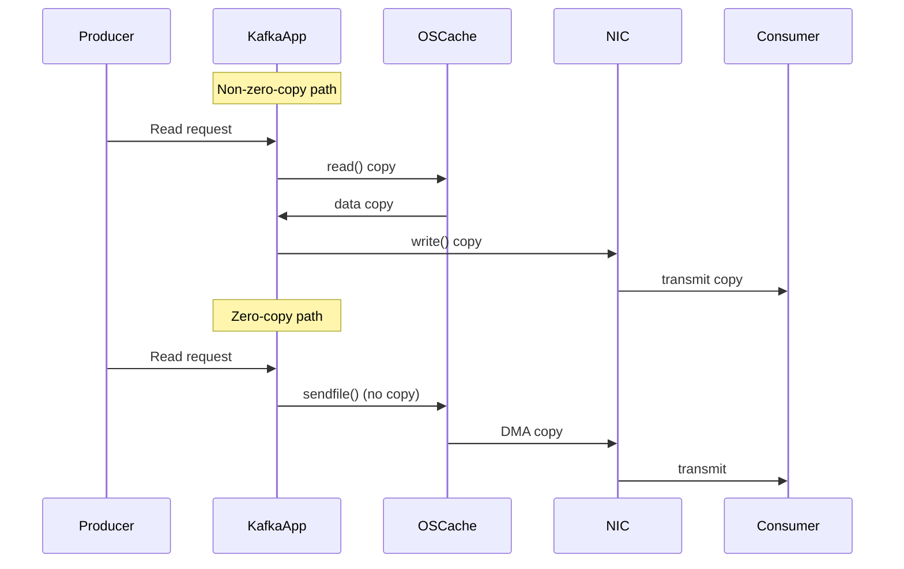

> Summary of [System Design: Why is Kafka fast?](https://www.youtube.com/watch?v=UNUz1-msbOM)
> from **ByteByteGo** · Published 2022-06-29 · Views: 1,231,856

*This note was generated automatically from the video transcript.*

## TL;DR
Kafka’s speed comes from two core design choices: using an **append‑only log** to guarantee sequential disk I/O, and leveraging the **zero‑copy** system‑call path (e.g., `sendfile()`) to move data from disk to the network with a single memory copy.

## Key Insights
- **Sequential I/O vs. random I/O:** Sequential writes on HDD arrays achieve *hundreds of MB/s*, while random writes drop to *hundreds of KB/s* – a difference of three orders of magnitude.  
- **Append‑only log:** Kafka stores records in a single, ever‑growing file per partition, ensuring every write is sequential.  
- **Cost‑effective storage:** HDDs cost ~⅓ of SSDs and provide ~3× the capacity, enabling long‑term retention without sacrificing throughput.  
- **Zero‑copy data path:** With `sendfile()`, Kafka copies data only once (OS cache → NIC buffer), eliminating multiple user‑space copies.  
- **DMA offloads copy work:** Modern NICs move data from memory to the wire via Direct Memory Access, freeing the CPU.  
- **Throughput focus:** Kafka optimizes for moving large volumes of data quickly, not for ultra‑low latency per‑message.  

## Detailed Breakdown

### 1. What “fast” means for Kafka
Kafka is marketed as “fast” primarily in terms of **throughput**—the ability to move massive amounts of data (records) per second. The analogy used is a wide pipe: a larger diameter (higher throughput) moves more liquid (data) than a narrow one, regardless of the speed of the flow.

### 2. Sequential I/O – the foundation
- **Disk access patterns:**  
  - *Random I/O* → arm of HDD moves to different tracks → high latency, low bandwidth.  
  - *Sequential I/O* → arm stays on a contiguous track → high bandwidth.  
- **Performance numbers (modern HDD arrays):**  
  - Sequential writes: **≈ hundreds MB/s**.  
  - Random writes: **≈ hundreds KB/s**.  
- **Kafka’s data structure:** An **append‑only log** per partition. New records are always written to the *end* of the file, guaranteeing sequential writes.  

- **Economic advantage:** HDDs are ~⅓ the price of SSDs and provide ~3× the capacity, allowing Kafka clusters to retain large volumes of data cheaply while still achieving high throughput.

### 3. Zero‑copy – minimizing data movement
#### 3.1 Non‑zero‑copy path (inefficient)
1. Disk → OS page cache.  
2. OS cache → Kafka user‑space buffer (copy).  
3. Kafka buffer → socket buffer (copy).  
4. Socket buffer → NIC buffer (copy).  
5. NIC transmits over the network.  

Result: **4 copies** + **2 system calls**.

#### 3.2 Zero‑copy path (efficient)
1. Disk → OS page cache (same as above).  
2. Kafka invokes `sendfile()` → kernel copies directly from OS cache to NIC buffer.  
3. NIC DMA transfers data to the wire (CPU not involved).  

Result: **1 copy** + **1 system call**.

- **DMA (Direct Memory Access):** The NIC reads data directly from memory without CPU intervention, further reducing CPU load and latency.

### 4. Why these two choices dominate
- **Sequential I/O** maximizes disk bandwidth, allowing Kafka to ingest and retain massive streams on inexpensive hardware.  
- **Zero‑copy** eliminates unnecessary memory copies, freeing CPU cycles for handling more connections or processing more messages.  
Together, they give Kafka its hallmark high‑throughput capability while keeping hardware costs low.

## Trade‑offs and Gotchas
- **Latency vs. throughput:** Kafka’s design favors bulk data movement; per‑message latency can be higher than systems optimized for low‑latency (e.g., in‑memory queues).  
- **Hardware dependence:** The sequential‑I/O advantage shrinks on pure SSD deployments where random I/O is much faster; however, cost considerations still favor HDDs for large retention.  
- **Zero‑copy limitations:** `sendfile()` works only for file‑based data; custom serialization or compression that requires transformation in user space may break the zero‑copy path.  
- **Operating‑system support:** Zero‑copy relies on OS kernels that implement `sendfile()` efficiently; older kernels may not provide the same benefit.  
- **Back‑pressure handling:** Because Kafka can ingest data extremely fast, producers must respect broker back‑pressure; otherwise, disk usage can balloon.  

## Takeaways
- **Design for sequential writes:** Use an append‑only log to keep disk I/O strictly sequential and reap 1000× bandwidth gains over random writes.  
- **Leverage zero‑copy APIs:** `sendfile()` (or equivalents) reduces memory copies and CPU overhead when moving data from disk to network.  
- **Choose storage wisely:** HDDs give a cost‑effective way to store petabytes while still delivering high throughput thanks to sequential I/O.  
- **Expect trade‑offs:** High throughput comes at the expense of per‑message latency and may require careful producer throttling.  
- **Modern NICs matter:** DMA offloading is essential to fully realize zero‑copy benefits; ensure your hardware supports it.

## Glossary
- **Sequential I/O:** Disk operations that read or write data in a contiguous order, minimizing seek time.  
- **Append‑only log:** A file where new records are always added at the end, never overwritten in place.  
- **Zero‑copy:** A technique where data is transferred between kernel buffers and the network interface without intermediate copies in user space.  
- **`sendfile()`:** A Unix system call that moves data directly from a file descriptor to a socket descriptor within the kernel.  
- **DMA (Direct Memory Access):** A hardware feature that allows devices (e.g., NICs) to read/write memory without CPU intervention.

## Full Transcript

Click to expand the raw transcript

Why is Kafka fast? What is the secret? We'll talk about it in this video. Let's dive right in. We'll first start by acknowledging that the term fast is ambiguous. What does it even mean that Kafka is fast? Are we talking latency? Are we talking throughput? It is fast compared to what? Kafka is optimized for high throughput. It is designed to move a large number of records in a short amount of time. Think of it as a very large pipe moving liquid. The bigger the diameter of the pipe, the larger the volume of liquid that can move through it. So when someone says Kafka is fast, they usually refer to Kafka's ability to move a lot of data efficiently. What are some of the design decisions that help Kafka move a lot of data quickly? There are many design decisions that contributed to Kafka's performance. In this video, we'll focus on two. We think these two carry the most weight. The first one is Kafka's reliance on sequential I/O. What is sequential I/O? Let's dig deeper into that. There's a common misconception that disk access is slow compared to memory access, but this largely depends on data access patterns. There are two types of disk access patterns - random and sequential. For hard drives it takes time to physically move the arm to different locations on the magnetic disks. This is what makes random access slow. For sequential access, though, since your arm doesn't need to jump around, it is much faster to read and write blocks of data one after the other. Kafka takes advantage of this by using an append-only log as its primary data structure. An append-only log adds new data to the end of the file. This access pattern is sequential. Now let's bring this idea home with some numbers. On modern hardware with an array of these hard disks, sequential writes reach hundreds of megabytes per second, while random writes are measured in hundreds of kilobyte per second. Sequential access is several order of magnitude faster. Using hard disks has its cost advantage, too. Compared to SSD, hard disks come at one-third of the price but with about three times the capacity. Giving Kafka a large pool of cheap disk space without any performance penalty means that Kafka can cost effectively retain messages for a long period of time, a feature that was uncommon to messaging systems before Kafka. The second design choice that gives Kafka its performance advantage is its focus on efficiency. Kafka moves a lot of data from network to disk, and from disk to network. It is critically important to eliminate excess copy when moving pages and pages of data between the disk and the network. This is where zero copy principle comes into the picture. Modern unix operating systems are highly optimized to transfer data from disk to network without copying data excessively. Let's dive deeper to see how this is done. First we look at how Kafka sends a page of data on disk to the consumer when zero copy is not used at all. First the data is loaded from disk to the OS cache. Second the data is copied from the OS cache into the Kafka application. Third the data is copied from Kafka to the socket buffer. And fourth the data is copied from the socket buffer to the network interface card buffer. And finally, the data is sent over the network to the consumer. Now this is clearly inefficient. There are four copies and two system calls. Now let's compare this to zero copy. The first step is the same. The data page is loaded from the disk to the OS cache. With zero copy, the Kafka application uses a system call called sendfile() to tell the operating system to directly copy the data from the OS cache to the network interface card buffer. In this optimized path, the only copy is from the OS cache into the network card buffer. With a modern network card, this copying is done with DMA. DMA stands for direct memory access. When DMA is used the cpu is not involved, making it even more efficient. To recap, sequential I/O and zero copy principle are the cornerstone to Kafka's high performance. Kafka uses other techniques to squeeze every ounce of performance out of modern hardware, but these two are the most important in our view. If you'd like to learn more about system design, check out our books and weekly newsletter. Please subscribe if you learned something new. Thank you so much, and we'll see you next time.

