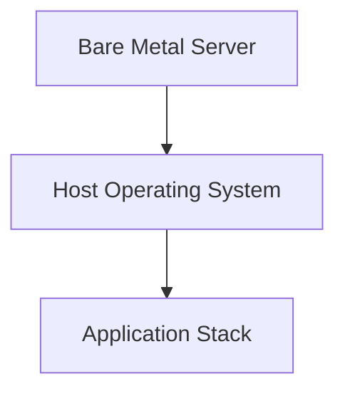
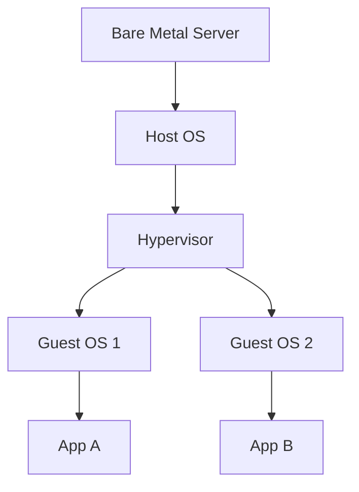
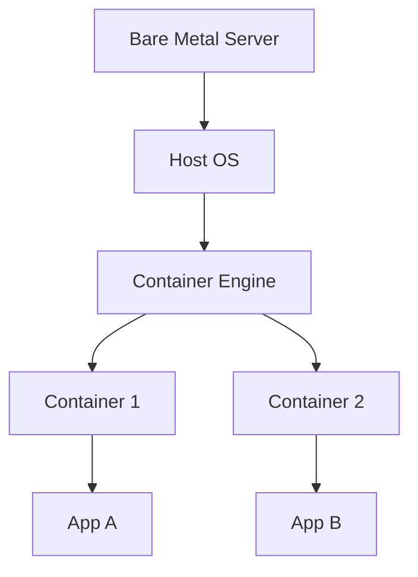

> Summary of [Big Misconceptions about Bare Metal, Virtual Machines, and Containers](https://www.youtube.com/watch?v=Jz8Gs4UHTO8)
> from **ByteByteGo** · Published 2022-07-14 · Views: 267,852

*This note was generated automatically from the video transcript.*

## TL;DR
Bare metal offers maximum performance and isolation but is costly and hard to scale; virtual machines provide flexible sizing and better utilization with moderate isolation; containers give the highest density and speed at the expense of weaker OS‑level security.

## Key Insights
- **Bare metal** guarantees physical isolation, eliminating noisy‑neighbor effects and side‑channel attacks, but incurs high CAPEX, management overhead, and slow provisioning.  
- **Virtual machines** run on a hypervisor (type‑1 “bare metal” or type‑2 on a host OS), enabling multiple guest OSes, dynamic sizing, and live migration, yet still suffer from noisy neighbors and CPU‑level side‑channel risks.  
- **Containers** virtualize the OS via a container engine, delivering rapid start‑up, higher density, and portability, while relying on OS‑level isolation that is comparatively less secure.  
- **Hybrid approaches** (containers inside VMs) balance security and flexibility by adding an extra isolation layer.  
- **Trade‑off mindset**: no solution is universally optimal; choose based on performance, security, cost, and operational agility requirements.

## Detailed Breakdown

### 1. Bare Metal
- **Definition**: A single‑tenant physical server with no virtualization layer.  
- **Advantages**  
  - *Performance*: Direct hardware access; ideal for workloads demanding the absolute highest compute or I/O throughput.  
  - *Isolation*: No noisy‑neighbor contention; each tenant owns the entire CPU, memory, and storage.  
  - *Security*: Immune to hypervisor‑related side‑channel attacks (e.g., Spectre, Meltdown) because there is no shared CPU state across tenants.  
- **Typical Use‑Cases**: High‑frequency trading, large‑scale databases, workloads with strict compliance (e.g., PCI‑DSS, HIPAA) where regulatory bodies may mandate physical isolation.  
- **Drawbacks**  
  - Expensive CAPEX and OPEX.  
  - Slow to provision – hardware procurement and rack‑up can take weeks.  
  - Requires skilled ops teams for firmware, OS, and hardware lifecycle management.  

### 2. Virtual Machines (VMs)
- **Architecture**  
  - *Host OS* runs on bare metal.  
  - *Hypervisor* (VM monitor) sits on top of the host OS (type‑2) or directly on hardware (type‑1 “bare metal hypervisor”).  
  - Each VM contains its own *guest OS* and applications.  
- **Types of Hypervisors**  
  - **Bare‑metal hypervisor** (e.g., VMware ESXi, Microsoft Hyper‑V) – controls hardware directly, offering higher performance but requiring more expensive, virtualization‑ready CPUs.  
  - **Hosted hypervisor** (e.g., VirtualBox, VMware Workstation) – runs as a process on a host OS, easier to set up but with extra overhead.  
- **Benefits**  
  - *Resource Utilization*: Multiple VMs share the same physical server, achieving higher overall CPU/memory usage.  
  - *Scalability*: Resize VMs (CPU, RAM) on demand; live‑migration moves a running VM to another host without downtime.  
  - *Flexibility*: Supports heterogeneous guest OSes (Linux, Windows) on the same hardware.  
- **Performance Spectrum**  
  - General‑purpose VMs: a few vCPUs, a few GB RAM.  
  - High‑performance VMs: hundreds of vCPUs, terabytes of RAM.  
- **Downsides**  
  - *Noisy Neighbor*: Co‑located VMs compete for shared CPU caches and memory bandwidth, potentially degrading performance.  
  - *Side‑Channel Vulnerabilities*: Same physical cores expose attacks like Spectre/Meltdown across VM boundaries.  

### 3. Containers
- **Architecture**  
  - Runs directly on the host OS; the *container engine* (e.g., Docker, containerd) provides OS‑level isolation via namespaces and cgroups.  
  - Each container bundles the application binary plus its runtime dependencies (libraries, frameworks).  
- **Key Characteristics**  
  - *Lightweight*: No guest OS per container; containers are just isolated processes.  
  - *Fast Provisioning*: Startup times measured in seconds or milliseconds versus minutes for VMs.  
  - *Density*: A single bare‑metal server can host many more containers than VMs (often 10‑100× more, depending on workload).  
  - *Portability*: Identical container images run unchanged across development, test, and production environments.  
- **Security Considerations**  
  - Shared kernel means a compromised container could potentially affect the host or sibling containers via kernel exploits.  
  - OS‑level primitives (namespaces, cgroups) provide weaker isolation than hardware‑enforced VM boundaries.  
- **Hybrid Model**: Deploying containers inside VMs adds a hypervisor layer, reducing the attack surface at the cost of extra resource overhead.  

### 4. Choosing Between the Three
| Criterion | Bare Metal | Virtual Machines | Containers |
|-----------|------------|------------------|------------|
| **Performance** | Highest (no abstraction) | Near‑bare‑metal (depends on hypervisor) | Slightly lower (shared kernel) |
| **Isolation** | Physical (strongest) | Hypervisor‑level (good) | OS‑level (weaker) |
| **Cost & Utilization** | Low utilization, high cost | High utilization, moderate cost | Highest utilization, lowest cost |
| **Scalability** | Slow (hardware procurement) | Fast (dynamic sizing, live‑migration) | Very fast (instant start) |
| **Portability** | Low (hardware‑specific) | Moderate (VM images) | High (container images) |
| **Typical Use‑Case** | Latency‑sensitive, regulated workloads | Mixed OS environments, legacy apps | Micro‑services, CI/CD pipelines |

### 5. Beyond Containers: Serverless & Edge
- The video briefly mentions serverless and edge computing as the next abstraction layers, offering even higher developer productivity but introducing new trade‑offs (cold start latency, vendor lock‑in, limited control over underlying resources).  

## Trade-offs and Gotchas
- **Performance vs. Cost**: Bare metal gives raw speed but wastes idle cycles; VMs and containers improve utilization but add abstraction overhead.  
- **Security vs. Flexibility**: Physical isolation (bare metal) > VM isolation > container isolation; adding a VM layer around containers improves security but reduces density.  
- **Noisy Neighbor**: Present in both VMs and containers when sharing CPU caches or memory bandwidth; mitigated by resource quotas, CPU pinning, or dedicated hardware.  
- **Side‑Channel Attacks**: Spectre/Meltdown affect any multi‑tenant environment sharing CPU cores; bare metal eliminates cross‑tenant exposure, VMs and containers remain vulnerable.  
- **Management Complexity**: Bare metal requires hardware lifecycle ops; VMs need hypervisor management; containers need orchestration (K8s) and image hygiene.  
- **Live Migration Limits**: VMs can be live‑migrated; containers typically require restart unless using advanced tools (e.g., CRIU), which may not be production‑ready.  

## Takeaways
- **Match the abstraction to the requirement**: Use bare metal for ultra‑high performance or strict compliance; VMs for mixed‑OS workloads and moderate isolation; containers for rapid scaling and micro‑service architectures.  
- **Hybrid layering is a practical compromise**: Running containers inside VMs gives you the security of VM isolation with the agility of containers.  
- **Always account for noisy‑neighbor and side‑channel risks** when co‑locating workloads; apply CPU pinning, resource limits, or dedicated hardware as needed.  
- **Operational overhead matters**: Consider team expertise and tooling (hypervisor management vs. container orchestration) when choosing.  
- **Future‑proofing**: Keep an eye on serverless/edge trends, but remember they inherit the same underlying trade‑offs of the layer they abstract.

## Glossary
- **Bare Metal**: Physical server hardware dedicated to a single tenant, with no virtualization layer.  
- **Hypervisor**: Software that creates and manages virtual machines; can be type‑1 (bare‑metal) or type‑2 (hosted).  
- **Bare‑Metal Hypervisor**: Hypervisor that runs directly on hardware without a host OS, offering higher performance.  
- **Virtual Machine (VM)**: Emulated computer system with its own guest OS, running on top of a hypervisor.  
- **Noisy Neighbor**: Performance degradation caused by another tenant consuming disproportionate shared resources.  
- **Side‑Channel Attack**: Exploits that infer secret data by observing indirect effects (e.g., cache timing) across shared CPU cores.  
- **Container**: Lightweight, OS‑level isolated runtime environment that packages an app and its dependencies.  
- **Container Engine**: Runtime that implements OS‑level isolation (e.g., Docker, containerd).  
- **Namespaces & Cgroups**: Linux kernel features used by containers to isolate process IDs, network, and limit resource usage.  
- **Live Migration**: Moving a running VM from one physical host to another without shutting it down.  
- **Serverless**: Execution model where developers write functions that run on-demand in a managed environment, abstracting away servers.

## Full Transcript

Click to expand the raw transcript

Hi. Welcome to another system design video.What are the differences between bare metal,virtual machines, and containers?When deploying a modern application stack,how do we decide which one to use?In this video, we’ll take a closer look at each of these.Let’s dive right in.The granddaddy of these is bare metal.A bare metal server is a physical computerthat is a single tenant only.Once upon a time, all servers were bare metal.Bare metal gives us complete controlover the hardware resourcesand the software stack to run.For software applications that require the absolutehighest performance from the hardware,bare metal could be a good way to go.Bare metal servers are physically isolated.The isolation provides two benefits:First, it is not affected by the noisy neighbor problem.This problem occurs when one tenant's performanceis impacted because of the activitiesof another tenant sharing the same hardware.Second, the isolation provides the highest level of security.For example, it is not affected by side-channel attacks.These attacks take advantage of the design flawsin modern microprocessors to allow a malicious tenantto steal secrets from its neighbors.This strong security guaranteeis another reason to use bare metal.When an application needs to meet the most stringentsecurity, compliance, or regulatory requirements,bare metal could sometimes be the only way to go.What are the downsides of bare metal?Bare metal is expensive, hard to manage,and hard to scale.Acquiring new hardware takes time,and it takes a competent team to manage them well.Next up is Virtual Machines.A virtual machine is the emulation of a physical computer.This is called virtualization.Many virtual machines can run ona single piece of bare metal hardware.On top of the bare metal hardwareis the host operating system.Running on top of the host operating systemis a special piece of software called a hypervisor.This is also known as a virtual machine monitor.The hypervisor manages virtual machines.It creates an abstraction layer over the hardwareso that multiple operating systems can runalongside each other.Each virtual machine has its own guest operating system.On top of each guest operating systemruns the applications for a tenant.As a side note:There is a concept called bare metal hypervisor,not to be confused with bare metal hardware.A bare metal hypervisor controls the hardware directlywithout relying on the host operating system.This gives the hypervisor full controlover the hardware and provides higher performance.However, hardware that supports the bare metal hypervisoris more expensive.Virtual machines have come a long wayin performance and scale.These days we can choose virtual machines ofpretty much any size to fit our workloads,from general purpose ones with just a few cpu coresand a few GBs of memory,to high-performance ones with hundreds of coresand terabytes of memory.What are the benefits of virtual machines?Virtual machines are cheaper to run.Many of them can share the same hardware,allowing much higher resource utilization.They are easier to scale, too.This provides an organization more flexibility.Scaling up virtual machines is easier.Some fancy virtualization software can even movea running virtual machine from one bare metalhardware to anotherwithout shutting down the virtual machine.What are some of the downsides to virtual machines?Virtual machines could be vulnerableto the noisy neighbor problem described earlier.If our application co-locates with a resource hog of a neighbor,our own application performance could suffer.Also, virtual machines running on the samebare metal hardware share the same physical CPU cores.They are vulnerable to attacks that aim at design flawsin modern processors.Side-channel attacks like Meltdown and Spectreare some well-known examples.Next up - Containers.A container is a lightweight and standalone packageof an application with all its dependencieslike libraries, frameworks, and runtime.Containerization is considered to be a lightweight versionof virtualization.Like virtualization, here we have bare metal hardwareand the host operating system.But instead of virtualizing the hardware with a hypervisor,we virtualize the operating system itselfwith a piece of special software called the container engine.On top of the container engine runs many containers.Each of these is its own application environmentisolated from each other.The container engine provides even fasterresource provisioning.And all the resources needed to run the applicationare packaged together,so that the applications can run anywhere.Containers are scalable and portable.They are lightweight and require less hardware resourcesto run than virtual machines.A bare metal server can host significantlymore containers than virtual machines.Since each container runsas a native process of the host operating system,they are much faster to start, too.All these make containers even easier to deployand maintain at scale.However, containers are potentially less secure.They share the same underlying operating system,and the isolation relies on the OS-level primitives.This means containersare exposed to a wider class of security vulnerabilitiesat the operating system level.It is possible to run containers inside virtual machines.Why would we want to do that?One reason is that it provides better securityby reducing the possible attack surfaces.This is a tradeoff between flexibility and security.What comes after containers?Serverless and edge computing come to mind.They make the developer productivityand deployment stories even more compelling,but with their own sets of tradeoffs.We might look into these in another video.In conclusion, system design is about tradeoffs.It is no different when it comes to bare metal,virtual machines, and containers.There is no single right answer.If you would like to learn more about system design, check out our books and weekly newsletter.Please subscribe if you learned something new.Thank you so much, and we’ll see you next time.

