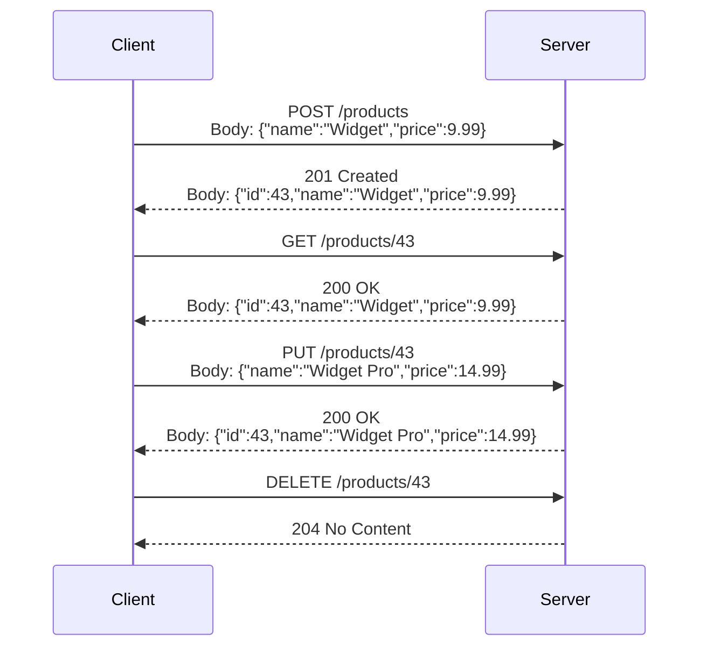
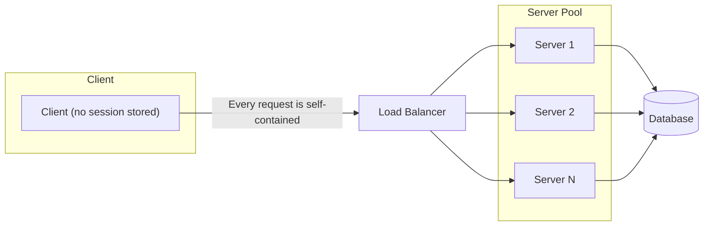

> Summary of [What Is REST API? Examples And How To Use It: Crash Course System Design #3](https://www.youtube.com/watch?v=-mN3VyJuCjM)
> from **ByteByteGo** · Published 2022-08-24 · Views: 1,421,795

*This note was generated automatically from the video transcript.*

## TL;DR

REST (REpresentational State Transfer) is a set of architectural conventions—not a formal specification—that has dominated web API design since the early 2000s. It organizes resources behind unique URIs, maps HTTP verbs to CRUD operations, enforces statelessness, and relies on standard HTTP status codes, making it simple, scalable, and "good enough" for the vast majority of web and mobile backends.

## Key Insights

- REST is **not a specification**; it is a set of conventions that became the de facto standard for web APIs in the early 2000s.
- Resources must be identified by **nouns** in the URI (e.g., `/products`), never by verbs (e.g., `/getAllProducts`).
- The four HTTP verbs—**GET, POST, PUT, DELETE**—map directly to the CRUD operations (Read, Create, Update, Delete).
- **Statelessness** is the critical architectural property: neither client nor server stores session context between requests, which is what makes horizontal scaling straightforward.
- **Idempotency** determines whether a failed request can be safely retried; POST (create) is typically *not* idempotent, while GET, PUT, and DELETE are.
- HTTP status codes follow a three-band convention: **2xx** (success), **4xx** (client error), **5xx** (server error), and a well-behaved client may retry only on 5xx.
- Two practical completeness features round out a well-behaved REST API: **pagination** (`limit`/`offset` query params) and **URI versioning** (e.g., `/v1/products`).

## Detailed Breakdown

### What REST Is (and Is Not)

The video opens by clarifying a common misconception: REST is **not a formal specification** like SOAP or gRPC. It is a *set of rules and conventions* that became the common standard for building web APIs starting in the early 2000s. An API that follows these conventions is called a **RESTful API**. Real-world examples cited are **Twilio**, **Stripe**, and **Google Maps**.

The name itself—**REpresentational State Transfer**—describes the core idea: the client manipulates *representations* of server-side *resources* by *transferring* state (data) over HTTP.

### Resources and URIs

A RESTful API organizes all data as **resources**, each addressed by a unique **URI** (Uniform Resource Identifier). The URI path differentiates resource types:

| Resource | URI |
|----------|-----|
| All products | `/products` |
| A single product | `/products/42` |
| Orders for a user | `/users/7/orders` |

A critical rule: **group by noun, not verb**. The endpoint to fetch all products is `/products`, *not* `/getAllProducts`. The *action* is conveyed by the HTTP verb, not the path.

### HTTP Verbs and CRUD

A client interacts with a resource by sending an HTTP request. The request line contains the **HTTP verb** followed by the **URI**:

```
GET /products/42 HTTP/1.1
POST /products HTTP/1.1
PUT /products/42 HTTP/1.1
DELETE /products/42 HTTP/1.1
```

The four verbs map to CRUD:

| Verb | CRUD | Purpose |
|------|------|---------|
| **GET** | Read | Fetch data about an existing resource |
| **POST** | Create | Create a new resource |
| **PUT** | Update | Update (replace) an existing resource |
| **DELETE** | Delete | Remove an existing resource |

The request may include an **optional body** containing a custom payload, typically encoded in **JSON**. For example, a `POST /products` body might be `{"name": "Widget", "price": 9.99}`.



### HTTP Status Codes

The first line of the server's response carries an **HTTP status code** that tells the client what happened:

- **2xx** – Request succeeded (e.g., `200 OK`, `201 Created`, `204 No Content`).
- **4xx** – Client-side error (e.g., `400 Bad Request` for malformed syntax, `404 Not Found`).
- **5xx** – Server-side error (e.g., `503 Service Unavailable`).

A well-behaved client **may retry** a request that returned a 5xx code. However, the video stresses the word *may*: retrying is only safe when the operation is **idempotent**.

### Idempotency

An API operation is **idempotent** when making *n* identical requests has the same effect as making a *single* request.

- **GET, PUT, DELETE** are idempotent by design.
- **POST** (create) is generally **not** idempotent: sending the same `POST /products` twice creates two resources.

This distinction matters for retry logic. If a `POST` times out and the client blindly retries, it may create a duplicate. The video does not go into specific mitigation strategies (e.g., idempotency keys), but flags the risk explicitly.

### Statelessness

The video calls statelessness a **"critical attribute"** of REST. It means:

- Neither the client nor the server stores any session or conversation state between requests.
- Every request–response cycle is **fully independent** of all others.
- Each request must carry all information the server needs (e.g., authentication tokens in headers).

The practical payoff: because no single server holds session state, you can place a **load balancer** in front of any number of identical server instances and route each request to whichever instance is free. This is what makes web applications **easy to scale horizontally** and "well behaved."



### Pagination

When an endpoint can return a very large collection (e.g., `GET /products` with millions of rows), the API should support **pagination**. The video describes the common **limit/offset** scheme:

```
GET /products?limit=20&offset=40
```

- `limit` – maximum number of items to return.
- `offset` – number of items to skip (i.e., start from the 41st item).

If the client omits these parameters, the server should apply **sensible defaults** (the video does not specify exact defaults, but the convention is to cap the page size to avoid unbounded responses).

### API Versioning

The video identifies **versioning** as essential for backward compatibility. When a breaking change is introduced, consumers need time to migrate. The most straightforward versioning strategy is to **prefix the version in the URI**:

```
/v1/products
/v2/products
```

This lets `/v1/` and `/v2/` coexist, so existing clients keep working while new clients adopt the updated contract. The video notes there are "many ways to version an API" but does not enumerate alternatives (header-based versioning, query-parameter versioning, etc.).

### Positioning Among API Styles

The video closes by acknowledging that REST "may not be the best choice for all companies," but its **simplicity** is precisely why it is so widely adopted. It briefly names **GraphQL** and **gRPC** as other popular API options, deferring a detailed comparison to separate videos.

## Trade-offs and Gotchas

- **POST is not idempotent.** Blindly retrying a timed-out POST can create duplicate resources. Extra care (e.g., client-generated idempotency keys) is needed, though the video does not detail a specific mechanism.
- **Statelessness eliminates server-side session memory.** This simplifies scaling but pushes all context (auth tokens, user preferences) into every request, increasing payload size and requiring the client to manage its own state.
- **Noun-only URIs can be awkward** for operations that don't map cleanly to CRUD (e.g., "cancel an order"). The video does not discuss sub-resource or action-URI workarounds.
- **Pagination via limit/offset** can become slow on very large datasets because the server must skip `offset` rows on every page. Cursor-based pagination is a common alternative, but it is not mentioned in the video.
- **URI versioning (`/v1/`, `/v2/`)** is simple but can lead to combinatorial explosion if many versions must be supported simultaneously. The video acknowledges "many ways to version" without elaborating.
- **REST is a convention, not a spec.** There is no formal compliance test; two teams can both call their APIs "RESTful" while making very different design choices.
- **Not a one-size-fits-all solution.** The video explicitly states REST "may not be the best choice for all companies," pointing to GraphQL and gRPC as alternatives for different use cases.

## Takeaways

- Model your API around **nouns** (resources) in the URI and let **HTTP verbs** carry the action. Avoid verb-laden paths like `/getAllProducts`.
- Return **correct HTTP status codes** (2xx / 4xx / 5xx) so clients can implement proper error handling and retry logic.
- Keep your API **stateless**: every request must be self-contained. This is the single property that makes horizontal scaling trivial.
- Always support **pagination** (`limit`/`offset` with sensible defaults) on list endpoints and **version** your API in the URI (`/v1/...`) to protect consumers from breaking changes.
- Before reaching for REST, consider whether **GraphQL** (flexible querying) or **gRPC** (high-performance, typed contracts) better fits your latency, payload, or client-diversity requirements.

## Glossary

- **REST (REpresentational State Transfer):** An architectural style for distributed systems where clients manipulate representations of server-side resources via HTTP; not a formal specification.
- **URI (Uniform Resource Identifier):** A string that uniquely identifies a resource on a server, e.g., `/products/42`.
- **CRUD:** Create, Read, Update, Delete—the four fundamental data-manipulation operations mapped to POST, GET, PUT, DELETE.
- **Idempotent:** A property of an operation where repeating the same request any number of times yields the same result as a single execution.
- **Stateless:** An architectural property where neither client nor server retains session context between requests; each request is independent.
- **Pagination:** A technique of splitting a large result set into smaller pages, commonly via `limit` (page size) and `offset` (starting position) query parameters.
- **API Versioning:** The practice of exposing multiple, coexisting versions of an API contract so that breaking changes do not immediately break existing consumers.
- **GraphQL:** A query language for APIs (by Facebook/Meta) that lets clients request exactly the fields they need in a single endpoint.
- **gRPC:** Google's high-performance RPC framework using HTTP/2 and Protocol Buffers for typed, binary-serialized contracts.

## Full Transcript

<details>
<summary>Click to expand the raw transcript</summary>

REST is the most common communication standard between computers over Internet. What is it? Why is it so popular? Let's take a look. API stands for Application Programming Interface. It is a way for two computers to talk to each other. The common API standard used by most mobile and web applications to talk to the servers is called REST. It stands for REpresentational State Transfer. It is a mouthful. What does that mean? REST is not a specification. It is a new set of rules that has been the common standard for building web API since the early 2000s. An API that follows the REST standard is called a RESTful API. Some real-life examples are Twilio, Stripe and Google Maps. Let's look at the basics of REST. A RESTful API organizes resources into a set of unique URIs, or Uniform Resource Identifiers. The URIs differentiate different types of resources on a server. Here are some examples. The resources should be grouped by noun and not verb. An API to get all products should be slash products and not slash getAllProducts. A client interacts with a resource by making a request to the endpoint for the resource over HTTP. The request has a very specific format, as shown here. The line contains the URI for the resource we'd like to access. The URI is preceded by an HTTP verb which tells the server what we want to do with the resource. A POST request means we want to create a new resource. A GET means we want to read the data about an existing resource. A PUT is for updating an existing resource. A DELETE is for removing an existing resource. You might have heard the acronym CRUD. This is what it stands for. In the body of these requests, there could be an optional HTTP request body that contains a custom payload of data, usually encoded in JSON. The server receives a request, processes it, and formats the result into a response. The first line of the response contains the HTTP status code to tell the client what happened to the request. A well-implemented RESTful API returns proper HTTP status codes. The 200-level codes mean the request was successful. The 400-level codes means something was wrong with our request. For example the requests contain incorrect syntax. At the 500- level, it means something went wrong at the server level. For example, the service was unavailable. A well-behaved client could choose to retry a failed request with a 500-level status code. We said "could choose to retry" because some actions are not idempotent, and those require extra care when retrying. When an API is idempotent, making multiple identical requests has the same effect as making a single request. This is usually not the case for a POST request to create a new resource. The response body is optional and could contain the data payload and is usually formatted in JSON. There's a critical attribute of REST that is worth discussing more. A REST implementation should be stateless. It means the two parties don't need to store any information about each other, and every request and response (cycle) is independent from all others. This leads to web applications that are easy to scale and well behaved. There are two final points to discuss to round out a well-behaved RESTful API. If an API endpoint returns a huge amount of data, use pagination. A common pagination scheme uses "limit" and "offset" as parameters. Here is an example. If they are not specified, the server should assume sensible default values. Lastly, versioning of an API is very important. Versioning allows an implementation to provide backward compatibility, so that if we introduce breaking changes from one version to another, consumers can get enough time to move to the next version. There are many ways to version an API. The most straightforward is to prefix the version before the resource on the URI. For instance, like this.RESTful API is simple and effective when applied sensibly. It may not be the best choice for all companies, but it is simple and good enough, and that's why it is so widely used. There are other popular API options like GraphQL and gRPC. We'll discuss those and compare them in separate videos. If you would like to learn more about system design, check out our books and weekly newsletter. Please subscribe if you learned something new. Thank you so much, and we'll see you next time.

</details>
