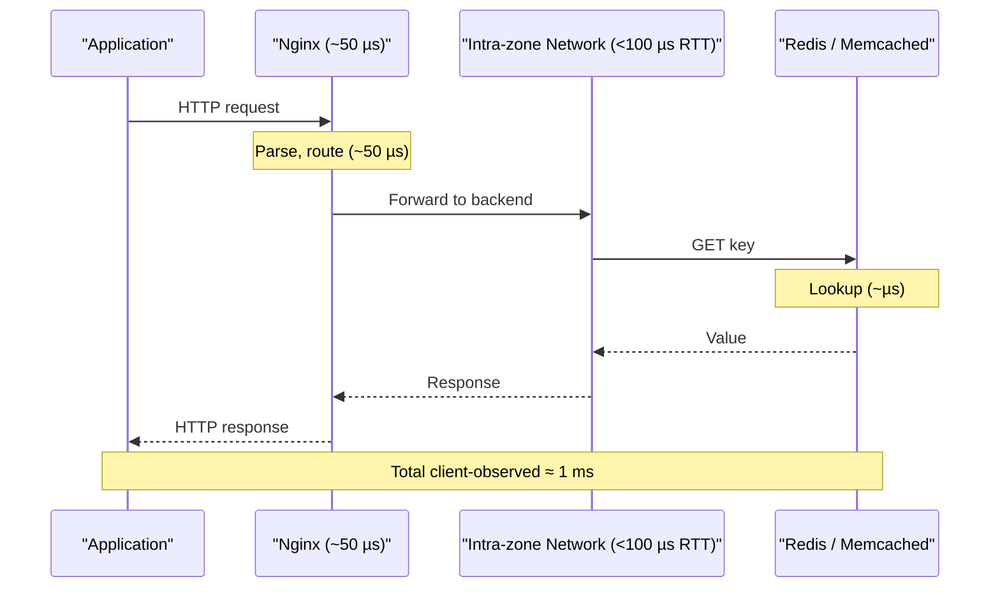
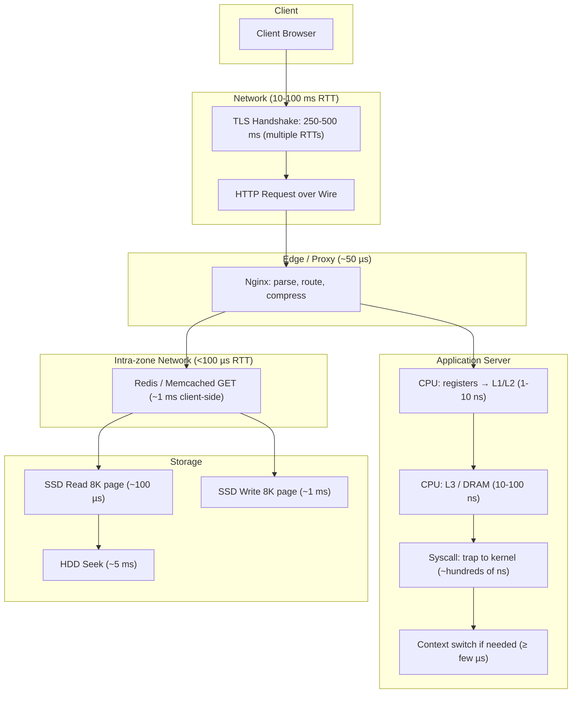

> Summary of [Latency Numbers Programmer Should Know: Crash Course System Design #1](https://www.youtube.com/watch?v=FqR5vESuKe0)
> from **ByteByteGo** · Published 2022-10-04 · Views: 370,012

*This note was generated automatically from the video transcript.*

## TL;DR

This video walks through a curated list of common latency numbers grouped by order of magnitude—from sub-nanosecond CPU register access up to multi-second network transfers—emphasizing that understanding the *relative* differences (orders of magnitude) matters far more than memorizing exact figures. The numbers have been updated for 2020s hardware and cloud infrastructure, and the goal is to build an engineer's intuition for where bottlenecks will appear in a system design.

## Key Insights

- **Relative magnitude over absolute value:** Knowing that L3 cache is ~100× slower than L1, or that main memory is hundreds of times slower than a register, is more practically useful than the exact nanosecond count.
- **Physics-bound vs. technology-bound latencies:** Network RTT between continents is constrained by the speed of light and stays roughly constant; disk seek times, by contrast, have dropped dramatically with SSD adoption.
- **System-call overhead is just the trap:** The several-hundred-nanosecond cost of a Linux syscall is only the kernel entry/exit; the actual work (e.g., a file read) adds on top.
- **SSD write is ~10× slower than SSD read:** An 8 K page read takes ~100 µs, but a write of the same page approaches 1 ms—a factor that directly affects database and cache write paths.
- **Intra-zone cloud RTT has dropped below 100 µs in many cases:** This 2020s update means a Redis/Memcached GET (~1 ms client-side) is dominated by the application and serialization layers, not just the network hop.
- **bcrypt is deliberately slow (~300 ms):** The cost is a feature—making each brute-force guess expensive enough to render offline cracking impractical.
- **TLS handshake adds multiple RTTs (250–500 ms):** Because it stacks several round trips, the total scales with geographic distance, making it a significant contributor to first-request latency.
- **Context-switch cost is a floor, not a ceiling:** A few microseconds is the best case; if the scheduler must page in data for the new thread, the cost can be orders of magnitude higher.

## Detailed Breakdown

### Why Latency Numbers Matter

The video opens by framing the goal: not to memorize a table, but to develop an *intuition* for how many orders of magnitude separate one operation from another. Two categories of numbers are called out:

- **Technology-dependent:** Disk seek time, cache sizes, and memory bandwidth shift as hardware evolves.
- **Physics-dependent:** Light-travel time between continents changes very slowly, so inter-continental RTT is relatively stable.

The numbers presented are updated for the 2020s (e.g., modern cloud intra-zone RTT, Apple M1 memory latency), but the author explicitly states that absolute accuracy is not the objective.

### Time-Unit Refresher

Before the table, the video anchors the units:

| Unit | Value |
|---|---|
| 1 nanosecond (ns) | 10⁻⁹ s |
| 1 microsecond (µs) | 10⁻⁶ s |
| 1 millisecond (ms) | 10⁻³ s |

### Sub-Nanosecond (< 1 ns)

- **CPU register access** – the fastest operation a processor can perform.
- **One CPU clock cycle** – on a modern 3–5 GHz CPU, a single cycle is roughly 0.2–0.3 ns.

There are very few registers (tens, not thousands), so this speed is available only for a tiny working set.

### 1 – 10 ns: L1 / L2 Cache & Expensive CPU Ops

- **L1 and L2 cache access** fall in this band.
- **Branch misprediction penalty** can cost up to ~20 CPU clock cycles, which at 3–5 GHz lands in the 4–7 ns range—still within this tier.

The practical takeaway: keeping your hot working set in L1/L2 avoids a 10–100× penalty versus registers.

### 10 – 100 ns: L3 Cache & Main Memory

- **L3 (last-level) cache access** sits at the *fast* end (~10–30 ns).
- **Main memory (DRAM) access** on a modern CPU (the video cites the Apple M1) sits at the *slow* end (~100 ns).
- The video stresses that main memory is **a few hundred times slower** than a CPU register access.

This gap is why cache hierarchy exists and why data-layout decisions (struct-of-arrays vs. array-of-structs, cache-line alignment) have measurable impact.

### 100 ns – 1 µs: System Calls & Small Hashes

- **Linux system call (trap only):** several hundred nanoseconds. The video is explicit that this is *just* the cost of trapping into the kernel and back; the work the syscall performs (e.g., `read()`, `write()`) is additional.
- **MD5 hash of a 64-bit number:** ~200 ns. A useful reference for how cheap a single small cryptographic hash is.

### 1 – 10 µs: Context Switches & Small Memory Copies

- **Context switch between Linux threads:** at least a few microseconds (best case). If the scheduler must fault in pages for the incoming thread, the cost can be significantly higher.
- **Copying 64 KB within main memory:** a few microseconds.

The video notes that at this tier, operations are roughly **1,000× slower** than a CPU register access.

### 10 – 100 µs: Proxy Processing, Memory Bandwidth, SSD Reads

- **Nginx processing a typical HTTP request:** ~50 µs.
- **Reading 1 MB sequentially from main memory:** ~50 µs.
- **SSD read latency (8 K page):** ~100 µs.

This is the first tier where "higher-level" operations (network proxies, storage I/O) enter the picture.

### 100 µs – 1 ms: SSD Writes, Intra-Zone Network, In-Memory Caches

- **SSD write latency:** ~1 ms, roughly **10× slower** than the read latency for the same 8 K page.
- **Intra-zone network round trip (modern cloud):** a few hundred microseconds; some providers now clock in **below 100 µs**. The video flags this as a 2020s update.
- **Memcached / Redis GET (client-measured):** ~1 ms, which *includes* the intra-zone network RTT above.

### 1 – 10 ms: Inter-Zone Network & HDD Seek

- **Inter-zone network round trip (modern cloud):** a few milliseconds.
- **HDD seek time:** ~5 ms (the mechanical arm must physically move).

The contrast between a 5 ms HDD seek and a 100 µs SSD read is a 50× difference and is a primary reason databases moved to SSD-backed storage.

### 10 – 100 ms: Cross-Continent Network & Large Memory Reads

- **Network RTT US East ↔ US West, or US East ↔ Europe:** tens of milliseconds.
- **Reading 1 GB sequentially from main memory:** falls in this range (on the order of 10–100 ms depending on bandwidth).

### 100 ms – 1 s: bcrypt, TLS, Long-Distance RTT, SSD Bulk Reads

- **bcrypt password hash:** ~300 ms. Intentionally slow to make brute-force cracking impractical.
- **TLS handshake:** 250–500 ms. It involves multiple network round trips (ClientHello, ServerHello, certificate exchange, key exchange, Finished), so the total scales with the RTT between the two endpoints.
- **Network RTT US West ↔ Singapore:** in this range.
- **Reading 1 GB sequentially from SSD:** also in this range.

### > 1 s: Large Network Transfers

- **Transferring 1 GB over the network within the same cloud region:** ~10 seconds.

This is the slowest number in the list and a reminder that bulk data movement is a fundamentally different problem from low-latency lookups.

### Putting It All Together: A Request Path

The following diagram shows a typical web request touching multiple latency tiers, illustrating why each layer's cost compounds:

## Trade-offs and Gotchas

- **System-call number is a floor, not a total:** The "several hundred ns" figure for a Linux syscall covers only the trap. A `read()` that must wait on disk I/O adds the storage latency on top.
- **Context-switch cost is workload-dependent:** The "a few microseconds" figure assumes the thread's pages are already resident. A cold thread that triggers page faults can take orders of magnitude longer.
- **SSD write vs. read asymmetry (≈10×):** Designing a write-heavy workload (e.g., a WAL, a streaming ingest) without accounting for this gap can surprise you. Reads look fast; writes are an order of magnitude slower.
- **Intra-zone RTT is not uniform:** The video notes some cloud providers now report <100 µs, but "a few hundred microseconds" is still the safer planning number. Cross-AZ or cross-region jumps to the next tier.
- **TLS handshake cost scales with distance:** At 250–500 ms for a typical handshake, a user on the US West coast connecting to a server in Singapore pays multiple long RTTs. Session resumption (TLS 1.3 1-RTT or 0-RTT) mitigates this but does not eliminate it.
- **bcrypt's 300 ms is a feature, not a bug:** If you are profiling authentication latency, do not "optimize" bcrypt. The cost is the security mechanism.
- **Absolute numbers shift; ratios are more stable:** Disk seek times have dropped from ~10 ms (2000s HDD) to ~100 µs (NVMe SSD). Network RTT between continents has barely moved. Anchor your intuition to the *ratio* (e.g., "memory is ~100× slower than L1") rather than the absolute value.
- **The 1 GB / 10 s network transfer is a reminder of bandwidth vs. latency:** A single 8 K read is 100 µs, but moving 1 GB is a throughput problem, not a latency problem. Conflating the two leads to wrong architectural choices.

## Takeaways

- **Memorize the orders of magnitude, not the digits.** "L1 is nanoseconds, DRAM is ~100 ns, SSD read is ~100 µs, SSD write is ~1 ms, HDD seek is ~5 ms, cross-continent RTT is ~100 ms, 1 GB over the network is ~10 s" is the mental model that pays off in design reviews.
- **Always account for the write path.** SSD writes are ~10× slower than reads; if your design is read-heavy it may look fine, but a write-heavy workload (replication, WAL, batch ingest) will hit that 10× wall.
- **Network hops compound.** A single intra-zone RTT is <100 µs, but a TLS handshake stacks 3–4 RTTs, and a cross-continent call stacks them at 100 ms each. Count your round trips before you count your CPU cycles.
- **System calls and context switches are cheap in isolation but add up.** Hundreds of nanoseconds per syscall is negligible for one call, but a tight loop making thousands of syscalls (e.g., `read()` in a loop instead of `readv()` or `io_uring`) multiplies that cost.
- **Use the numbers to sanity-check your architecture.** If your p99 latency budget is 50 ms and you are making three cross-AZ calls (each ~5 ms) plus a TLS handshake (250–500 ms on first connect), you already know where the budget goes before you write a line of code.

## Glossary

- **Branch misprediction penalty:** The number of CPU cycles wasted when the processor's branch predictor guesses the wrong direction for a conditional branch, requiring it to flush and re-execute the pipeline.
- **Intra-zone / Inter-zone:** Cloud terminology. A "zone" (or "availability zone") is an isolated datacenter within a region. Intra-zone means within the same zone; inter-zone means between zones in the same region.
- **TLS handshake:** The multi-message exchange (ClientHello → ServerHello → Certificate → Key Exchange → Finished) that establishes an encrypted channel. TLS 1.3 reduces this to 1 RTT for a full handshake and 0 RTT for resumption.
- **bcrypt:** A password-hashing function (based on Blowfish) with a configurable work factor. Its slowness is intentional: each guess in a brute-force attack costs ~300 ms, making large-scale offline cracking infeasible.
- **8 K page:** The typical read/write unit for SSD and block-level storage. An 8 K read/write is the smallest I/O the storage layer usually services.
- **WAL (Write-Ahead Log):** A logging technique where changes are written to a sequential log before being applied to the main data structure, ensuring durability. Write-heavy by nature, making SSD write latency a key constraint.

## Full Transcript

Click to expand the raw transcript

In this video, we hope to develop an intuition on some of the common latency numbers.They could be very useful in system design.It is not critical to know the exact numbers.Developing a sense of the relative orders of magnitude difference between these things is way more important.Some of these numbers like disk seek time have changed drastically as technology evolves, while others like network latency between countries stay pretty consistent because they have to obey the laws of physics.We updated some of these numbers to more closely reflect reality in the 2020s.But again, absolute accuracy is not the goal.Developing an intuition of the relative differences is.Here’s what we plan to do.We will group the latency numbers by order of magnitude, starting with sub-nanoseconds, all the way up to seconds.To lay the groundwork, let’s get a sense of what these time units are first.1 nanosecond is 1 billionth of a second.1 microsecond is 1 millionth of a second.1 millisecond is 1 thousandth of a second.So, here we go.Let’s dive right in.At the top is the sub-nanosecond range.Accessing CPU registers is sub-nanosecond.It is super fast to access CPU registers, but there are very few of them.A clock cycle of a modern CPU is also in the sub-nanosecond range.In the 1 to 10 ns range we have L1 and L2 cache accesses.Some expensive CPU operations are also in this range.Something like a branch mispredict penalty could cost up to 20 CPU clock cycles, which is also in this range.The next range is 10 to 100ns.L3 cache access is usually at the fast end of this range.For a modern processor like the Apple M1, referencing main memory is at the slow end of this range.In other words, main memory access on a modern CPU is a few hundred times slower than CPU register access.The next range is from 100 to 1000 nanoseconds, or 1 microsecond.The most useful thing to know in this range is the cost of a system call.On Linux, making a simple system call takes several hundred nanoseconds.This is just the direct cost of the trap into the kernel and back, it does not account for the cost of executing the system calls themselves.It takes about 200ns to md5 hash a 64-bit numberNext up, the 1 to 10 us range.We’ve reached the level where things are about a thousand times slower than a CPU register access.Context switching between Linux threads takes at least a few microseconds.This is about the best-case scenario.Depending on the workload, if the context switch involves bringing pages of data from memory for the new thread, it could take significantly longer.To put it in perspective, copying 64KB from one main memory location to another also takes a few microseconds.The next up is 10 to 100 microseconds.At this level, things are slow enough that we can start to include some higher-level operations.A network proxy like Nginx would take about 50 microseconds to process a typical HTTP request.Reading 1MB of data sequentially from the main memory takes about 50 microseconds.The read latency of the SSD is in this range, taking about 100 microseconds to read an 8K page.The next range is 100 to 1000 microseconds or 1 millisecond.This range has some interesting things.The SSD write latency is about 10 times slower than the read latency, and it is at the top end of this range, taking close to a millisecond to write a page.Intra-zone network round trip for modern cloud providers takes a few hundred microseconds.This is one of the numbers updated for the 2020s.These days they trend closer to the fast end, some even clocked in at less than 100 microseconds.A typical Memcache or Redis get operation takes about 1 millisecond as measured by the client.This includes the network round trip mentioned above.Next up, 1 to 10 ms.Inter-zone network round trip of the modern cloud is in this range.The seek time of the hard disk drive is about 5 milliseconds.It takes time to move the arms.The next range is 10 to 100 ms.The network round trip between the US east and west coast, or the US east coast and Europe is in this range.So is reading 1GB sequentially from main memory.There are several interesting things in the 100 to 1000 ms range.In one of our videos, we talked about using a slow hash function like bcrypt to encrypt a password.It takes 300ms to bcrypt a password.It is slow enough to render brute force password cracking ineffective.TLS handshake is typically in the 250ms to 500ms range.It adds several network round trips so the number depends on the distance between the machines.The network round trip between the US west coast and Singapore is in this range.Reading 1GB sequentially from an SSD is also in this range.Lastly, here’s an example of something taking over a second.Transferring 1GB over the network within the same cloud region takes about 10 seconds.That’s all about latency numbers.We hope you find them useful.If you would like to learn more about system design, check out our books and weekly newsletter.Please subscribe if you learned something new.Thank you so much, and we’ll see you next time.

