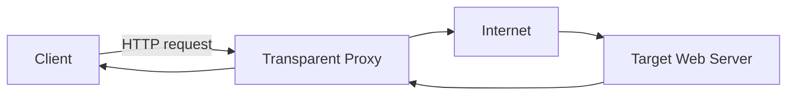
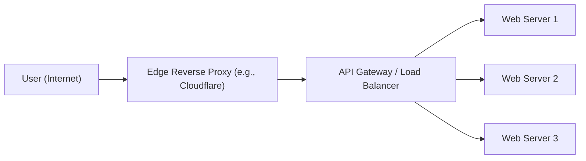

> Summary of [Proxy vs Reverse Proxy (Real-world Examples)](https://www.youtube.com/watch?v=4NB0NDtOwIQ)
> from **ByteByteGo** · Published 2022-10-25 · Views: 820,719

*This note was generated automatically from the video transcript.*

## TL;DR
A forward proxy mediates **client‑to‑Internet** traffic, while a reverse proxy mediates **Internet‑to‑server** traffic. Reverse proxies add security, load‑balancing, caching, and SSL termination, often in multiple layers (edge → API gateway/load balancer → origin servers).

## Key Insights
- **Forward proxy** hides client IPs, bypasses firewalls, and can enforce content filtering; it requires client configuration unless deployed as a *transparent* proxy.  
- **Reverse proxy** hides origin server IPs, making DDoS attacks harder and enabling centralized SSL termination.  
- Load‑balancing via a reverse proxy distributes traffic across a pool of servers, preventing any single node from becoming a bottleneck.  
- Edge providers (e.g., Cloudflare) run reverse proxies globally, reducing latency and providing massive processing capacity close to users.  
- Reverse proxies can cache static assets, serving repeated requests directly from memory/disk and reducing origin load.  
- Modern deployments often stack multiple reverse‑proxy layers: edge → API gateway/load balancer → web‑server cluster.  

## Detailed Breakdown

### 1. Forward Proxy Basics
A **forward proxy** sits **between a group of client machines and the Internet**.  
- Clients send requests to the proxy.  
- The proxy forwards the request to the target web server, receives the response, and relays it back to the client.

#### Why use a forward proxy?
1. **Identity protection** – the web server sees only the proxy’s IP.  
2. **Bypass restrictions** – clients can reach blocked sites by tunneling through an external proxy (subject to firewall rules).  
3. **Content filtering** – organizations route all outbound traffic through a proxy that blocks disallowed URLs (e.g., social media).

#### Transparent proxy
Large institutions often avoid per‑client configuration by using a *transparent proxy*: a Layer‑4 switch redirects matching traffic to the proxy automatically.

### 2. Reverse Proxy Fundamentals
A **reverse proxy** sits **between the Internet and one or more web servers**.  
- External clients send requests to the reverse proxy.  
- The proxy forwards the request to an appropriate origin server, receives the response, and returns it to the client.

#### Primary motivations
1. **Protection** – origin IPs are hidden, reducing the attack surface for DDoS.  
2. **Load balancing** – distributes incoming requests across a server pool.  
3. **Caching** – stores static responses locally for fast reuse.  
4. **SSL termination** – performs the costly TLS handshake once, then forwards plain HTTP to origins.

### 3. Real‑World Reverse Proxy Deployments
#### Edge layer (e.g., Cloudflare)
- Reverse proxies are deployed in **hundreds of global locations**.  
- They sit closest to users, providing low‑latency routing and massive aggregate capacity.

#### API gateway / Load balancer layer
- Inside the provider’s network, a second reverse‑proxy layer (often an **API gateway** or **load balancer**) receives traffic from the edge and spreads it across a **cluster of web servers**.

#### Combined ingress services
- Some cloud platforms merge the edge and load‑balancer functions into a single **ingress service**, simplifying configuration while preserving the two‑hop model (edge → ingress → origins).

### 4. Operational Benefits
- **Latency reduction**: Edge proxies serve cached assets from locations near the user.  
- **Scalability**: Adding more origin servers behind the reverse proxy scales capacity without changing client DNS.  
- **Security**: Centralized TLS termination and IP masking simplify certificate management and mitigate direct attacks on origins.

## Trade-offs and Gotchas
- **Single point of failure**: If the reverse proxy layer goes down, all downstream services become unreachable; redundancy (multiple proxies, health checks) is essential.  
- **Cache staleness**: Improper cache‑control headers can serve outdated content; need careful invalidation strategy.  
- **SSL termination exposure**: Decrypting traffic at the proxy means the internal network must be trusted; otherwise, end‑to‑end encryption is lost.  
- **Transparent proxy detection**: Some applications (e.g., certain corporate VPNs) may reject traffic that appears to be intercepted, limiting transparent proxy usefulness.  
- **Latency overhead**: Each additional proxy hop adds processing time; over‑layering can negate edge latency benefits if not properly sized.

## Takeaways
- Use a **forward proxy** when you need client anonymity, firewall bypass, or outbound content filtering.  
- Deploy a **reverse proxy** at the edge to hide origins, terminate SSL, cache static assets, and balance load across servers.  
- Architectures often stack **edge → API gateway/load balancer → origins** for global scale and resilience.  
- Ensure **high availability** for reverse proxies (multiple instances, health checks) to avoid a single point of failure.  
- Manage **cache headers** and **TLS policies** carefully to balance performance, freshness, and security.

## Glossary
- **Forward proxy**: Intermediary that represents clients when accessing external resources.  
- **Reverse proxy**: Intermediary that represents servers when handling inbound client requests.  
- **Transparent proxy**: Proxy that intercepts traffic without requiring client configuration, typically via network routing rules.  
- **SSL termination**: The process of decrypting TLS traffic at a proxy, forwarding plaintext to backend services.  
- **Edge service**: A server positioned close to end‑users, often part of a CDN, that handles inbound traffic before it reaches the core network.  
- **API gateway**: A reverse proxy that provides routing, authentication, rate limiting, and other API‑specific functions.  
- **Ingress service**: Cloud‑native entry point that combines edge routing and load balancing for inbound traffic.

## Full Transcript

Click to expand the raw transcript

Why is Nginx called a reverse proxy?What is a proxy anyways?Let’s take a look.Two common types of proxy are forward proxy and reverse proxy.A forward proxy is a server that sits between a group of client machines and the internet.When those clients make requests to websites on the internet, the forward proxy acts as a middleman intercepts those requests and talks to web servers on behalf of those client machines.Why would anyone want to do that?Here are a few common reasons.One, a forward proxy protects the client’s online identity.By using a forward proxy to connect to a website, the IP address of the client is hidden from the server.Only the IP address of the proxy is visible.It would be harder to trace back to the client.Two, a forward proxy can be used to bypass browsing restrictions.Some institutions like governments, schools, and big businesses use firewalls to restrict access to the internet.By connecting to a forward proxy outside the firewalls, the client machine can potentially get around these restrictions.It does not always work because the firewalls themselves could block the connections to the proxy.Three, a forward proxy can be used to block access to certain content.This is not uncommon for schools and businesses to configure their networks to connect all clients to the web through a proxy and apply filtering rules to disallow sites like social networks.It is worth noting that a forward proxy normally requires a client to configure its application to point to it.For large institutions, they usually apply a technique called transparent proxy to streamline the process.A transparent proxy works with layer 4 switches to redirect certain types of traffic to the proxy automatically.There is no need to configure the client machines to use it.It is difficult to bypass a transparent proxy when the client is on the institution's network.In summary, a forward proxy sits between the client and the internet and acts on behalf of the client.Now, let’s take a look at reverse proxy.A reverse proxy sits between the internet and the web servers.It intercepts the requests from clients and talks to the web server on behalf of the clients.Why would a website use a reverse proxy?Here are a few good reasons.One, a reverse proxy could be used to protect a website.The website’s IP addresses are hidden behind the reverse proxy and are not revealed to the clients.This makes it much harder to target a DDoS attack against a website.Second, a reverse proxy is used for load balancing.A popular website handling millions of users every day is unlikely to be able to handle the traffic with a single server.A reverse proxy can balance a large amount of incoming requests by distributing the traffic to a large pool of web servers, and effectively preventing any single one of them from becoming overloaded.Note that this assumes that the reverse proxy can handle the incoming traffic.Services like Cloudflare put reverse proxy servers in hundreds of locations all around the world.This puts the reverse proxy close to the users and at the same time provides a large amount of processing capacity.Third, a reverse proxy caches static content.A piece of content could be cached on the reverse proxy for a period of time.If the same piece of content is requested again from the reverse proxy, the locally cached version could be quickly returned.Fourth, a reverse proxy can handle SSL encryption.SSL handshake is computationally expensive.A reverse proxy can free up the origin servers from these expensive operations. Instead of handling SSL for all clients, a website only needs to handle SSL handshake from a small number of reverse proxies.Reverse proxies are everywhere. For a modern website, it is not uncommon to have many layers of reverse proxy.The first layer could be an edge service like Cloudflare.The reverse proxies are deployed to hundreds of locations worldwide close to the users.The second layer could be an API gateway or load balancer at the hosting provider.Many cloud providers combine these two layers into a single ingress service.The user would enter the cloud network at the edge close to the user, and from the edge, the reverse proxy connects over a fast fiber network to the load balancer where the request is evenly distributed over a cluster of web servers.If you like our videos, you may like our weekly system design newsletter as well.It covers topics and trends in large-scale system designs. Trusted by 150,000+ readers.Subscribe at: blog.bytebytego.com

