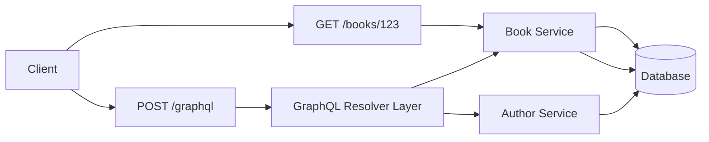

> Summary of [What Is GraphQL? REST vs. GraphQL](https://www.youtube.com/watch?v=yWzKJPw_VzM)
> from **ByteByteGo** · Published 2022-11-10 · Views: 534,153

*This note was generated automatically from the video transcript.*

## TL;DR
GraphQL is a schema‑driven query language that lets clients request exactly the data they need, potentially aggregating multiple backend resources in a single request. It trades the simplicity and cache‑friendliness of REST for richer client control, higher implementation overhead, and extra performance safeguards.

## Key Insights
- GraphQL’s schema defines **types** and **relationships**, letting clients compose arbitrary queries without additional endpoints.  
- A single GraphQL request can replace many REST calls, eliminating the classic **N+1 query** problem.  
- Implementing GraphQL requires **dedicated tooling** (schema definition, resolvers, server libraries) on both client and server sides.  
- Because GraphQL typically uses **HTTP POST** to a single endpoint, standard HTTP caching mechanisms are less effective than REST’s GET‑based caching.  
- Unrestricted client queries can lead to **expensive operations** (e.g., full table scans), so rate‑limiting, depth limiting, and query‑cost analysis are essential safeguards.  
- For simple CRUD services, the upfront cost of GraphQL often outweighs its benefits; REST remains the low‑friction choice.  
- GraphQL also supports **mutations** (writes) and **subscriptions** (real‑time updates), extending its capabilities beyond pure queries.

## Detailed Breakdown

### 1. What is GraphQL?
- Developed by Meta, GraphQL is a **query language** and **runtime** for APIs.
- It sits **between the client and backend services**, exposing a **schema** that describes the shape of the data.
- Clients can ask for exactly the fields they need, and the server resolves those fields from one or many underlying services.
- Supports three operation types:
  * **Query** – read‑only data fetch.
  * **Mutation** – write operations that modify data.
  * **Subscription** – server‑push notifications for data changes.

### 2. GraphQL vs. REST – Request Model
- **REST**: each resource has a unique URL. A `GET /books/123` returns a predefined representation (often includes nested resources like authors).  
- **GraphQL**: a single endpoint (e.g., `/graphql`) receives a query that specifies the exact fields and nested objects.



### 3. Example: Types and Queries
```graphql
type Book {
  id: ID!
  title: String!
  authors: [Author!]!
}

type Author {
  id: ID!
  name: String!
}
```
- The **schema** declares `Book` and `Author` types but not how to fetch them.
- A **Query** type then exposes entry points:
```graphql
type Query {
  book(id: ID!): Book
}
```
- A client can request:
```graphql
{
  book(id: "1") {
    title
    authors { name }
  }
}
```
- The server resolves `book` → `Book` data, then resolves `authors` by possibly calling a separate **Author Service**.

### 4. Benefits of GraphQL
- **Client‑driven data selection** eliminates over‑fetching and under‑fetching.
- **Single round‑trip** for complex data graphs, solving the N+1 problem that plagues naive REST implementations.
- **Versioning is implicit**: adding fields to the schema does not break existing clients.

### 5. Drawbacks and Engineering Costs
- **Tooling overhead**: need schema definition language, resolver code, code‑gen for client types, and runtime libraries.
- **Caching complexity**: default POST requests bypass HTTP caching; developers must implement custom cache keys or use persisted queries.
- **Security/performance risk**: unrestricted queries can cause expensive database operations. Mitigations include:
  * Query depth limits.
  * Cost analysis per field.
  * Whitelisting/allow‑list of approved queries.
- **Learning curve**: developers must understand schema design, resolver patterns, and the GraphQL execution engine.

### 6. When to Choose GraphQL
- When the client needs **flexible, nested data** and would otherwise issue many REST calls.
- When the API surface is **evolving rapidly** and backward compatibility is a priority.
- Not ideal for **simple CRUD services**, low‑traffic internal APIs, or environments where minimal operational overhead is critical.

## Trade‑offs and Gotchas
- **Pros**: reduced network chatter, single endpoint, strong typing, introspection, built‑in versioning.
- **Cons**: higher initial setup cost, harder to cache, potential for expensive queries, need for robust monitoring and query‑limiting.
- **Failure modes**: a badly crafted client query can overload a database; missing resolver logic can produce partial or empty responses.
- **Complexity adds risk**: every new resolver is another piece of code that can introduce bugs or latency.

## Takeaways
- Use GraphQL when you need **granular client control** over data shape and want to avoid multiple REST round‑trips.  
- Invest in **query‑cost analysis and depth limiting** early to protect backend services.  
- For **simple CRUD** or low‑traffic APIs, prefer REST to keep the stack lightweight.  
- Plan for **custom caching strategies** (e.g., persisted queries, CDN edge caching) if performance is a concern.  
- Treat the GraphQL schema as a **public contract**; evolve it carefully to maintain backward compatibility.

## Glossary
- **GraphQL**: a query language and runtime for APIs that lets clients request exactly the data they need.  
- **REST**: Representational State Transfer, an architectural style that uses HTTP verbs and resource‑based URLs.  
- **Mutation**: a GraphQL operation that changes data on the server.  
- **Subscription**: a GraphQL operation that enables real‑time push updates to the client.  
- **N+1 Query**: a performance anti‑pattern where fetching a list of items triggers an additional query per item.  
- **Resolver**: server‑side function that maps a field in the GraphQL schema to data fetched from a data source.  
- **Schema**: the type system definition that describes all possible queries, mutations, and subscriptions.  
- **Caching**: storing responses to reuse for identical requests, typically handled automatically for HTTP GET but not for GraphQL POSTs.

## Full Transcript

<details>
<summary>Click to expand the raw transcript</summary>

What is GraphQL?When should we use it?Let’s take a look.GraphQL is a query language for API developed by Meta.It provides a schema of the data in the API and gives clients the power to ask for exactly what they need.GraphQL sits between the clients and the backend services.It could aggregate multiple resource requests into a single query.It also supports mutations, and subscriptions.Mutations are GraphQL’s way of applying data modifications to resources.Subscriptions are GraphQL’s way for clients to receive notifications on data modifications.How is GraphQL the same as REST?How are they different?Let’s dive deeper.In practice, both GraphQL and REST send HTTP requests and receive HTTP responses.Let’s compare how simple REST and GraphQL operations look like.REST centers around resources. Each resource is identified by a URL.To fetch a book from a bookstore API, it could look something like this.Note that the authors field is implementation specific.Some REST API implementations might break them out into separate REST calls.With GraphQL, this looks different.We first define the types.In this example, we have the Book and Author types.These types describe the kinds of data available.They don’t specify how the data is retrieved via GraphQL.To do that, we need to define a Query, like this.Now we can send a request to the GraphQL endpoint to fetch the same data.As we can see, REST and GraphQL both use HTTP.Both make a request via a URL, and both can return a JSON response in the same shape.Here are the differences.With GraphQL, we specify the exact resources we want, and also which fields we want.In the REST example, the API implementer decided for us that authors are included as related resources.With GraphQL, the client decides what to include.This brings up one of the main benefits of GraphQL.GraphQL doesn’t use URLs to specify the resources that are available in the API.Instead, it uses a GraphQL schema.We can send a complex query that fetches additional data according to relationships defined in the schema.Doing the same in REST is more complicated.We would have to do that client side with multiple requests.This is a common problem resulting in N+1 queries.Next, let’s discuss some drawbacks of GraphQL.The beauty of REST is that we don’t need special libraries to consume someone else’s API.Requests can simply be sent using common tools like cURL or simply a web browser.In contrast, GraphQL requires heavier tooling support, both on the client and server sides.This requires a sizable upfront investment.This upfront cost might not be worth it, especially for very simple CRUD APIs.Another criticism of GraphQL is that it is more difficult to cache.REST uses HTTP GET for fetching resources, and HTTP GET has a well-defined caching behavior that is leveraged by browsers, CDNs, proxies, and web servers.GraphQL has a single point of entry and uses HTTP POST by default.This prevents the full use of HTTP caching.With care, GraphQL could be configured to better leverage HTTP caching.The detail is very nuanced.For this video, it is important to understand that it is extra work, and getting it right is not trivial.The final concern we have with GraphQL is that while GraphQL allows clients to query for just the data they need, this also poses a great danger.Imagine this example where a mobile application shipped a new feature that causes an unexpected table scan of a critical database table of a backend service.This could bring the database down as soon as the new application goes live.Yes, there are ways to mitigate this risk, but it adds even more complexity to a GraphQL implementation.The cost to safeguard risks like this must be factored in when considering GraphQL.So, should we use GraphQL?We have repeatedly said that software engineering is about tradeoffs.There is no one right answer.We hope that this video gives you some things to consider when exploring GraphQL for high-scale production use.If you would like to learn more about system design, check out our books and weekly newsletter.Please subscribe if you learn something today.Thank you so much and we'll see you next time.

</details>
