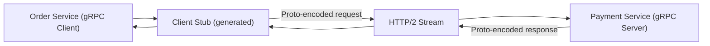

> Summary of [What is RPC? gRPC Introduction.](https://www.youtube.com/watch?v=gnchfOojMk4)
> from **ByteByteGo** · Published 2022-12-01 · Views: 760,453

*This note was generated automatically from the video transcript.*

## TL;DR
gRPC is Google’s open‑source RPC framework that couples strongly‑typed Protocol Buffers with HTTP/2 to deliver high‑performance, language‑agnostic inter‑service communication. It excels for microservice‑to‑microservice calls inside data centers and for mobile clients, but browsers lack the low‑level HTTP/2 control needed for native gRPC.

## Key Insights
- gRPC uses **Protocol Buffers** as its default binary serialization, giving compact messages and auto‑generated, type‑safe client/server stubs.  
- Built on **HTTP/2**, gRPC can multiplex many RPC calls over a single long‑lived TCP connection, dramatically reducing connection overhead.  
- The generated **client stub** hides the wire format; developers call it like a local function, while the framework handles encoding, transport, and decoding.  
- Benchmarks cited in the video claim gRPC is **~5× faster than JSON‑based REST** due to binary encoding and HTTP/2 efficiencies.  
- Browsers cannot directly use gRPC because they don’t expose the required HTTP/2 primitives; **gRPC‑Web** works via a proxy but with a reduced feature set.  
- gRPC’s language‑agnostic code generation lets each microservice pick its preferred programming language without sacrificing API compatibility.  
- Ideal use‑cases: high‑throughput intra‑datacenter microservice communication and bandwidth‑constrained mobile clients; less suited for public web APIs consumed by browsers.

## Detailed Breakdown

### 1. What is an RPC?
- A **local procedure call** executes code within the same process.  
- A **remote procedure call (RPC)** lets one machine invoke code on another machine, presenting the remote call as if it were local to the caller.

### 2. gRPC Overview
- Open‑source framework released by Google in 2016, a rewrite of Google’s internal RPC system.  
- Provides a **type‑safe, production‑grade API** surface for connecting large numbers of microservices across data centers.

### 3. Protocol Buffers (proto)
- Language‑agnostic schema definition (`.proto` files) describing message structures and service RPC signatures.  
- Tooling generates **data access classes** and **client/server stubs** for languages such as Go, Java, C#, Python, etc.  
- Binary format is **compact** and **fast to serialize/deserialize**, outperforming text formats like JSON.

### 4. High‑Performance Foundations
#### Binary Encoding
- Protocol Buffers’ binary layout reduces payload size and CPU cycles; the video cites a **5× speed advantage over JSON**.

#### HTTP/2 Transport
- gRPC leverages HTTP/2 streams, enabling:
  - **Multiplexing**: many concurrent RPCs share one TCP connection.
  - **Header compression** (HPACK) and binary framing, lowering latency.
  - **Flow control** and **server push** capabilities (though not commonly used by gRPC).

### 5. End‑to‑End Call Flow
1. **Client code** invokes a method on the generated **client stub**.  
2. Stub **serializes** arguments into a Protocol Buffer message.  
3. Message is placed into an **HTTP/2 data frame** and sent over the shared TCP connection.  
4. Server receives the frame, **deserializes** the protobuf, and dispatches to the service implementation.  
5. Service returns a response object; the server stub **serializes** it, sends it back via HTTP/2, and the client stub **deserializes** for the caller.

### 6. Browser Limitations & gRPC‑Web
- Browsers expose only high‑level HTTP/1.1‑style APIs (Fetch, XHR) and lack direct access to HTTP/2 stream IDs or custom frame types.  
- **gRPC‑Web** introduces a lightweight proxy that translates between browser‑friendly HTTP/1.1/2 requests and native gRPC on the server, but it **does not support all gRPC features** (e.g., bidirectional streaming).

### 7. When to Use gRPC
- **Microservice communication** inside data centers where low latency, high throughput, and language heterogeneity matter.  
- **Mobile clients** where bandwidth and battery are limited; binary payloads and multiplexed connections conserve resources.  
- **Internal APIs** where you control both client and server; public web APIs for browsers are better served by REST/JSON or GraphQL.

## Trade-offs and Gotchas
- **Pros**: Strong typing, auto‑generated code, high throughput, multiplexed connections, language‑agnostic.  
- **Cons**: Steeper learning curve than REST, binary payloads are not human‑readable, debugging requires protobuf tooling.  
- **Browser incompatibility**: Direct gRPC calls from browsers are not possible; gRPC‑Web adds latency and feature gaps.  
- **Operational complexity**: Requires HTTP/2‑aware load balancers and proxies; older infrastructure may need upgrades.  
- **Versioning**: Changing `.proto` schemas must follow protobuf compatibility rules (e.g., never renumber fields) to avoid breaking existing services.

## Takeaways
- Use gRPC when you need **fast, type‑safe, multiplexed RPC** between services you control.  
- Define your API once in a `.proto` file; let the tooling generate client and server stubs for any supported language.  
- Remember that **binary protobuf messages are not self‑describing**; maintain versioned `.proto` files in source control.  
- For public web APIs, prefer REST/JSON or GraphQL unless you can accept the overhead of a gRPC‑Web proxy.  
- Ensure your deployment stack (load balancers, service mesh, observability) fully supports **HTTP/2**.

## Glossary
- **RPC (Remote Procedure Call)**: A protocol that allows a program to cause a procedure to execute on another address space (commonly on another machine).  
- **Protocol Buffers**: Google’s language‑neutral, platform‑neutral, extensible mechanism for serializing structured data; defined via `.proto` schema files.  
- **HTTP/2**: The second major version of HTTP, introducing binary framing, multiplexed streams, header compression, and server push.  
- **Client Stub**: Auto‑generated client‑side code that provides local method signatures which internally handle serialization, transport, and deserialization.  
- **gRPC‑Web**: A bridge that enables browser‑based applications to call gRPC services via a proxy that translates between browser‑compatible HTTP and native gRPC.

## Full Transcript

Click to expand the raw transcript

What is gRPC?When should we use it?Let’s take a look.gRPC is an open-source remote procedure call framework created by Google in 2016.It was a rewrite of their internal RPC infrastructure that they used for years.But first, what is an RPC, or a remote procedure call?A local procedure call is a function call within a process to execute some code.A remote procedure call enables one machine to invoke some code on another machine asif it is a local function call from a user’s perspective.gRPC is a popular implementation of RPC.Many organizations have adopted gRPC as the preferred RPC mechanism to connect a largenumber of microservices running within and across data centers.What makes gRPC so popular?Let’s dive a little deeper.First, gRPC has a thriving developer ecosystem.It makes it very easy to develop production-quality and type-safe APIs that scale well.The core of this ecosystem is the use of Protocol Buffers as its data interchange format.Protocol Buffers is a language-agnostic and platform-agnostic mechanism for encoding structured data.gRPC uses Protocol Buffers to encode and send data over the wire by default.While gRPC could support other encoding formats like JSON, Protocol Buffers provide several advantages that make it the encoding format of choice for gRPC.Protocol Buffers support strongly-typed schema definitions.The structure of the data over the wire is defined in a proto file.Protocol Buffers provide broad tooling support to turn the schema defined in the proto file into data access classes for all popular programming languages.A gRPC service is also defined in a proto file by specifying RPC method parameters and return types.The same tooling is used to generate gRPC client and server code from the proto file.Developers use these generated classes in the client to make RPC calls, and in the server to fulfill the RPC requests.By supporting many programming languages, the client and server can independently choose the programming language and ecosystem best suited for their own particular use cases.This is traditionally not the case for most other RPC frameworks.The second reason why gRPC is so popular is because it is high-performance out of the box.Two factors contribute to its performance.First is that Protocol Buffers is a very efficient binary encoding format.It is much faster than JSON.Second, gRPC is built on top of HTTP/2 to provide a high-performance foundation at scale.The use of HTTP/2 brings many benefits.We discussed HTTP/2 in an earlier video.Check out the link in the description for more information.gRPC uses HTTP/2 streams.It allows multiple streams of messages over a single long-lived TCP connection.This allows the gRPC framework to handle many concurrent RPC calls over a small number ofTCP connections between clients and servers.To understand how gRPC works, let’s walk through a typical flow from a gRPC client to a gRPC server.In this example, the Order Service is the gRPC client, and the Payment Service is the gRPC server.When the Order Service makes a gRPC call to the Payment Service, it invokes the client code generated by gRPC tooling at build time.This generated client code is called a client stub.gRPC encodes the data passed to the client stub into Protocol Buffers and sends it to the low-level transport layer.gRPC sends the data over the network as a stream of HTTP/2 data frames.Because of binary encoding and network optimization, gRPC is said to be 5 times faster than JSON.The payment service receives the packets from the network, decodes them, and invokes the server application.The result returned from the server application gets encoded into Protocol Buffers and sent to the transport layer.The Order Service receives the packets, decodes them, and sends the result to the client application.As we see from the example above, gRPC is very easy to implement.If it is so easy, why do we not see wide-spread use of gRPC between web clients and web servers?One reason is that gRPC relies on lower-level access to HTTP/2 primitives.No browsers currently provide the level of control required over web requests to support a gRPC client.It is possible to make gRPC calls from a browser with the help of a proxy.This technology is called gRPC-Web.However, the feature set is not fully compatible with gRPC and its usage remains low compared to gRPC.So, where does gRPC shine, and when should we use it?gRPC is the inter-service communication mechanism of choice between microservices in the data centers.Its broad support for many programming languages allows services to choose their own language and developer ecosystems best suited for their own use cases.We also see increasing use of gRPC in the native mobile clients.Its efficiency and performance makes a lot of sense in the energy- and bandwidth-constrained environments that are mobile devices.If you would like to learn more about system design, check out our books and weekly newsletter.Please subscribe if you learned something new.Thank you so much, and we’ll see you next time.

