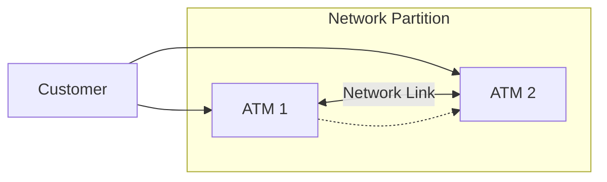
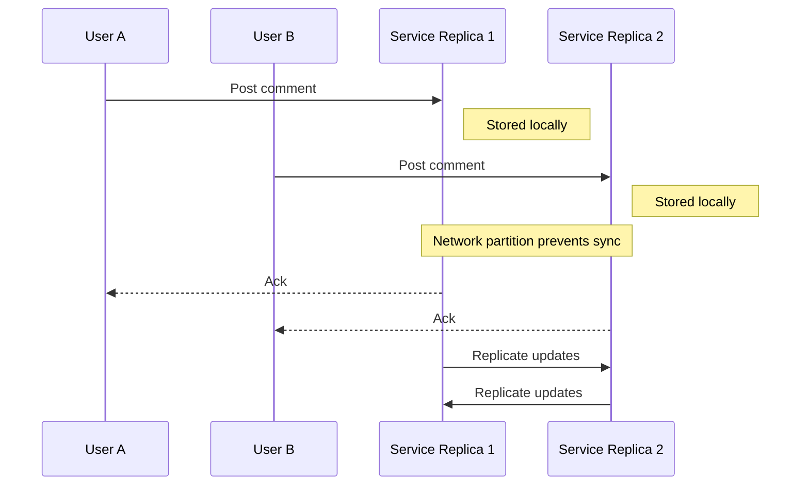

> Summary of [CAP Theorem Simplified](https://www.youtube.com/watch?v=BHqjEjzAicA)
> from **ByteByteGo** · Published 2023-01-03 · Views: 251,591

*This note was generated automatically from the video transcript.*

## TL;DR
CAP states that in the presence of a network partition a distributed system must sacrifice either **Consistency** or **Availability**. Real‑world systems often adopt hybrid or “best‑effort” strategies that lie between the extremes.

## Key Insights
- **CAP trade‑off**: When a partition occurs, you can keep the system **available** (serve requests) *or* keep it **consistent** (all nodes see the same data), but not both.
- **Bank ATM example** illustrates the danger of choosing availability: two isolated ATMs can each let a customer withdraw the full balance, resulting in a negative total after reconnection.
- **Social media** workloads typically favor availability; occasional stale reads are acceptable, whereas strict consistency would make commenting unavailable during a partition.
- **Real‑world nuance**: CAP’s binary model (100 % consistency vs. 100 % availability) is oversimplified; systems can offer *partial* consistency/availability and employ hybrid rules (e.g., read‑only during partitions, limit write size).
- **Reconciliation complexity** grows with data structure richness (e.g., Google Docs concurrent edits require conflict‑resolution algorithms).
- **Beyond CAP**: When the network is healthy, the dominant trade‑off shifts to **latency vs. consistency**, captured by the PACELC theorem.

## Detailed Breakdown

### 1. What is the CAP Theorem?
- **Consistency (C)** – every read sees the most recent write; all nodes have the same view.
- **Availability (A)** – every request receives a response (success or failure) without waiting for other nodes.
- **Partition tolerance (P)** – the system continues operating despite network partitions (loss of communication between subsets of nodes).

> **Network partition**: a failure that isolates groups of nodes so they cannot exchange messages.

When a partition occurs, a system must **choose** between C and A.

### 2. Concrete Bank ATM Example
- **Setup**: Two ATMs, each stores the full account balance locally; no central database.
- **Operations**: `deposit`, `withdraw`, `check balance`. Balance must never drop below 0.
- **Normal flow**: A transaction updates both ATMs over the network, keeping them consistent.

#### Partition Scenarios
| Strategy | Behavior during partition | Result after partition resolves |
|----------|---------------------------|---------------------------------|
| **Prioritize Consistency** | ATMs refuse deposits/withdrawals; only balance inquiries allowed. | No negative balance; system was unavailable. |
| **Prioritize Availability** | ATMs allow all operations locally. | Both ATMs may have withdrawn the full balance → negative total after sync. |
| **Hybrid** | Allow reads; block large writes; maybe allow small withdrawals. | Reduces risk of negative balance while keeping most services up. |

### 3. Social Media Commenting Example
- **Scenario**: Two users comment on the same post during a partition.
- **Availability‑first**: Both comments are accepted locally; each user may not see the other's comment until the partition heals.
- **Consistency‑first**: Commenting feature is disabled; users see a stale view but no divergent state.

### 4. Why CAP Can Be Misleading
- **Binary assumption**: CAP treats consistency and availability as all‑or‑nothing, while production systems often expose *degrees* (e.g., eventual consistency, read‑only mode).
- **Reconciliation cost**: Simple numeric balances are easy to fix; complex structures (documents, graphs) need sophisticated conflict‑resolution (CRDTs, OT).
- **Latency vs. consistency**: When the network is healthy, designers care more about how fast a read returns versus how fresh the data is—a trade‑off captured by **PACELC** (`P`artition `A`vailability `C`onsistency `E`lse `L`atency `C`onsistency).

### 5. Practical Takeaways
- Use CAP as a **mental model** for *failure* scenarios, not as a prescriptive rule for normal operation.
- Design **fallback modes** (read‑only, limited‑write) that gracefully degrade during partitions.
- Choose data structures and replication strategies that match the *acceptable* level of inconsistency (e.g., CRDTs for collaborative editing).
- Complement CAP analysis with **PACELC** to reason about latency‑consistency trade‑offs when the network is intact.

## Trade-offs and Gotchas
- **Choosing Consistency** → higher safety (no stale reads) but may block critical user actions during outages.
- **Choosing Availability** → better user experience during failures, but risk of divergent state and costly reconciliation.
- **Hybrid policies** can mitigate extremes but add implementation complexity and require careful threshold tuning (e.g., “small withdrawals only”).
- **Reconciliation** may be trivial (numeric totals) or extremely hard (rich text documents); underestimate this cost.
- **Assuming 100 %** of any property is unrealistic; design for *acceptable* percentages (e.g., 99.9 % availability, eventual consistency within seconds).

## Takeaways
- Treat CAP as a **starting point** for thinking about partition handling; always layer additional constraints (latency, cost, data model) on top.
- Implement **graceful degradation**: define which operations stay available and which are blocked when a partition is detected.
- Prefer data models with **built‑in conflict resolution** (CRDTs, version vectors) when you must stay highly available.
- Remember that **real‑world systems rarely operate at the extremes**; aim for a balanced SLA that matches business requirements.

## Glossary
- **Consistency**: All nodes see the same data at the same logical point in time.
- **Availability**: Every request receives a response, regardless of the state of other nodes.
- **Partition tolerance**: The ability of a system to keep functioning despite network splits.
- **Network partition**: A failure that isolates subsets of nodes, preventing them from communicating.
- **Eventual consistency**: Guarantees that, given no new updates, all replicas will converge to the same value.
- **CRDT (Conflict‑free Replicated Data Type)**: Data structures that resolve concurrent updates automatically without coordination.
- **PACELC theorem**: Extends CAP by adding the trade‑off between latency and consistency when there is no partition (`Else` case).

## Full Transcript

Click to expand the raw transcript

What is the CAP theorem?How useful is it to system design?Let’s take a look.The CAP theorem is a concept in computer science that explains the trade-offs between consistency, availability, and partition tolerance in distributed systems.Consistency refers to the property of a system where all nodes have a consistent view of the data.It means all clients see the same data at the same time no matter which node they connect to.Availability refers to the ability of a system to respond to requests from users at all times.Partition tolerance refers to the ability of a system to continue operating even if there is a network partition.But what is a network partition?A network partition happens when nodes in a distributed system are unable to communicate with each other due to network failures.When there is a network partition, a system must choose between consistency and availability.If the system prioritizes consistency, it may become unavailable until the partition is resolved.If the system prioritizes availability, it may allow updates to the data.This could result in data inconsistencies until the partition is resolved.Let’s go through a concrete example.Let's say we have a tiny bank with two ATMs connected over a network.The ATMs support three operations: deposit, withdraw, and check balance.No matter what happens, the balance should never go below zero.There is no central database to keep the account balance.It is stored on both ATMs.When a customer uses an ATM, the balance is updated on both ATMs over the network.This ensures that the ATMs have a consistent view of the account balance.If there is a network partition and the ATMs are unable to communicate with each other, the system must choose between consistency and availability.If the bank prioritizes consistency, the ATM may refuse to process deposits or withdrawals until the partition is resolved.This ensures that the balance remains consistent, but the system is unavailable to customers.If the bank prioritizes availability, the ATM may allow deposits and withdrawals to occur, but the balance may become inconsistent until the partition is resolved.This allows the system to remain available to users, but at the cost of data consistency.The preference for availability could be costly to the bank.When there is a network partition, the customer could withdraw the entire balance from both ATMs.When the network comes back online, the inconsistency is resolved and now the balance is negative. That is not good.Let’s go through another example and see how a social media platform could apply the CAP theorem.During a network partition, if two users are commenting on the same post at the same time, one user's comment may not be visible to the other user until the partition is resolved.Alternatively, if the platform prioritizes consistency, the commenting feature may be unavailable to users until the partition is resolved.For a social network, it is often acceptable to prioritize availability at the cost of users seeing slightly different views some of the time.The CAP theorem may sound very simple, but the real world is messy.As with many things in software engineering, it is all about tradeoffs, and the choices are not always so black and white.The CAP theorem assumes 100% availability or 100% consistency.In the real world, there are degrees of consistency and availability that distributed system designers must carefully consider.This is where the simplistic model of the CAP theorem could be misleading.Back to the bank example, during a network partition, the ATM could allow only balance inquiries to be processed, while deposits or withdrawals are blocked.Alternatively, the bank could implement a hybrid approach.For example, the ATM could allow balance inquiries and small withdrawals to be processed during a partition, but block large withdrawals or deposits until the partition is resolved.It is worth noting that in the real world, reconciliation after a network partition could get very messy.The bank example above is simple to reconcile.In real life, the data structures involved could be complex and challenging to reconcile.A good example of a complex data structure is Google Docs.Resolving conflicting updates could be tricky.So is the CAP theorem useful?Yes, it is a useful tool to help us think through the high-level trade-offs to consider when there is a network partition.This is a good starting point, but it does not provide a complete picture of the trade-offs to consider when designing a well-rounded distributed system.Specifically, when the system is operating normally without any network failure, which is most of the time, there is an entire set of interesting trade-offs to consider between latency and consistency.This is covered by the PACELC theorem, which we should cover in another video.If you'd like to learn more about system design, check out our book and weekly newsletter.Please subscribe if you learn something new.Thank you so much and we'll see you next time.

