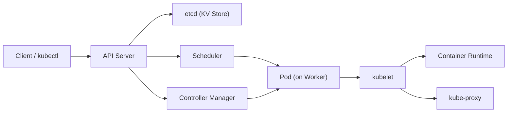
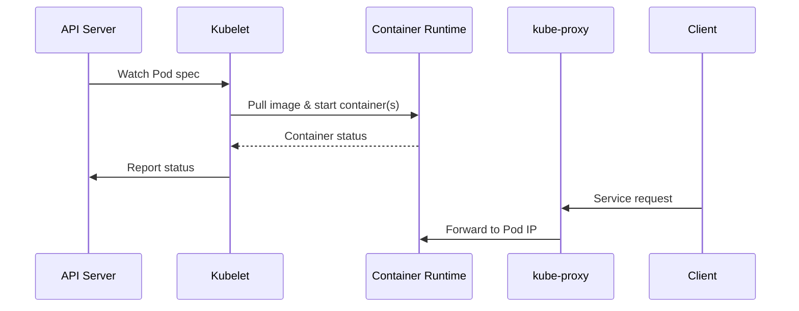

> Summary of [Kubernetes Explained in 6 Minutes | k8s Architecture](https://www.youtube.com/watch?v=TlHvYWVUZyc)
> from **ByteByteGo** · Published 2023-01-11 · Views: 1,855,154

*This note was generated automatically from the video transcript.*

## TL;DR
Kubernetes (k8s) is an open‑source container orchestration platform that automates deployment, scaling, and management of containerized workloads via a control plane (API server, etcd, scheduler, controller manager) and worker nodes (kubelet, container runtime, kube‑proxy). It offers high scalability and portability but brings considerable operational complexity and resource cost.

## Key Insights
- Kubernetes originated from Google’s Borg system and was open‑sourced in 2014.  
- A cluster consists of a **control plane** (state management) and **worker nodes** (actual workload execution).  
- The control plane’s core components are **API server**, **etcd**, **scheduler**, and **controller manager**.  
- Pods are the smallest deployable unit; they host one or more containers with shared storage and networking.  
- Worker‑node daemons (**kubelet**, **container runtime**, **kube‑proxy**) enforce the desired state and handle networking.  
- Managed Kubernetes services (EKS, GKE, AKS) offload control‑plane responsibilities, reducing operational burden.  
- Trade‑offs: strong scalability & portability vs. high setup complexity and baseline resource cost.

## Detailed Breakdown

### 1. What is Kubernetes and Why “k8s”?
Kubernetes is an open‑source platform that orchestrates containers—automating their deployment, scaling, and lifecycle management. The nickname **k8s** replaces the eight letters between “k” and “s” in *Kubernetes* (e.g., i18n for internationalization).

### 2. Cluster Overview
A **Kubernetes cluster** groups multiple **nodes**:
- **Control plane nodes** (often multi‑zone for HA) manage cluster state.
- **Worker nodes** run the actual container workloads inside **Pods**.

### 3. Control Plane Components
| Component | Role |
|-----------|------|
| **API Server** | Central RESTful entry point; validates and persists all cluster requests. |
| **etcd** | Distributed, strongly consistent key‑value store holding the entire cluster’s desired and current state. |
| **Scheduler** | Observes pending Pods, matches them to nodes based on resource requests, affinity rules, and constraints. |
| **Controller Manager** | Runs a set of controllers (e.g., ReplicationController, DeploymentController) that continuously reconcile the actual state with the desired state. |

#### Interaction Flow
1. User issues a `kubectl apply` → API Server validates and writes the object to **etcd**.  
2. **Scheduler** watches for unscheduled Pods, selects a node, and updates the Pod’s spec in **etcd**.  
3. **Controller Manager** watches resources (e.g., Deployments) and creates/updates Pods to meet replica counts, performing rollouts or rollbacks as needed.

### 4. Worker Node Components
| Component | Role |
|-----------|------|
| **kubelet** | Node‑level agent; pulls Pod specs from the API server, starts/stops containers via the runtime, and reports status back. |
| **Container Runtime** | Executes containers (Docker, containerd, CRI‑O); handles image pull, lifecycle, and resource isolation. |
| **kube‑proxy** | Implements Service networking; programs iptables/ipvs rules to route traffic to the correct Pod IPs and provides simple load‑balancing. |

#### Data Flow on a Worker

### 5. When to Use Kubernetes?
- **Upsides**: Horizontal scaling, self‑healing, rolling updates/rollbacks, multi‑cloud/hybrid portability, high availability.  
- **Downsides**: Significant operational complexity, steep learning curve, baseline resource overhead (control plane + node agents).  

**Managed services** (EKS, GKE, AKS) mitigate control‑plane complexity by handling provisioning, upgrades, and HA, making Kubernetes accessible to midsize teams. For very small teams, the “YAGNI” principle suggests avoiding Kubernetes unless its benefits outweigh the cost.

## Trade-offs and Gotchas
- **Complexity vs. Control**: Full self‑managed clusters give maximum flexibility but demand deep expertise; managed services trade some control for simplicity.  
- **Resource Overhead**: Even a minimal cluster needs several CPU cores and GBs of RAM for control‑plane components; small workloads may be cost‑inefficient.  
- **Networking Nuances**: kube‑proxy’s iptables/ipvs mode can affect performance and debugging; misconfigured Service/Ingress rules lead to traffic routing failures.  
- **State Consistency**: etcd must be run with an odd number of nodes (≥3) for quorum; loss of quorum can render the cluster inoperable.  
- **Version Skew**: API server, kubelet, and controller manager versions must be compatible; mixing mismatched versions can cause subtle bugs.

## Takeaways
- Understand the **four control‑plane components** and their responsibilities before deploying a cluster.  
- Treat **Pods** as the atomic unit of deployment; design containers to be co‑located only when they truly share lifecycle or resources.  
- Prefer **managed Kubernetes** for production unless you have a dedicated SRE team.  
- Allocate enough resources for **etcd quorum** and control‑plane redundancy to avoid single points of failure.  
- Start small, automate rollouts, and monitor health checks to reap Kubernetes’ self‑healing benefits without overwhelming operational overhead.

## Glossary
- **Pod**: Smallest deployable unit in Kubernetes; encapsulates one or more containers with shared network/storage.  
- **etcd**: Distributed key‑value store used for persisting cluster state.  
- **Scheduler**: Component that decides on which node a pending Pod should run.  
- **Controller Manager**: Runs background controllers that reconcile desired vs. actual state (e.g., Deployment, ReplicaSet).  
- **kubelet**: Node agent that ensures containers described in Pod specs are running and healthy.  
- **Container Runtime**: Software that runs containers (Docker, containerd, CRI‑O).  
- **kube‑proxy**: Network proxy that implements Service abstraction and load‑balances traffic to Pods.  
- **Managed Kubernetes Service**: Cloud‑provider‑hosted Kubernetes control plane (EKS, GKE, AKS).  
- **YAGNI**: “You Aren’t Gonna Need It” – principle advising against premature complexity.

## Full Transcript

Click to expand the raw transcript

What is Kubernetes?Why is it called k8s?What makes it so popular?Let’s take a look.Kubernetes is an open-source container orchestration platform.It automates the deployment, scaling, and management of containerized applications.Kubernetes can be traced back to Google's internal container orchestration system, Borg, which managed the deployment of thousands of applications within Google.In 2014, Google open-sourced a version of Borg.That is Kubernetes.Why is it called k8s?This is a somewhat nerdy way of abbreviating long words.The number 8 in k8s refers to the 8 letters between the first letter “k” and the last letter “s” in the word Kubernetes.Other examples are i18n for internationalization, and l10n for localization.A Kubernetes cluster is a set of machines, called nodes, that are used to run containerized applications.There are two core pieces in a Kubernetes cluster.The first is the control plane.It is responsible for managing the state of the cluster.In production environments, the control plane usually runs on multiple nodes that span across several data center zones.The second is a set of worker nodes.These nodes run the containerized application workloads.The containerized applications run in a Pod.Pods are the smallest deployable units in Kubernetes.A pod hosts one or more containers and provides shared storage and networking for those containers.Pods are created and managed by the Kubernetes control plane.They are the basic building blocks of Kubernetes applications.Now let’s dive a bit deeper into the control plane.It consists of a number of core components.They are the API server, etcd, scheduler, and the controller manager.The API server is the primary interface between the control plane and the rest of the cluster.It exposes a RESTful API that allows clients to interact with the control plane and submit requests to manage the cluster.etcd is a distributed key-value store.It stores the cluster's persistent state.It is used by the API server and other components of the control plane to store and retrieve information about the cluster.The scheduler is responsible for scheduling pods onto the worker nodes in the cluster.It uses information about the resources required by the pods and the available resources on the worker nodes to make placement decisions.The controller manager is responsible for running controllers that manage the state of the cluster.Some examples include the replication controller, which ensures that the desired number of replicas of a pod are running, and the deployment controller, which manages the rolling update and rollback of deployments.Next, let’s dive deeper into the worker nodes.The core components of Kubernetes that run on the worker nodes include kubelet, container runtime, and kube proxy.The kubelet is a daemon that runs on each worker node.It is responsible for communicating with the control plane.It receives instructions from the control plane about which pods to run on the node, and ensures that the desired state of the pods is maintained.The container runtime runs the containers on the worker nodes.It is responsible for pulling the container images from a registry, starting and stopping the containers, and managing the containers' resources.The kube-proxy is a network proxy that runs on each worker node.It is responsible for routing traffic to the correct pods.It also provides load balancing for the pods and ensures that traffic is distributed evenly across the pods.So when should we use Kubernetes?As with many things in software engineering, this is all about tradeoffs.Let’s look at the upsides first.Kubernetes is scalable and highly available.It provides features like self-healing, automatic rollbacks, and horizontal scaling.It makes it easy to scale our applications up and down as needed, allowing us to respond to changes in demand quickly.Kubernetes is portable.It helps us deploy and manage applications in a consistent and reliable way regardless of the underlying infrastructure.It runs on-premise, in a public cloud, or in a hybrid environment.It provides a uniform way to package, deploy, and manage applications.Now how about the downsides?The number one drawback is complexity.Kubernetes is complex to set up and operate.The upfront cost is high, especially for organizations new to container orchestration.It requires a high level of expertise and resources to set up and manage a production Kubernetes environment.The second drawback is cost.Kubernetes requires a certain minimum level of resources to run in order to support all the features we mentioned above.It is likely an overkill for many smaller organizations.One popular option that strikes a reasonable balance is to offload the management of the control plane to a managed Kubernetes service.Managed Kubernetes services are provided by cloud providers.Some popular ones are Amazon EKS, GKE on Google Cloud, and AKS on Azure.These services allow organizations to run the Kubernetes applications without having to worry about the underlying infrastructure.They take care of tasks that require deep expertise, like setting up and configuring the control plane, scaling the cluster, and providing ongoing maintenance and support.This is a reasonable option for a mid-size organization to test out Kubernetes.For a small organization, YAGNI - You ain’t gonna need it - is our recommendation.If you would like to learn more about system design, check out our books and weekly newsletter.Please subscribe if you learn something new.Thank you and we'll see you next time.

