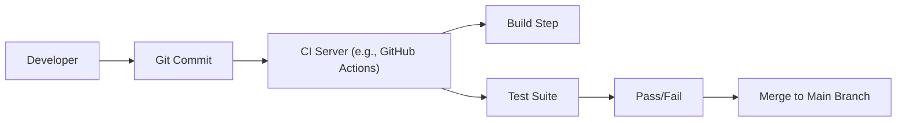
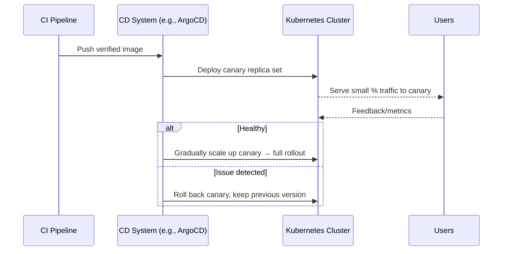

> Summary of [CI/CD In 5 Minutes | Is It Worth The Hassle: Crash Course System Design #2](https://www.youtube.com/watch?v=42UP1fxi2SY)
> from **ByteByteGo** · Published 2023-01-18 · Views: 391,938

*This note was generated automatically from the video transcript.*

## TL;DR
CI/CD automates building, testing, and deploying code so teams can ship higher‑quality software faster. CI is widely adopted and relatively straightforward, while true continuous deployment (CD) is practical mainly for stateless services and requires extra patterns (feature flags, canary) for safety.

## Key Insights
- **CI** runs on every commit, executing builds and a suite of automated tests to verify merge safety.  
- Maintaining **high‑coverage, reliable tests** is the hardest part of CI; flaky or slow tests hurt developer productivity.  
- **CD** is feasible for stateless services (API/web servers) but rarely fully automated for stateful components like databases.  
- **Feature flags** decouple code rollout from feature activation, enabling instant rollbacks without redeploy.  
- **Canary deployments** expose new code to a tiny, low‑risk user segment first, limiting blast radius.  
- Popular CI tools include **GitHub Actions, Buildkite, Jenkins, CircleCI, TravisCI**; CD tools add Kubernetes‑native options like **ArgoCD**.  
- The overall benefit of CI/CD depends on system complexity, team maturity, and the ability to invest in robust testing and monitoring.

## Detailed Breakdown

### 1. What is CI/CD?
CI/CD stands for **Continuous Integration** and **Continuous Delivery/Deployment**.  
- **Continuous Integration (CI)**: automatically builds and tests each commit before it merges into the main branch.  
- **Continuous Delivery (CD)**: automatically pushes a verified build to a staging or production environment, optionally with manual approval.  
- **Continuous Deployment**: the extreme of CD where every successful build is released to production without human gate.

### 2. Continuous Integration (CI)

#### 2.1 Core Workflow

- **Trigger**: Every push to the repository fires a CI pipeline.  
- **Build step**: Uses language‑specific build tools (e.g., Gradle for Java, Webpack for JS).  
- **Test suite**: Runs unit tests (Jest, JUnit), integration tests (Playwright, Cypress), and possibly end‑to‑end tests.  
- **Outcome**: If any step fails, the commit is blocked from merging.

#### 2.2 Tooling Landscape
| Category | Example Tools |
|----------|---------------|
| Source Control | GitHub, GitLab |
| CI Orchestrators | GitHub Actions, Buildkite, Jenkins, CircleCI, TravisCI |
| Unit Test Frameworks | Jest (JS), JUnit (Java) |
| Integration/E2E | Playwright, Cypress |
| Build Systems | Gradle (Java), Webpack (JS) – note the JS ecosystem fragmentation |

#### 2.3 Challenges
- **Test coverage vs. speed**: High coverage → longer runtimes → slower feedback loops.  
- **Flakiness**: Unreliable tests cause false negatives, eroding trust in CI.  
- **Maintenance overhead**: Keeping test suites up‑to‑date as code evolves.

### 3. Continuous Delivery / Deployment (CD)

#### 3.1 When Is Real CD Viable?
- **Stateless services** (e.g., REST APIs, web front‑ends) where a new container can replace the old one without data loss.  
- **Good production monitoring** to detect regressions quickly.

#### 3.2 Deployment Patterns for Safety
1. **Feature Flags** – code is always deployed, but new functionality is hidden behind a runtime toggle.  
2. **Canary Deployments** – route a small percentage of traffic (often power users or internal staff) to the new version first.

#### 3.3 Tooling for CD
- **General CI/CD orchestrators** (GitHub Actions, Buildkite, Jenkins) can also handle deployment steps.  
- **Kubernetes‑native CD**: **ArgoCD** watches Git repos and syncs desired manifests to the cluster, providing declarative rollouts.

#### 3.4 Stateful Systems
- Databases, WebSocket clusters, or any component that holds mutable state are rarely fully automated.  
- Teams typically use a **fixed deployment cadence** (e.g., weekly) with manual approvals, extensive pre‑deployment checks, and a dedicated platform team.

### 4. Overall Assessment
- CI is **low‑hanging fruit**: easy to adopt, immediate feedback, high ROI.  
- CD delivers **speed and reliability** for simple services but requires mature testing, monitoring, and rollout strategies for complex systems.  
- The “hassle” of CI/CD is primarily the **investment in test quality, infrastructure, and cultural discipline**.

## Trade-offs and Gotchas
- **Speed vs. Confidence**: Faster pipelines improve developer velocity but may cut corners on test depth.  
- **Flaky Tests**: Undermine CI trust; must be quarantined or fixed promptly.  
- **Feature Flag Debt**: Accumulating unused flags adds code complexity; requires regular cleanup.  
- **Canary Complexity**: Requires traffic routing, metrics collection, and automated rollback logic.  
- **Stateful Deployments**: Automating DB schema migrations can cause data loss if not carefully versioned and backward‑compatible.  
- **Tool Overhead**: Managing many ecosystem‑specific build/test tools (Webpack vs. newer bundlers) can increase maintenance burden.

## Takeaways
- Start with **solid CI**: automate builds and a reliable test suite before attempting CD.  
- Use **feature flags** to separate deployment from feature activation, enabling instant rollbacks.  
- Adopt **canary deployments** for high‑traffic, user‑facing services to limit blast radius.  
- Reserve **full continuous deployment** for **stateless** workloads; treat stateful services with a more controlled cadence.  
- Choose tools that fit your stack (e.g., GitHub Actions + ArgoCD for a Kubernetes‑centric workflow) and invest in **observability** to catch issues early.

## Glossary
- **CI (Continuous Integration)**: Automated process that builds and tests code on each commit.  
- **CD (Continuous Delivery/Deployment)**: Automated process that moves a verified build to staging or production.  
- **Feature Flag**: Runtime toggle that enables/disables a feature without redeploying code.  
- **Canary Deployment**: Gradual rollout to a small subset of users before full production release.  
- **Stateless Service**: Service that does not retain client‑specific data between requests; easy to replace.  
- **Stateful Service**: Service that maintains persistent state (e.g., databases, session stores).  
- **ArgoCD**: GitOps continuous delivery tool for Kubernetes that syncs manifests from Git to clusters.  
- **Flaky Test**: Test that intermittently passes/fails without code changes, often due to timing or environment issues.

## Full Transcript

Click to expand the raw transcript

What is CI/CD?How does it help us ship faster?Is it worth the hassle?Let’s take a look.CI/CD, or Continuous Integration and Continuous Delivery, automates the software development process from the initial code commit all the way through to deployment.It eliminates much of the manual human intervention traditionally required to get new code to production.The CI/CD process takes care of building, testing, and deploying new code to production.The promise is that it enables software teams to deploy better-quality software faster.This all sounds very good, but does it work in real life?The answer is - it depends.Let’s break up CI/CD into their own parts and discuss them separately.CI is less controversial and more common.In a nutshell, it is the practice of using automation to enable teams to merge code changes into the shared repository early and often.Each commit triggers an automated workflow on a CI server that runs a series of tasks to make sure the commit is safe to merge into the main branch.A good CI process relies on a set of good tests.It is non-trivial to maintain a set of tests with sufficient coverage that is not flakey.High test coverage usually takes longer to run. This impacts developer productivity. It is a tough balancing act, but it is worth the effort to get it right.What are some common tools used in CI?A good source code management system is the foundation.Github is a very popular example. It should hold everything needed to build the software.This includes source code, test scripts, and scripts to build the software applications.There are many tools to manage the CI process itself.Github Actions and Buildkite are some modern examples. Jenkins, CircleCI, and TravisCI are also common.These tools manage the build and test tasks in CI.There are many test tools for writing and running tests.These tools are usually language and ecosystem specific.For example, for JS, Jest is an example of the unit testing framework, while playwright and cypress are some common integration testing frameworks for web applications.The build tools are even more diverse and ecosystem specific. Gradle is a powerful build tool for Java.The Javascript build ecosystem is fragmented and hard to keep track of. Webpack is the standard, but many new build tools claim to be much faster, but they are not yet as extensible as webpack.Now let’s examine the CD part of CI/CD.CD is continuous deployment.If we are being truthful, real continuous deployment is hard.They do exist, but the practice is not as common as CI.Many teams only practice CD on the most basic types of systems.These systems are usually stateless, like the API or web server tiers.With good production monitoring, these systems could be deployed continuously with minimal risks.They are stateless, and rollbacks are usually quick and harmless.It is also a common practice to wrap new features in feature flags to separate the deployment of the code from the activation of the features.This allows the team to quickly shut off new features if they cause any issues without requiring a full rollback.Canary deployment is also a common practice for products with hundreds of millions of users.It deploys the new production code to a tiny subset of the power users and staff who both appreciate new features and have the risk appetite to help catch problems before the new code is deployed widely.This allows the team to test the new code in a real-world environment while limiting the blast radius if something goes wrong.These techniques work well for simple stateless systems.On the other hand, very few teams have the resources or the convictions to implement real continuous, hands-off deployment on complex stateful systems like database backend clusters or other types of stateful systems like a websocket cluster.Instead, these systems are usually on a fixed deploy cadence.The deployment process is manual, risky and time consuming.They require the care of a dedicated platform team. It is rare to see these systems deploy fully continuously and automatically.What are some tools that are used for CD?The tools we mentioned earlier like Github Actions, Buildkite, and Jenkins are commonly used to handle CD tasks.There are also infrastructure-specific tools that make CD easier to maintain.For example, on Kubernetes, ArgoCD is popular.In conclusion, CI/CD is a powerful software development practice that can help teams ship better-quality software faster.However, it's not a one-size-fits-all solution and its implementation may vary depending on the complexity of the system.If you'd like to learn more about system design, check out our books and weekly newsletter.Please subscribe if you learned something new.Thank you so much and we'll see you next time.

