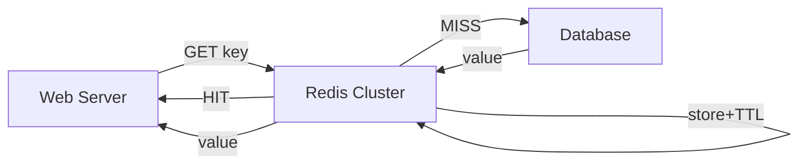
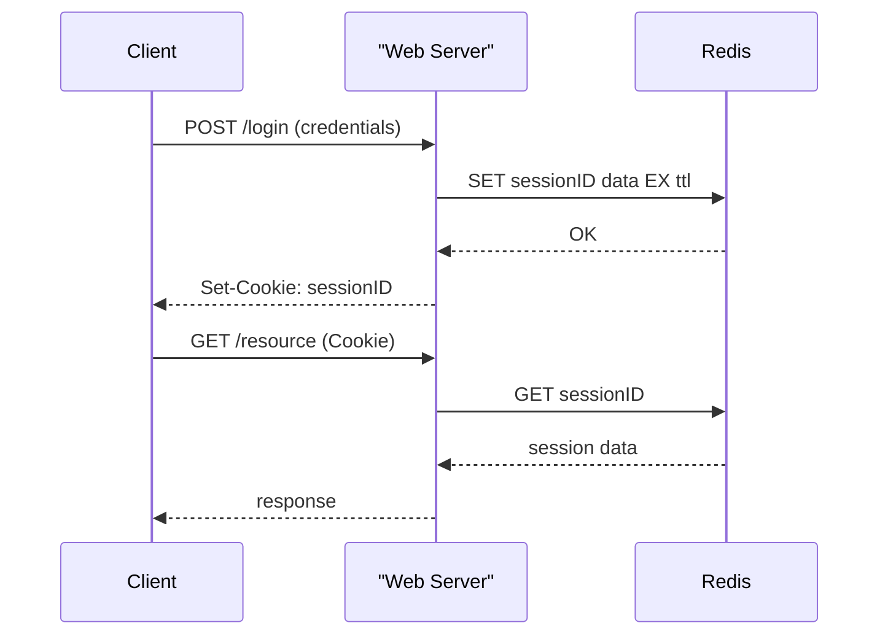
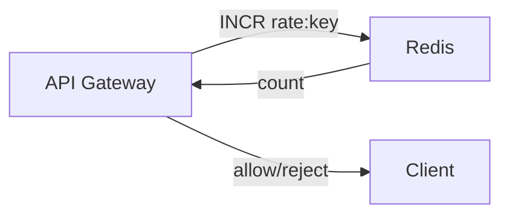
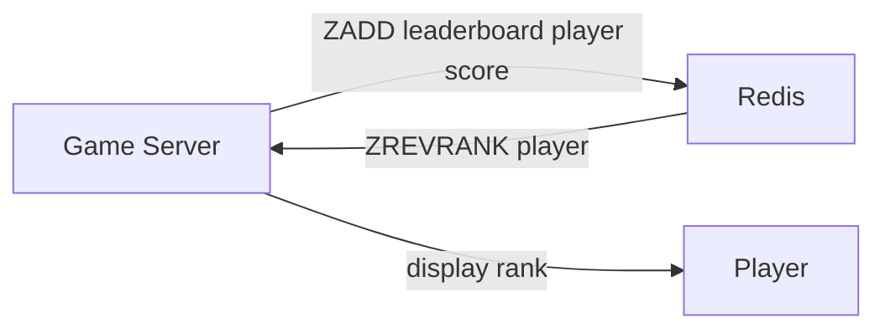

> Summary of [Top 5 Redis Use Cases](https://www.youtube.com/watch?v=a4yX7RUgTxI)
> from **ByteByteGo** · Published 2023-02-16 · Views: 266,052

*This note was generated automatically from the video transcript.*

## TL;DR
Redis’s in‑memory data structures make it ideal for high‑speed caching, session storage, distributed locks, rate limiting, and gaming leaderboards. Deploying Redis as a distributed cache or lock requires careful TTL, sharding, and replication strategies to avoid thundering‑herd and availability pitfalls.

## Key Insights
- **Cache**: Redis stores hot objects in memory, reducing DB load; sharding spreads load across a cluster.  
- **Session Store**: Stateless web servers read/write session data via a session‑ID cookie; replication provides fast failover, while persistence (RDB/AOF) is too slow for most session workloads.  
- **Distributed Lock**: `SETNX`/`SET … NX EX` give atomic lock acquisition with a timeout; client libraries are recommended for fault‑tolerant implementations.  
- **Rate Limiter**: Simple counters (`INCR` + `EXPIRE`) enforce per‑IP/user limits; more advanced algorithms (leaky bucket) can also be built on top of Redis.  
- **Leaderboard**: Sorted Sets (`ZADD`, `ZRANGE`) deliver O(log N) insert and O(log N + M) range queries, perfect for real‑time game rankings.  
- **Operational Concerns**: Proper TTL, handling thundering‑herd on cache miss, and using replication for high availability are critical for production reliability.

## Detailed Breakdown

### 1. Caching Objects
- **Goal**: Serve frequently requested data from memory to cut latency and DB load.  
- **Pattern**:  
  1. Web server checks Redis for key.  
  2. If hit → return cached value.  
  3. If miss → load from DB, write to Redis with a TTL, then return.  
- **Scaling**: A Redis cluster shards keys across multiple nodes, balancing load.  
- **Operational Tips**:  
  - Choose an appropriate TTL to keep data fresh and avoid stale reads.  
  - Guard against a *thundering herd* on cold start by using “lazy” or “early‑expiration” strategies (e.g., staggered TTLs or background refresh).  



### 2. Session Store
- **Workflow**:  
  1. User logs in → server creates session object, stores it in Redis with a unique session ID, returns cookie.  
  2. Subsequent requests include the cookie; server fetches session data by ID from Redis.  
- **Durability**:  
  - Redis is in‑memory; a restart clears data.  
  - Persistence (RDB snapshots, AOF) is too slow for session recovery.  
  - Production setups use **replication**: a primary and one or more replicas; on primary failure, a replica is promoted.  
- **Considerations**: Session TTL must be short enough to free memory but long enough for user experience.



### 3. Distributed Lock
- **Primitive**: `SET key value NX EX seconds` (or older `SETNX` + `EXPIRE`).  
- **Acquisition**:  
  - Client generates a unique token (e.g., UUID).  
  - Executes `SET lock "token" NX EX 3`.  
  - If return = OK → lock held; else retry after back‑off.  
- **Release**: Delete only if token matches (to avoid releasing another client’s lock).  
- **Limitations**: Simple `SETNX` lacks safety against client crashes or clock drift; production libraries (e.g., Redlock) add quorum checks and automatic renewal.  

```mermaid
flowchart LR
  client1["Client 1"] -->|SETNX lock "token" EX 3| redis["Redis"]
  redis -->|1 (OK)| client1
  client1 -->|work| client1
  client1 -->|DEL lock| redis
  client2["Client 2"] -->|SETNX lock "token2" EX 3| redis
  redis -->|0 (FAIL)| client2
```

### 4. Rate Limiter
- **Simple Counter**:  
  - Key = `rate:<IP>` or `rate:<userID>`.  
  - `INCR key` → count.  
  - `EXPIRE key 60` (seconds) to reset each minute.  
  - If count ≤ limit → allow; else reject.  
- **Advanced**: Leaky bucket or token bucket can be modeled with a sorted set storing timestamps, then trimming old entries.  



### 5. Gaming Leaderboard
- **Data Structure**: Sorted Set (`ZADD playerID score`).  
- **Operations**:  
  - `ZADD leaderboard playerID score` – O(log N).  
  - `ZRANGE leaderboard 0 9 WITHSCORES` – top‑10 players, O(log N + M).  
  - `ZREVRANK leaderboard playerID` – player’s rank, O(log N).  
- **Use Cases**: Global high scores, per‑region leaderboards, time‑windowed rankings.  



## Trade-offs and Gotchas
- **Memory Cost**: All data lives in RAM; large datasets require scaling out or eviction policies.  
- **Persistence Latency**: RDB snapshots and AOF can cause pause‑times; not suitable for low‑latency session data.  
- **TTL Misconfiguration**: Too short → frequent cache misses; too long → stale data and memory pressure.  
- **Thundering Herd**: Simultaneous cache miss spikes can overload the DB; mitigate with request coalescing or early refresh.  
- **Lock Safety**: Simple `SETNX` lacks fault tolerance; use vetted libraries (e.g., Redlock) for critical sections.  
- **Cluster Sharding**: Requires client‑side key hashing; cross‑slot operations (e.g., multi‑key transactions) are limited.  
- **Replication Lag**: In asynchronous replication, a replica may be slightly behind; acceptable for sessions but not for strict consistency needs.

## Takeaways
- Use Redis as a **cache** for hot data, but always pair it with a sensible TTL and herd‑mitigation strategy.  
- For **session storage**, rely on replication for HA; persistence is generally unnecessary.  
- Implement **distributed locks** with the atomic `SET … NX EX` pattern and a battle‑tested client library.  
- Build **rate limiters** with simple counters; upgrade to token/leaky bucket only when needed.  
- Leverage **Sorted Sets** for real‑time leaderboards, benefiting from logarithmic insert and range query performance.

## Glossary
- **TTL (Time‑to‑Live)**: Expiration time after which a key is automatically deleted.  
- **Sharding**: Distributing data across multiple nodes based on a hash of the key.  
- **Thundering Herd**: A surge of requests hitting the backing store when a cached entry expires.  
- **AOF (Append‑Only File)**: Redis persistence mode that logs every write operation.  
- **RDB (Redis Database)**: Snapshot‑based persistence that writes the entire dataset to disk at intervals.  
- **Redlock**: A distributed lock algorithm that uses multiple Redis instances to achieve higher safety guarantees.  
- **Sorted Set**: Redis data type that stores unique members with a floating‑point score, kept in order by score.

## Full Transcript

<details>
<summary>Click to expand the raw transcript</summary>

In this video, we discover the versatility of Redis.We’ll talk about the top use cases that have been battle-tested in production at various companies and at various scales.Get insights into how Redis solves interesting scalability challenges for us and learn why it is a great tool to know well in our system design toolset.Let’s dive right into it.First of all, what is Redis, and why do people use it?Redis is an in-memory data structure store.It is most commonly used as a cache.It supports many data structures, such as strings, hashes, lists, sets, and sorted sets.Redis is known for its speed.We made a video to explain why Redis is so fast.Look for the link in the description if you would like to watch that video.Let’s dive into the top use cases of Redis.The number one use case for Redis is caching objects to speed up web applications.In this use case, Redis stores frequently requested data in memory.It allows the web servers to return frequently accessed data quickly.This reduces the load on the database and improves the response time for the application.At scale, the cache is distributed among a cluster of Redis servers.Sharding is a common technique to distribute the caching load evenly across the cluster.Other topics to consider when deploying Redis as a distributed cache include setting a correct TTL and handling a thundering herd on cold start.Another common use case is to use Redis as a session store to share session data among stateless servers.When a user logs in to a web application, the session data is stored in Redis, along with a unique session ID that is returned to the client as a cookie.When the user makes a request to the application, the session ID is included in the request, and the stateless web server retrieves the session data from Redis using the ID.It's important to note that Redis is an in-memory database.The session data stored in Redis will be lost if the Redis server restarts.Even though Redis provides persistence options like snapshots and AOF, or Append-Only File, that allow session data to be saved to disk and reloaded into memory in the event of a restart, these options often take too long to load on restart to be practical.In production, replication is usually used instead.In this case, data is replicated to a backup instance. In the event of a crash of the main instance, the backup is quickly promoted to take over the traffic.Next use case is distributed lock.Distributed locks are used when multiple nodes in an application need to coordinate access to some shared resource.Redis is used as a distributed lock with its atomic commands like SETNX, or SET if Not eXists.It allows a caller to set a key only if it does not already exist.Here’s how it works at a high level:Client 1 tries to acquire the lock by setting a key with a unique value and a timeout using the SETNX command: SETNX lock "1234abcd" EX 3If the key was not already set, the SETNX command returns 1, indicating that the lock has been acquired by Client 1.Client 1 finishes its work and releases the lock by deleting the key.If the key was already set, the SETNX command returns 0, indicating that the lock is already held by another client.In this case, Client 1 waits and retries the SETNX operation until the lock is released by the other client.Note that this simple implementation might be good enough for many use cases, but it is not completely fault tolerant.For production use, there are many Redis client libraries that provide high quality distributed lock implementation built out of the box.Next up is rate limiter.Redis can be used as a rate limiter by using its increment command on some counters and setting expiration times on those counters.A very basic rate-limiting algorithm works this way:For each incoming request, the request IP or user ID is used as a key.The number of requests for the key is incremented using the INCR command in Redis.The current count is compared to the allowed rate limit.If the count is within the rate limit, the request is processed.If the count is over the rate limit, the request is rejected.The keys are set to expire after a specific time window, e.g., a minute, to reset the counts for the next time window.More sophisticated rate limiters like the leaky bucket algorithm can also be implemented using Redis.The last use case we would like to talk about is gaming leaderboard.For most games that are not super high scale, Redis is a delightful way to implement various types of gaming leaderboards.Sorted Sets are the fundamental data structure that enables this.A Sorted Set is a collection of unique elements, each with a score associated with it. The elements are sorted by score. This allows for quick retrieval of the elements by score in logarithmic time.That’s it for our top Redis use cases.Redis is very versatile.There are many different ways to use it.Some features are more battle-tested than others.Our creativity is the limit.Use it with care, and have fun with it.If you like our videos, you may like our System Design newsletter as well.It covers topics like trends and large-scale system design.Trusted by 200,000 readers.Subscribe at blog.bytebytego.com.

</details>
