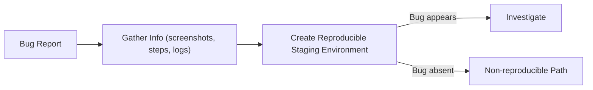
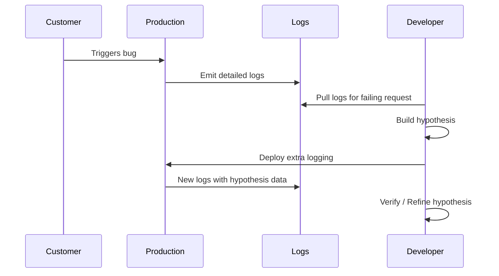

> Summary of [Debugging Like A Pro](https://www.youtube.com/watch?v=J8uAiZJMfzQ)
> from **ByteByteGo** · Published 2023-02-24 · Views: 171,767

*This note was generated automatically from the video transcript.*

## TL;DR
Debugging is a disciplined, mindset‑driven process that starts with thorough information gathering and a reproducible environment, then proceeds through systematic investigation (print statements, debuggers, log‑driven hypotheses). When bugs can’t be reproduced, iterate with targeted logging and theory testing, while remembering to prioritize impact and take regular mental breaks.

## Key Insights
- **Mindset matters:** Treat every bug as a logical problem with a solution; stay persistent, know when to ask for help, and prioritize based on impact.  
- **Information is power:** Capture screenshots, recordings, exact reproduction steps, and full logs before attempting a fix.  
- **Reproducibility halves the effort:** Isolating the environment on a staging server is often the single most effective step.  
- **Lightweight instrumentation wins:** Liberal `print`/logging statements give a timeline of execution without heavy debugger setup.  
- **When reproduction fails, chase the call stack:** Start from the error line, walk up the stack, and build a timeline from logs of a single failing request.  
- **Iterative hypothesis testing:** Add focused logs, deploy to production (or ship to the customer), and repeat until the theory is confirmed or refuted.  
- **Human factors are critical:** Breaks, rubber‑duck explanations, and collaboration frequently surface the missing insight.  
- **Don’t over‑invest:** Some bugs aren’t worth the effort; weigh severity, frequency, and customer impact before deep diving.

## Detailed Breakdown

### 1. Adopt the Right Mindset
- **Logical certainty:** Even the most obscure bug has a deterministic cause; the challenge is locating it.  
- **Temporary stuckness:** Treat “stuck” as a state that will pass with persistence or external input.  
- **Know your limits:** Recognize when a teammate or domain expert can accelerate resolution.  
- **Impact‑driven effort:** Prioritize bugs by severity (e.g., data loss vs cosmetic UI glitch) and avoid sunk‑cost fallacy.

### 2. Gather Complete Bug Information
1. **Customer artifacts:** Request screenshots or screen recordings.  
2. **Reproduction steps:** Document every click, API call, and configuration detail.  
3. **Logs & error messages:** Pull server logs, client console output, and any stack traces.  

These items form the “debugging packet” that will be referenced throughout the investigation.

### 3. Build a Reproducible Environment
- **Isolate variables:** Replicate OS version, dependency versions, feature flags, and network conditions on a staging server.  
- **Validate reproducibility:** If the bug appears on staging, you have a controlled testbed; if not, you must move to non‑reproducible strategies.

### 4. Investigation Strategies (When Reproducible)
- **Print statements / lightweight logging:** Insert statements at key branches to construct an execution timeline.  
- **Full‑stack debuggers:** Use language‑specific tools (e.g., Erlang/OTP introspection) when print‑based tracing is insufficient.  
- **Compare expected vs actual flow:** Align printed timestamps with the intended sequence of operations.

### 5. Handling Non‑Reproducible Bugs
Common causes:
- Production‑only load patterns (high QPS, latency spikes).  
- Race conditions that only surface under specific timing.  
- Device‑specific environment quirks (hardware, OS patches).

**Iterative workflow:**
1. **Trace from error line up the call stack** to identify the entry point.  
2. **Mine logs** for the failing request’s full lifecycle, building a chronological view.  
3. **Form a hypothesis** about the root cause.  
4. **Add targeted logging** (e.g., timestamps, variable values) to validate the hypothesis.  
5. **Deploy the instrumentation** to production or ship a build to the customer.  
6. **Observe**; repeat steps 3‑5 until the bug is isolated.

### 6. Strategies When Completely Stuck
- **Take a break:** Physical activity, sleep, or a change of scenery can reset mental models.  
- **Rubber‑duck debugging:** Explain the problem aloud to an inanimate object or write it as an email to an imaginary mentor.  
- **Collaborate:** Pair‑program or ask a colleague for a fresh perspective; often a new set of eyes spots a missing assumption.

## Trade‑offs and Gotchas
- **Print vs. Debugger:** Print statements are low‑overhead but can clutter code; debuggers give deep inspection but may be unavailable in production or require service restarts.  
- **Adding logging to production:** Risks performance impact and log‑spam; keep added logs scoped and temporary.  
- **Prioritization bias:** Over‑fixing low‑impact bugs can waste time; use a severity matrix (e.g., S1‑S4).  
- **Reproducibility assumptions:** Staging may never perfectly mirror production load, leading to false negatives.  
- **Human fatigue:** Long, repetitive hypothesis cycles can cause tunnel vision; regular breaks mitigate this.  

## Takeaways
- **Start with a complete bug packet** (screenshots, steps, logs) before writing any code.  
- **Reproduce on staging**; if you can’t, treat the production environment as a data source and iterate with focused logging.  
- **Use lightweight instrumentation first**; only bring in heavyweight debuggers when necessary.  
- **Prioritize bugs by impact** and be willing to defer low‑severity issues.  
- **Leverage mental‑reset techniques** (breaks, rubber‑ducking, collaboration) to break dead‑ends.

## Glossary
- **Race condition:** A concurrency bug where the system’s behavior depends on the unpredictable timing of threads or processes.  
- **Call stack:** The ordered list of active function/method calls at a particular point in program execution.  
- **Rubber‑duck debugging:** Explaining a problem out loud to an inanimate object to clarify thinking and uncover hidden assumptions.  
- **Severity matrix (S1‑S4):** A common classification where S1 is critical (system‑wide outage) and S4 is minor (cosmetic UI issue).

## Full Transcript

Click to expand the raw transcript

Have you ever wondered why debugging is not taught in school?Most developers actually learn it on the job, and only a lucky few have a mentor to guide them through the process.In this video, we're going to present a systemic approach to debugging that you can use as a checklist on your debugging journey.Debugging demands discipline, and it's easy to get off course and waste valuable time.We'll show you how to make sound tradeoffs and use good judgment.So whether you're a beginner or an experienced developer, this video is for you.Follow along as we share our tips and tricks for effective debugging.And remember, feel free to use these in any order - there's no right or wrong way to debug!Let's start by discussing the importance of having the right mindset when it comes to debugging challenging problems.It can mean the difference between giving up too early or ultimately solving the issue.When facing tough debugging challenges, it's important to keep the following things in mind:First, remember that computers are logical, and there is always a logical explanation for the issue at hand, even if it may seem impossible to find at the moment.Secondly, being stuck is only temporary, and with persistence and effort, the issue will eventually be resolved.Third, it's important to know your limits and recognize when it's time to seek help from others who may have more expertise.Lastly, it is not always necessary to spend a significant amount of effort in resolving every bug.We should prioritize bugs based on their potential impact and severity.We should accept that fact that some bugs may not be worth the effort.Let's start by covering the basics.When we receive a bug report from a customer, it's important to gather as much information about it as possible.Request a screenshot or screen recording from the customer if possible.Additionally, collect detailed steps to reproduce the issue, and gather all relevant logs, including any error messages associated with the bug.The goal is to obtain as much information as possible to help us reproduce the problem.If we can isolate the environment and context where the issue occurs, we can try to recreate it on a staging server and see if we can reproduce the problem.Having a reproducible environment is half the battle.Now that we have a reproducible environment, how should we investigate the bug? Here are a few strategies to consider:First, use print statements liberally.They can help construct a timeline of what happened and determine if the events we expected to happen in the code actually line up with the print statements.For some language ecosystems, setting up a debugger may be a viable option.For example, systems like Erlang/OTP have excellent introspection capabilities, making the debugger an excellent first tool to reach for.Ultimately, if we can reproduce the bug, it should not be too difficult to get to the bottom of it.While it will take time and patience, following the strategies we mentioned should help us solve the issue eventually.What if we can't reproduce the issue?Well, that's much tougher. It may require some luck and a lot of patience.Let's try to understand why we sometimes have so much trouble reproducing the issue. Here are a few common scenarios:Some bugs only appear under production loads.Some bugs only appear under production loads in certain race conditions.There may be specific context or environment on the customer's device that triggers the bug.What can we do in these situations? Here are a few ideas:If there is a specific error, retrace the code from the line where the error occurred all the way up the call stack.Comb through all the logs for clues and build a timeline by following one failed request through the entire request lifecycle.If we're lucky, we may be able to come up with a theory as to what is happening.Next, we can add logging to the code to prove the theory and deploy it to production or ship it to the customer.Repeat this process until we gather more clues and eventually solve the issue.Keep in mind that this cycle can be lengthy and frustrating, but persistence is key.Lastly, let's review some general strategies to consider when we're completely stuck:Take a break.Sometimes, stepping away from the problem and coming back with a fresh mind can provide new insights.Sleep on it, get some exercise, or engage in a different activity to clear your mind.Tea drinking, some yoga, field of grass visualization etc.Get a rubber duck. Sometimes, talking about the problem out loud can lead to a "light bulb" moment.For others, writing out the problem or emailing an imaginary mentor can help generate new ideas and perspectives.Get help. Don't hesitate to collaborate with someone else on the problem.A fresh set of eyes and a different perspective can often help to reveal new solutions.Debugging can be tough, but with the right mindset and strategies, you can overcome any challenge.Good luck.If you like our videos, you may like our weekly system design newsletter as well.It covers topics and trends in large-scale system design.Trusted by 250,000 readers.Subscribe at blog.bytebytego.com

