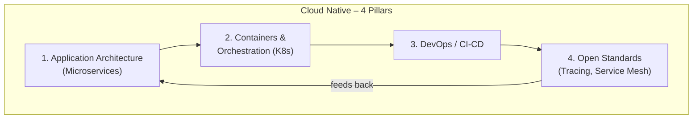

> Summary of [But What Is Cloud Native Really All About?](https://www.youtube.com/watch?v=p-88GN1WVs8)
> from **ByteByteGo** · Published 2023-03-06 · Views: 212,578

*This note was generated automatically from the video transcript.*

## TL;DR

Cloud Native is not simply "running your app on the cloud"; it is a blueprint for building web-scale applications that are more available, scalable, and agile, built on four pillars: microservices architecture, container orchestration, DevOps/CI-CD processes, and adherence to open standards. The decision to adopt a Cloud Native strategy depends on application complexity—small, simple apps may be better served by a monolith, while large, complex systems benefit from the scalability and faster development cycles Cloud Native provides.

## Key Insights

- The term "Cloud Native" first surfaced around 2013 when Netflix discussed their web-scale architecture at an AWS re:Invent talk, and no universally accepted definition has ever been established.
- Cloud Computing (running apps on provider-managed infrastructure) is a necessary but insufficient condition for being Cloud Native; the distinction lies in *how* the application is architected, packaged, developed, and standardized.
- The four pillars are: (1) microservices architecture, (2) containers + orchestration (Kubernetes), (3) DevOps with CI/CD, and (4) adoption of Cloud Native open standards (tracing, service mesh, etc.).
- Microservices are deliberately small, loosely coupled, and communicate via well-defined APIs, enabling independent deployment, scaling, and team ownership.
- Kubernetes is the de-facto orchestration layer that oversees container placement, failure detection/repair, and load balancing across microservices.
- CI/CD splits into Continuous Integration (regular merges + automated tests) and Continuous Delivery (automated deployment pipelines to production).
- Open standards like Jaeger, Zipkin, OpenTelemetry (tracing) and Istio, Linkerd (service mesh) free developers from reimplementing cross-cutting concerns like logging, tracing, and service discovery.
- Adoption is conditional: small/simple applications may not justify the operational overhead of a Cloud Native approach.

## Detailed Breakdown

### Origin and Definition

The term "Cloud Native" first appeared publicly around 2013 when Netflix presented their web-scale application architecture at an AWS re:Invent conference. The speaker notes that the meaning has likely shifted since then, and—critically—there has never been a single authoritative definition. "It means different things to different people." The video's purpose is to offer ByteByteGo's own interpretation and to clarify when the approach is actually warranted.

The core promise of Cloud Native is a **blueprint** for building web-scale applications on the cloud that are:

- **More available** – resilient to component failures.
- **More scalable** – individual pieces can scale independently.
- **More agile** – teams can ship new features quickly without compromising availability, enabling faster response to changing customer demands.

### Cloud Computing vs. Cloud Native

Cloud Computing, in its most basic form, means running applications on computing resources managed by a cloud provider (AWS, GCP, Azure) instead of purchasing and managing your own hardware. Migrating an existing monolith to the cloud:

- Frees the team from hardware management.
- Makes provisioning new compute fast.
- Makes scaling up "effortless" at the infrastructure level.

However, **simply running an application on the cloud does not make it Cloud Native.** The distinction is architectural and process-oriented, not merely locational.

### Pillar 1: Application Architecture – Microservices

Traditional approach: a **monolithic application**—a single binary containing all required functionalities. Problems:

- Difficult to develop, test, and deploy quickly (one change touches the whole binary).
- Challenging to scale (you scale the entire monolith, not just the hot path).

Cloud Native approach: decompose the monolith into **multiple small, interdependent services (microservices)**. Design principles:

- **Small** – each service has a narrow, well-defined responsibility.
- **Loosely coupled** – services communicate via **well-defined APIs** (typically REST/gRPC).
- **Independently deployable and scalable** – each team owns its service and can deploy/scale on its own timeline without coordinating a monolithic release.

**Concrete example from the video:** An e-commerce application is decomposed into a **shopping cart service**, a **payment service**, and an **inventory service**, each communicating over APIs.

### Pillar 2: Containers and Container Orchestration

**Containers** are lightweight packaging units that bundle a microservice together with everything it needs to run (runtime, libraries, config) so it behaves identically in any environment.

As the number of microservices grows, manually managing hundreds or thousands of containers becomes infeasible. **Container orchestration** is the layer that manages this fleet so all microservices run smoothly as a single unified application.

The dominant orchestration platform is **Kubernetes**, which:

- Oversees and controls **where containers run** (scheduling across nodes).
- **Detects and repairs failures** (restarts crashed pods, reschedules them).
- **Balances load** between microservice instances.

### Pillar 3: Development Process – DevOps and CI/CD

Because microservices are developed, deployed, and scaled **independently**, the development process must support high-frequency, low-risk releases. This demands:

- High collaboration between **development** and **operations** teams.
- Significant investment in **automation**.

**DevOps** is the practice emphasizing collaboration, communication, and automation between dev and ops to deliver cloud-native applications quickly and reliably.

The critical technical component is **CI/CD**:

- **Continuous Integration (CI):** Regularly merge code changes into a shared repository and run **automated tests** to verify correctness before merging.
- **Continuous Delivery (CD):** Automate the **deployment** of software to production environments through automated deployment pipelines.

### Pillar 4: Cloud Native Open Standards

As the ecosystem matures, critical cross-cutting concerns become **standardized** and best practices become widely available. Being Cloud Native means leveraging these standardized components as building blocks rather than reinventing them.

Key standards and projects mentioned:

| Concern | Projects |
|---|---|
| Container orchestration | **Kubernetes** |
| Distributed tracing (observability) | **Jaeger**, **Zipkin**, **OpenTelemetry** |
| Service mesh (service-to-service communication) | **Istio**, **Linkerd** |

**Distributed tracing** tracks a request as it propagates through a "maze of microservices," giving end-to-end visibility into latency and failures.

A **service mesh** is a dedicated infrastructure layer that manages service-to-service communication (mTLS, retries, circuit breaking, traffic routing) between microservices, abstracting these concerns away from application code.

The net effect: developers are freed from worrying about logging, tracing, and service discovery, and can focus on their own microservice's business logic.

### When (and When Not) to Adopt Cloud Native

The video is explicit: **it depends.**

- **Small, relatively simple applications:** A traditional monolithic architecture or a simpler deployment model may suffice. The operational overhead of microservices, Kubernetes, and full CI/CD pipelines may not be justified.
- **Larger, more complex applications:** Cloud Native offers increased scalability, availability, and faster development cycles.

The decision should be based on a careful evaluation of:
1. The application's actual requirements (scale, availability, team size).
2. The organization's resources (ops expertise, tooling budget).

When done right, the payoff is applications that are **more reliable, scalable, and resilient** in a **shorter amount of time**.

## Trade-offs and Gotchas

- **No single definition exists.** "Cloud Native" is a moving target; what Netflix meant in 2013 differs from what the CNCF ecosystem standardizes today. Teams should define their own concrete criteria rather than relying on the buzzword.
- **Cloud Computing ≠ Cloud Native.** Lifting a monolith onto AWS EC2 or ECS gives you elastic infrastructure but none of the architectural, process, or standards benefits. The four pillars must all be addressed.
- **Microservices add operational complexity.** Independent deployment and scaling come at the cost of managing inter-service communication, distributed tracing, service discovery, and a larger attack surface.
- **Kubernetes is not mandatory but is de-facto standard.** The video names Kubernetes as "a popular" orchestration platform, but smaller teams may find it overkill; simpler orchestrators or even container-only deployments can work at lower scale.
- **CI/CD investment is non-trivial.** The video emphasizes "a significant investment in automation." Without mature pipelines, the promise of fast, reliable delivery does not materialize.
- **Over-adoption risk.** For small, simple applications, the video explicitly warns that a Cloud Native approach "may not be necessary." The operational tax (orchestration, mesh, tracing infrastructure) can outweigh the benefits.
- **Open standards reduce lock-in but add a learning curve.** Adopting Jaeger/Zipkin/OpenTelemetry or Istio/Linkerd means learning a new tooling layer before you see productivity gains.

## Takeaways

1. **Separate "on the cloud" from "cloud native."** Running on AWS is table stakes; the four pillars (microservices, containers/orchestration, DevOps/CI-CD, open standards) are what actually deliver the scalability and agility promises.
2. **Decompose by ownership, not just by function.** Microservices should be small enough that a single team can own, deploy, and scale them independently on their own timeline.
3. **Invest in CI/CD before scaling microservices.** Without automated integration and deployment pipelines, the independence of microservices becomes a coordination nightmare rather than a productivity win.
4. **Leverage open standards for cross-cutting concerns.** Use established projects (OpenTelemetry for tracing, Istio/Linkerd for service mesh) instead of building your own logging, tracing, or service-discovery layers.
5. **Match the architecture to the problem.** If your application is small and simple, a well-deployed monolith on the cloud is perfectly valid. Reserve the full Cloud Native stack for applications where scale, availability, and team velocity genuinely demand it.

## Glossary

- **Monolithic application:** A single software binary (or deployable unit) that contains all application logic, typically deployed as one unit and scaled as a whole.
- **Microservices:** An architectural style in which an application is composed of many small, independently deployable services, each owning a narrow business capability and communicating over well-defined APIs.
- **Container:** A lightweight, isolated runtime environment that packages an application with its dependencies so it runs identically across any host that supports the container runtime (e.g., Docker).
- **Container orchestration:** The automated management (scheduling, scaling, healing, networking) of a large fleet of containers across a cluster of machines.
- **Kubernetes (K8s):** An open-source container orchestration platform that schedules containers, detects/repairs failures, and balances load.
- **DevOps:** A cultural and technical practice emphasizing collaboration and automation between development and operations teams to shorten the feedback loop from code change to production.
- **CI/CD (Continuous Integration / Continuous Delivery):** CI = regularly merging code and running automated tests; CD = automating the deployment of tested code to production via pipelines.
- **Distributed tracing:** An observability technique that tracks a single request as it traverses multiple microservices, recording timing and metadata at each hop (tools: Jaeger, Zipkin, OpenTelemetry).
- **Service mesh:** A dedicated infrastructure layer (e.g., Istio, Linkerd) that handles service-to-service communication concerns—mTLS, retries, circuit breaking, traffic routing—transparently to application code.
- **CNCF (Cloud Native Computing Foundation):** The open-source foundation that hosts and standardizes many Cloud Native projects (Kubernetes, Prometheus, Envoy, etc.). *Not explicitly named in the transcript but implied by the "open standards" pillar.*

## Full Transcript

Click to expand the raw transcript

What is Cloud Native?How is it different from Cloud Computing?Should we go Cloud Native?Let's take a closer look.The term "Cloud Native" seemed to first appeared around 10 years ago when Netflix discussed their web-scale application architecture at a 2013 AWS re:Invent talk.At that time, the meaning of the term was likely different than it is today.However, one thing remains the same: there were no clear definitions for it then, and there still are not any clear definitions now.It means different things to different people.In this video, we provide our interpretation of the term "Cloud Native" and discuss why and when it is important.To start, what are the promises of Cloud Native?Cloud Native is a blueprint for building web-scale applications on the cloud that are more available and scalable.It promises increased agility to ship new features quickly without compromising availability, making it quicker to respond to changing customer demands.Before we dive into how Cloud Native fulfills these promises, let’s first understand what its close cousin, Cloud Computing, is.In its most basic form, Cloud Computing is running applications on computing resources managed by cloud providers, without having to purchase and manage hardware ourselves.Migrating an existing monolithic application from on-premise to the cloud is a great start.It frees the team from managing hardware infrastructure.It is fast to provision new computing resources, and scaling up is effortless.However, simply running an application on the cloud does not make it Cloud Native.For an application to be considered Cloud Native, there are at least 4 pillars to consider.The first pillar is the application architecture.Cloud-native applications are made up of multiple small, interdependent services called microservices.Traditionally, developers built monolithic applications with a single binary containing all the required functionalities.It was difficult to develop, test, and deploy a monolithic application quickly.It was also challenging to scale a monolithic application.By using the cloud-native approach, developers break the functionalities of a large application into smaller microservices.These services are designed to be small, allowing teams to take ownership of their own services and deploy and scale them independently on their own timeline.These microservices are loosely coupled.They communicate with each other via well-defined APIs.For example, an e-commerce application might be composed of a shopping cart service which talks to a payment service and an inventory service.The second pillar is containers and container orchestration.Cloud native applications are packaged in containers.Containers are lightweight components that contain everything needed to run a microservice in any environment.Container orchestration is an essential component for large cloud-native applications.As the number of microservices grows, container orchestration manages the large number of containers so all the microservices can run smoothly as a single unified application.A popular container orchestration platform is Kubernetes.It oversees and controls where containers run, detects and repairs failures, and balances load between microservices.The third pillar is the development process.Cloud native applications are built using a microservices architecture.Different services are developed, deployed, and scaled independently of each other.This requires a high level of collaboration between development and operations teams, as well as a significant investment in automation for the development and deployment process.This is where DevOps comes into play.DevOps is a development practice that emphasizes collaboration, communication, and automation between development and operations teams to deliver cloud-native applications quickly and reliably.A critical component of DevOps is CI/CD.It enables teams to automate the software development and deployment process, making it faster and more reliable.The Continuous Integration part of CI/CD refers to the practice of regularly merging code changes into a shared repository and running automated tests to ensure that the code is working as expected.The Continuous Delivery part of CI/CD refers to the practice of automating the deployment of the software to production environments, often through the use of automated deployment pipelines.The last pillar is the adoption of Cloud Native open standards.As the Cloud Native ecosystem matures, critical components become standardized and best practices become widely available.Being cloud native means leveraging these standardized components as building blocks and following these best practices as they become available.Let’s walk through some well-known standards and projects behind those standards.We already mentioned Kubernetes.It is a widely-known orchestration project.Distributed tracing is an essential component of observability.It tracks requests as they propagate through a maze of microservices.Some well-known projects are Jaeger, Zipkin and OpenTelemetry.Service mesh is a core infrastructure layer for managing service-to-service communication between microservices.Istio and Linkerd are some examples.By leveraging open standards, it frees developers from having to worry about common functionalities like logging, tracing, and service discovery.This allows developers to focus on what matters, which is their own microservice applications.So, when should we adopt a Cloud Native strategy?The answer is - it depends.If the application is small and relatively simple, a Cloud Native approach may not be necessary and a traditional monolithic architecture or a simpler deployment model may suffice.However, for larger and more complex applications, Cloud Native can offer a wide range of benefits, such as increased scalability, availability, and faster development cycles.Ultimately, the decision to adopt a Cloud Native strategy should be based on a careful evaluation of the application's requirements and the organization's resources.When done right, a Cloud Native approach can help organizations build and deploy applications that are more reliable, scalable, and resilient in a shorter amount of time.If you like our videos, you may like our system design newsletter as well.It covers topics and trends in large-scale system design.Trusted by 250,000 readers.Subscribe at blog.bytebytego.com

