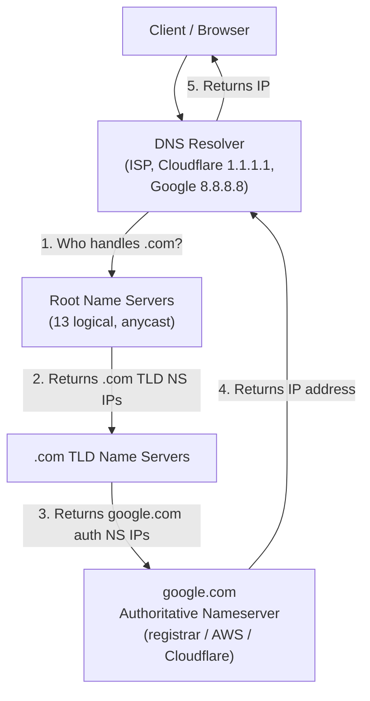
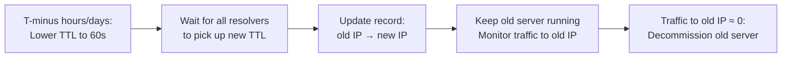

> Summary of [Everything You Need to Know About DNS: Crash Course System Design #4](https://www.youtube.com/watch?v=27r4Bzuj5NQ)
> from **ByteByteGo** · Published 2023-03-14 · Views: 318,473

*This note was generated automatically from the video transcript.*

## TL;DR

DNS is a hierarchical, decentralized directory system that translates human-readable domain names into machine-readable IP addresses through a three-tier chain of authoritative servers (root → TLD → domain). Its robustness comes from anycast routing at the root level, a multi-level caching strategy, and the ability to delegate authority to any provider. The primary operational risk is slow propagation due to TTLs and non-compliant resolvers, mitigated by pre-emptively shortening TTLs and keeping old infrastructure alive.

## Key Insights

- DNS is not a single system but a **three-level hierarchy** of authoritative servers: 13 logical root name servers, TLD name servers (one per TLD like `.com`, `.org`, `.de`), and per-domain authoritative nameservers.
- Each of the 13 root name servers has **one IP address** but is backed by **many physical servers** worldwide, reached via **anycast** routing so queries hit the nearest instance.
- A typical query traverses up to **five cache layers** before hitting the network: browser cache → OS resolver cache → DNS resolver cache → root → TLD → authoritative.
- The DNS resolver (ISP, Cloudflare 1.1.1.1, Google 8.8.8.8) is the **single entry point** for the client; it performs iterative lookups on the client's behalf.
- Because `.com` is extremely common, resolvers almost always **already cache** the `.com` TLD nameserver IPs, skipping the root step in practice.
- DNS propagation is slow because every record carries a **TTL**, and some resolvers **ignore TTL entirely**, so a record change can take minutes to hours to fully take effect.
- The standard mitigation is a two-step process: **pre-emptively lower the TTL to ~60 seconds** well before the change, then **keep the old server alive** until traffic fully drains.
- Domain registration defaults to the **registrar's** authoritative nameservers, but you can delegate to any provider (AWS Route 53, Cloudflare, etc.) for better performance and reliability.

## Detailed Breakdown

### What DNS Does

DNS (Domain Name System) is the internet's directory. Its sole job is to map a human-readable name like `google.com` to a machine-readable IP address. Without it, every HTTP request would require you to type an IP. The system is "a little confusing" (as the video notes) because there are **different types of DNS servers** at different levels, each serving a distinct purpose.

### The Three-Tier Authoritative Hierarchy

The authoritative side of DNS is organized into three levels:

1. **Root name servers** – There are **13 logical root name servers** (labeled A through M in the real world, though the video does not name them). Each has a **single IP address**, but behind that IP sit **many physical servers** distributed globally. **Anycast** routing ensures a query is directed to the geographically nearest physical instance. Root servers store the IP addresses of all TLD name servers.

2. **TLD (Top-Level Domain) name servers** – One set per TLD. They store the IP addresses of the **authoritative nameservers** for every domain registered under that TLD. TLDs include:
   - Generic: `.com`, `.org`, `.edu`
   - Country-code: `.de`, `.uk`
   - Many others (the video notes "there are many others" without enumerating them).

3. **Authoritative nameservers for a domain** – These hold the actual DNS records (A, AAAA, CNAME, MX, etc.) for a specific domain and return the definitive answer. When you register a domain, the **registrar** runs the authoritative nameservers by default, but you can delegate to any provider. Cloud providers like **AWS** and **Cloudflare** operate robust, high-availability authoritative nameserver infrastructure.

This hierarchical, delegated design is what makes DNS **highly decentralized and robust**: no single point of failure, and each level only needs to know about the level directly below it.



### The Life of a DNS Query (Step by Step)

The video walks through a concrete example: the user types `google.com` into the browser.

1. **Browser cache** – The browser first checks its own in-memory DNS cache. If the answer is present and not expired, it uses it immediately. No network call.

2. **OS resolver** – If the browser cache misses, the browser makes an **operating system call** (e.g., `getaddrinfo` on Linux/macOS). The OS has its **own cache** (often managed by `nscd`, `systemd-resolved`, or the OS's built-in resolver). If the answer is there, it is returned.

3. **DNS resolver (recursive resolver)** – If the OS cache also misses, the query is sent to the **DNS resolver**. This is typically:
   - Your **ISP's** resolver, or
   - A public resolver like **Cloudflare 1.1.1.1** or **Google 8.8.8.8**.

   The resolver first checks **its own cache**. If the record is present and the TTL has not expired, it returns the cached answer.

4. **Root name server** – If the resolver's cache misses (or the cached answer has expired), the resolver sends a query to a **root name server**. The root server does **not** know the IP for `google.com`; it responds with a **referral**: "I don't know, but here are the IP addresses of the `.com` TLD name servers." In practice, because `.com` is so ubiquitous, the resolver **almost certainly already has the `.com` TLD IPs cached**, so this step is often skipped.

5. **TLD name server** – The resolver queries the `.com` TLD name server. The TLD server responds with another referral: "I don't know the IP, but here are the IP addresses of the authoritative nameservers for `google.com`."

6. **Authoritative nameserver** – The resolver queries `google.com`'s authoritative nameserver. This server **holds the answer** and returns the actual IP address (e.g., `142.250.80.46`).

7. **Return path** – The resolver returns the IP to the OS, the OS returns it to the browser, and the browser initiates a TCP/TLS connection to that IP.

Each level **caches** the answer it receives (with the TTL provided by the authoritative server), so subsequent queries for the same domain are answered at a closer level.

```mermaid
sequenceDiagram
    participant B as Browser
    participant OS as OS Resolver
    participant R as DNS Resolver
    participant Root as Root NS
    participant TLD as .com TLD NS
    participant Auth as google.com Auth NS

    B->>B: Check browser cache (miss)
    B->>OS: getaddrinfo("google.com")
    OS->>OS: Check OS cache (miss)
    OS->>R: DNS query for google.com
    R->>R: Check resolver cache (miss / expired)
    R->>Root: Who handles .com?
    Root-->>R: Referral: .com TLD NS IPs
    Note over R: (Often cached; step skipped)
    R->>TLD: Who handles google.com?
    TLD-->>R: Referral: google.com auth NS IPs
    R->>Auth: What is google.com's IP?
    Auth-->>R: 142.250.80.46 (TTL=300)
    R-->>OS: 142.250.80.46
    OS-->>B: 142.250.80.46
    B->>B: Cache the answer
```

### Why the Design Is Decentralized and Robust

- **13 logical roots, many physical servers**: No single root server is a bottleneck. Anycast spreads load and provides geographic redundancy.
- **Delegation at every level**: A root server only knows TLD servers; a TLD server only knows domain authoritative servers. No server needs to know every domain on the internet.
- **Multiple resolvers**: Users can choose any resolver (ISP, Cloudflare, Google), so no single resolver is a single point of failure.
- **Caching at every layer**: Browser, OS, and resolver each cache, reducing load on authoritative servers and speeding up repeated lookups.

### Operational Gotchas: Updating DNS on a Live System

The video dedicates its final section to the practical risks of changing DNS records for a **high-traffic production system**.

**The problem:**
- Every DNS record has a **TTL** (Time-To-Live). Some default TTLs are **quite long** (e.g., 24 hours / 86,400 seconds).
- **Not every resolver honors the TTL.** Some resolvers cache records longer than the TTL dictates. This means even after you update a record, some fraction of the world may still resolve to the old IP for an unpredictable amount of time.

**The two-step mitigation:**

1. **Pre-emptively lower the TTL.** Well in advance of the actual change (hours or a day before), update the record's TTL to a very short value, e.g., **60 seconds**. This gives every well-behaved resolver time to expire its old cache entry and pick up the new, shorter TTL. Once all resolvers are operating on a 60-second TTL, the actual record change will propagate within roughly a minute.

2. **Keep the old server alive.** After you flip the DNS record to point at the new IP, **do not decommission the old server immediately**. Leave it running and serving traffic until you observe that traffic to the old IP has dropped to an acceptable (near-zero) level. Because of non-compliant resolvers, this drain period can take **a while** and requires patience.



## Trade-offs and Gotchas

- **TTL is a double-edged sword.** A long TTL reduces load on authoritative servers and speeds up repeated lookups, but it makes record changes slow to propagate. A short TTL (e.g., 60 s) makes changes fast but increases query volume to authoritative servers.
- **Non-compliant resolvers are a real risk.** The video explicitly warns that "some of them don't honor the TTL." You cannot assume a 60-second TTL means 60 seconds; some resolvers may hold onto the old value for much longer. This is why the "keep the old server alive" step is non-negotiable.
- **Anycast at the root level** provides geographic redundancy but means you cannot pinpoint which physical server answered a query. Debugging root-level issues is harder than with a unicast deployment.
- **Registrar default nameservers** are functional but may not match the performance or reliability of dedicated providers like AWS or Cloudflare. Delegating to a cloud provider adds a dependency on that provider's infrastructure.
- **Caching at multiple layers** (browser, OS, resolver) means a single record change must propagate through **three independent caches** before every user sees the new value. Even with a 60-second TTL, the browser's own cache may hold the old value until the browser's internal TTL expires.
- **The video does not cover** DNSSEC, DNS-over-HTTPS (DoH), DNS-over-TLS (DoT), or the specific record types (A, AAAA, CNAME, MX, TXT, SRV) in detail. If your system design interview or production work touches on these, you will need additional references.

## Takeaways

- **Memorize the three-tier hierarchy**: 13 logical root servers (anycast) → TLD servers → domain authoritative servers. Each level only knows the next level down.
- **Trace a query through the five cache layers** (browser → OS → resolver → root → TLD → authoritative) before assuming a network problem. The answer is almost always in a cache somewhere.
- **Before any DNS record change in production, lower the TTL to ~60 seconds at least a day in advance.** This is the single most important operational habit.
- **Never decommission the old infrastructure until traffic to the old IP is verifiably near zero.** Non-compliant resolvers will keep sending traffic to the old IP for an unpredictable window.
- **You can delegate authoritative DNS to any provider** (AWS, Cloudflare, etc.) independent of your registrar. This is a common step in system design to decouple DNS reliability from the registrar.

## Glossary

- **Anycast**: A routing technique where multiple servers share a single IP address; BGP routes each query to the nearest (or least-congested) server. Used by all 13 root name servers.
- **Authoritative nameserver**: The DNS server that holds the definitive, source-of-truth records for a domain. It is the final answer in the resolution chain.
- **DNS resolver (recursive resolver)**: The server that receives a client's query and performs the full iterative lookup (root → TLD → authoritative) on the client's behalf, caching results along the way.
- **TLD (Top-Level Domain)**: The final segment of a domain name (e.g., `.com`, `.org`, `.de`). Each TLD has its own set of name servers.
- **TTL (Time-To-Live)**: The number of seconds a DNS record may be cached before it must be re-fetched from the authoritative server.
- **Referral**: A DNS response that does not contain the final answer but instead points to the next set of nameservers to query (e.g., root → TLD, TLD → authoritative).
- **Registrar**: The service through which a domain name is registered. By default, the registrar also operates the domain's authoritative nameservers.

## Full Transcript

<details>
<summary>Click to expand the raw transcript</summary>

DNS, or Domain Name System, is the backbone of the internet, but few know exactly how it works.In this video, we will learn all about the system design of DNS.Let’s dive right in.DNS is the internet’s directory.It translates human-readable domain names, such as google.com to machine-readable IP addresses.DNS is a little confusing because there are different types of DNS servers in the DNS hierarchy, each serving a different purpose.When a browser makes a DNS query, it’s asking a DNS resolver.This DNS resolver could be from our ISP, or from popular DNS providers like Cloudflare’s 1.1.1.1, or Google’s 8.8.8.8.If the DNS resolver does not have the answer in its cache, it finds the right authoritative nameserver and asks it.The authoritative nameserver is the one that holds the answer.When we update a domain’s DNS records, we are updating its authoritative nameserver.How does the DNS resolver find the authoritative name server?This is where the system of DNS gets interesting.There are three main levels of authoritative DNS servers.They are the root name servers, the top level domain (or TLD) name servers, and the authoritative nameservers for the domains.The root name servers store the IP addresses of the TLD name servers.There are 13 logical root name servers.Each root name server has a single IP address assigned to it.There are actually many physical servers behind each IP address.Through the magic of anycast, we get routed to the one closest to us.The TLD name servers store the IP addresses of the authoritative name servers for all the domains under them.There are many types of TLD names.We are all familiar with .com, .org and .edu.There are also country code TLDs like .de and .uk.There are many others.The authoritative name servers for a domain provide, well, authoritative, answers to DNS queries.When we register a domain, the registrar runs the authoritative nameservers by default, but we can change them to others.Cloud providers like AWS and Cloudflare run robust authoritative nameservers.This hierarchical design makes DNS highly decentralized and robust.Let’s walk through the life of a typical DNS query.The user types google.com into the browser.The browser first checks its cache.If it has no answer, it makes an operating system call to try to get the answer.The operating system call would most likely have its own cache.If the answer isn’t there, it reaches out to the DNS resolver.The DNS resolver first checks its cache.If it’s not there or if the answer has expired, it asks the root name server.The root name server responds with the list of the .com TLD name servers.Note that since .com is such a common TLD, the resolver most likely already caches the IP addresses for those .com TLD nameservers.The DNS resolver then reaches out to the .com TLD nameserver, and the .com TLD nameserver returns the authoritative nameservers to google.com.And finally, the DNS resolver reaches out to google.com’s authoritative nameserver, and it returns the IP address of google.comThe DNS resolver then returns the IP address to the operating system, the operating system returns it to the browser.Finally, let’s go over some gotchas when updating DNS records for a live, high-traffic production system.DNS propagation is slow because there is a TTL on each DNS record.And some of the default TTLs are pretty long. Also, not every DNS resolver is a good citizen.There are some out there that don’t honor the TTL.To mitigate the risk, there are two practical steps to take.First, reduce the TTL for the record that we want to change to something very short, say 60 seconds, well in advance before the update actually happens.This gives ample time for all the DNS servers to receive the shortened TTL which would allow the actual record update to take effect based on the new shortened TTL.Second, leave the server running on the old IP address for a while.Only decommission the server when traffic dies down to an acceptable level.Because some DNS resolvers don’t honor the TTL, this could take a bit of time and patience.This concludes our video on DNS.We hope you have a better understanding of how its hierarchical design makes it decentralized and robust.Remember, DNS is what translates domain names to IP addresses, making it a critical component of the internet backbone.If you like our videos, you may like our system design newsletter as well.It covers topics and trends in large-scale system design.Trusted by 250,000 readers.Subscribe at blog.bytebytego.com

</details>
