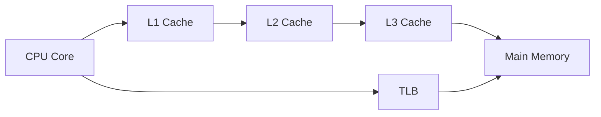
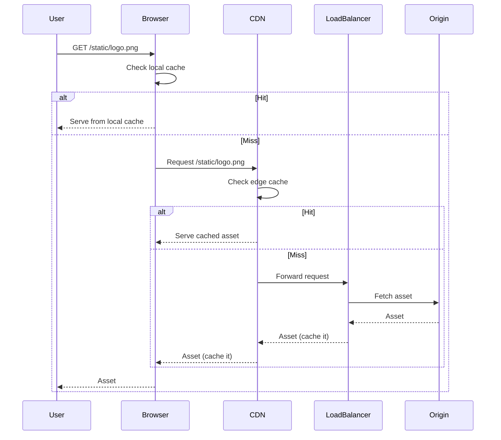
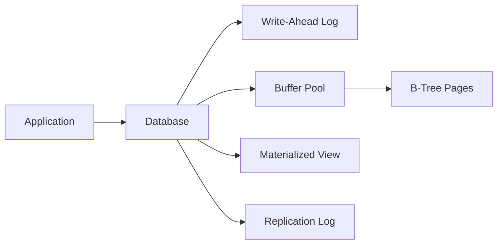

> Summary of [Cache Systems Every Developer Should Know](https://www.youtube.com/watch?v=dGAgxozNWFE)
> from **ByteByteGo** · Published 2023-04-04 · Views: 663,038

*This note was generated automatically from the video transcript.*

## TL;DR
Caching permeates every layer of a modern system—from CPU registers to browsers, CDNs, load balancers, message brokers, distributed stores, and databases. By keeping frequently accessed data close to the consumer, each cache reduces latency, off‑loads downstream resources, and improves overall throughput.

## Key Insights
- **Hardware caches (L1‑L3, TLB) keep the CPU fed with the hottest data, shrinking memory‑access latency from nanoseconds to a few cycles.**  
- **OS page cache and inode cache turn disk blocks into RAM, turning costly I/O into fast memory reads.**  
- **Browsers, CDNs, and some load balancers cache HTTP responses, turning round‑trip network latency into near‑instant local fetches.**  
- **Message brokers like Kafka persist large on‑disk caches, enabling consumers to replay data according to retention policies.**  
- **Distributed in‑memory caches (e.g., Redis) provide sub‑millisecond key‑value lookups, dramatically faster than relational DB reads.**  
- **Databases layer caching (WAL, buffer pool, materialized views, replication logs) decouples write‑ahead durability from query performance.**  
- **Each cache introduces consistency, eviction, and capacity trade‑offs that must be tuned per workload.**  

## Detailed Breakdown

### 1. Hardware‑Level Caches
- **L1 Cache** – Smallest (typically < 64 KB) and fastest; sits inside each CPU core. Stores the most frequently accessed instructions and data.
- **L2 Cache** – Larger (hundreds of KB) but slower; located on the CPU die or a nearby chip. Acts as a secondary buffer for L1 misses.
- **L3 Cache** – Even larger (several MB) and shared across cores; bridges the gap between CPU cores and main memory.
- **Translation Lookaside Buffer (TLB)** – Caches recent virtual‑to‑physical address translations, avoiding page‑table walks for every memory access.

### 2. Operating‑System Caches
- **Page Cache** – Resides in RAM; holds recently read disk blocks. When a process reads a file, the OS first checks the page cache, turning a potential 5‑10 ms disk read into a ~0.1 ms memory read.
- **Inode Cache** – Stores filesystem metadata (inode structures) to avoid repeated disk seeks for file attributes.

### 3. Front‑End Caching (Browser → CDN → Load Balancer)
1. **Browser Cache** – On first HTTP request, the server sends `Cache‑Control` / `Expires` headers. Subsequent identical requests are served from the local browser store, eliminating network latency.
2. **Content Delivery Network (CDN)** – Edge servers cache static assets (images, JS, CSS). If a request misses the edge cache, the CDN fetches from the origin, stores it, and serves future requests directly.
3. **Load Balancer Cache** – Some LBs (e.g., NGINX with `proxy_cache`) keep a copy of HTTP responses. This reduces load on backend services for cache‑able endpoints.

### 4. Messaging & Distributed Caches
- **Kafka** – Persists messages on disk in a *log* structure. The log acts as a massive, ordered cache; consumers can read at their own pace, and retention policies (e.g., 7 days) keep data available long after production.
- **Redis (or similar)** – In‑memory key‑value store. Provides O(1) reads/writes, often used for session data, leaderboards, or as a read‑through cache in front of a slower database.

### 5. Database‑Level Caching
- **Write‑Ahead Log (WAL)** – Guarantees durability by writing changes to a sequential log before applying them to the data pages.
- **Buffer Pool** – In‑memory area that caches frequently accessed pages (B‑tree nodes, rows). Queries hit the buffer pool first, avoiding disk I/O.
- **Materialized Views** – Pre‑computed query results stored as tables; read queries hit these directly, bypassing expensive joins or aggregations.
- **Replication Log** – Tracks changes for replica nodes; also serves as a cache for read‑only replicas.

## Trade-offs and Gotchas
- **Staleness vs. Freshness** – Aggressive caching reduces latency but can serve outdated data; cache‑invalidation strategies are critical.
- **Memory Pressure** – Over‑allocating cache (e.g., large Redis cluster) can starve other processes; eviction policies (LRU, LFU) must match access patterns.
- **Cache Warm‑up** – Cold caches cause initial latency spikes; consider pre‑warming or lazy loading.
- **Consistency Overhead** – Distributed caches need coherence protocols; network partitions can cause split‑brain scenarios.
- **Complexity** – Each additional cache layer adds operational complexity (monitoring, metrics, debugging cache misses).

## Takeaways
- Map the *data flow* of your system and identify the hottest read paths; place the smallest, fastest caches (CPU, page cache) closest to the consumer.
- Use HTTP caching headers wisely; a proper `Cache‑Control` policy can off‑load billions of requests to browsers and CDNs.
- Pair an in‑memory cache (Redis) with a durable store (DB + WAL) to get both speed and reliability.
- Monitor cache hit ratios at every layer; a low ratio often signals mis‑sized caches or poor eviction policies.
- Always design a clear invalidation or expiration strategy to avoid serving stale data.

## Glossary
- **L1/L2/L3 Cache**: Hierarchical CPU caches with decreasing speed and increasing size.
- **TLB (Translation Lookaside Buffer)**: Cache for virtual‑to‑physical address translations.
- **Page Cache**: OS‑level RAM cache of disk blocks.
- **Inode Cache**: OS cache of filesystem metadata structures.
- **CDN (Content Delivery Network)**: Distributed edge servers that cache and serve static content close to users.
- **Load Balancer Cache**: Optional caching performed by a reverse proxy or LB to reduce backend load.
- **Write‑Ahead Log (WAL)**: Sequential log ensuring durability before data pages are modified.
- **Buffer Pool**: In‑memory cache of database pages used to satisfy queries without disk I/O.
- **Materialized View**: Pre‑computed result set stored as a table for fast reads.
- **Replication Log**: Log of changes propagated to replica nodes in a DB cluster.

## Full Transcript

Click to expand the raw transcript

Caching is a common technique in modern computing to enhance system performance and reduce response time.From the front end to the back end, caching plays a crucial role in improving the efficiency of various applications and systems.A typical system architecture involves several layers of caching.At each layer, there are multiple strategies and mechanisms for caching data, depending on the requirements and constraints of the specific application.Before diving into a typical system architecture, let’s zoom in and look at how prevalent caching is within each computer itself.Let’s first look at computer hardware.The most common hardware cache are L1, L2, and L3 caches.L1 cache is the smallest and fastest cache, typically integrated into the CPU itself.It stores frequently accessed data and instructions, allowing the CPU to quickly access them without having to fetch them from slower memory.L2 cache is larger but slower than L1 cache, and is typically located on the CPU die or on a separate chip.L3 cache is even larger and slower than L2 cache, and is often shared between multiple CPU cores.Another common hardware cache is the translation lookaside buffer (TLB).It stores recently used virtual-to-physical address translations.It is used by the CPU to quickly translate virtual memory addresses to physical memory addresses, reducing the time needed to access data from memory.At the operating system level, there are page cache and other file system caches.Page cache is managed by the operating system and resides in main memory.It is used to store recently used disk blocks in memory.When a program requests data from the disk, the operating system can quickly retrieve the data from memory instead of reading it from disk.There are other caches managed by the operating system, such as the inode cache.These caches are used to speed up file system operations by reducing the number of disk accesses required to access files and directories.Now let’s zoom out and look at how caching is used in a typical application system architecture.On the application front end, web browsers can cache HTTP responses to enable faster retrieval of data.When we request data over HTTP for the first time, and it is returned with an expiration policy in the HTTP header;we request the same data again, and the browser returns the data from its cache if available.Content Delivery Networks (CDNs) are widely used to improve the delivery of static content, such as images, videos, and other web assets. One of the ways that CDNs speeds up content delivery is through caching.When a user requests content from a CDN, the CDN network looks for the requested content in its cache.If the content is not already in the cache, the CDN fetches it from the origin server and caches it on its edge servers.When another user requests the same content, the CDN can deliver the content directly from its cache, eliminating the need to fetch it from the origin server again.Some load balancers can cache resources to reduce the load on back-end servers.When a user requests content from a server behind a load balancer, the load balancer can cache the response and serve it directly to future users who request the same content. This can improve response times and reduce the load on back-end servers.Caching does not always have to be in memory. In the messaging infrastructure, message brokers such as Kafka can cache a massive amount of messages on disk.This allows consumers to retrieve the messages at their own pace. The messages can be cached for a long period of time based on the retention policy.Distributed caches such as Redis can store key-value pairs in memory, providing high read/write performance compared to traditional databasesFull-text search engines like Elastic Search can index data for document search and log search, providing quick and efficient access to specific data.Even within the database, there are multiple levels of caching available.Data is typically written to a write-ahead log (WAL) before being indexed in a B-tree. The buffer pool is a memory area used to cache query results, while materialized views can precompute query results for faster performance.The transaction log records all transactions and updates to the database,while the replication log tracks the replication state in a database cluster.Overall, caching data is an essential technique for optimizing system performance and reducing response time. From the front end to the back end, there are many layers of caching to improve the efficiency of various applications and systems.If you like our videos, you may like our system design newsletter as well. It covers topics and trends in large-scale system design. Trusted by 300,000 readers. Subscribe at blog.bytebytego.com

