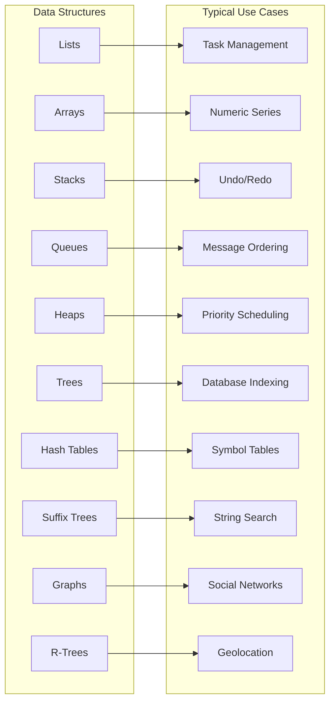

> Summary of [10 Key Data Structures We Use Every Day](https://www.youtube.com/watch?v=ouipSd_5ivQ)
> from **ByteByteGo** · Published 2023-05-01 · Views: 448,660

*This note was generated automatically from the video transcript.*

## TL;DR
Data structures are the building blocks of everyday software, each offering distinct performance characteristics and cache‑friendliness. Choosing the right one—lists, arrays, stacks, queues, heaps, trees, hash tables, suffix trees, graphs, or R‑trees—directly impacts system efficiency and scalability.

## Key Insights
- **Lists** provide ordered, mutable collections ideal for task queues, feeds, and shopping carts.  
- **Arrays** give fixed‑size, random‑access storage, perfect for numeric series, temperature logs, and image pixel grids.  
- **Stacks (LIFO)** enable undo/redo and browsing history by pushing and popping recent actions.  
- **Queues (FIFO)** preserve arrival order, useful for printer jobs, game inputs, and chat message delivery.  
- **Heaps** implement priority queues for task scheduling and memory management, exposing the highest/lowest priority in O(log n).  
- **Trees** (including B‑trees/B+‑trees) model hierarchical data, powering database indexes, AI decision trees, and filesystems.  
- **Hash tables** achieve average O(1) look‑ups for symbol tables, caches, and search‑engine indexes via a hash function.  
- **Suffix trees** and **graphs** excel at string search and relationship traversal, respectively, while **R‑trees** specialize in spatial nearest‑neighbor queries for mapping services.  
- **Cache friendliness** varies: contiguous structures (arrays) enjoy low cache‑miss rates; pointer‑heavy structures (linked lists, many trees) suffer more misses.

## Detailed Breakdown

### Lists
- **Use‑case:** Task management apps, social‑media feeds, shopping carts.  
- **Operations:** Insert, delete, reorder in O(1) (at ends) or O(n) (mid‑list).  
- **Example:** A to‑do list where each task can be added, removed, or marked complete.

### Arrays
- **Characteristics:** Fixed size, contiguous memory, O(1) random access.  
- **Ideal scenarios:** Known‑size collections, numeric calculations, image processing.  
- **Example:** Storing hourly temperature readings for a city to compute daily averages.

### Stacks
- **Principle:** Last‑In‑First‑Out (LIFO).  
- **Common pattern:** Push on change, pop on undo.  
- **Example:** Text editor undo stack storing each edit operation.

### Queues
- **Principle:** First‑In‑First‑Out (FIFO).  
- **Typical jobs:** Printer queues, game input buffers, chat message ordering.  
- **Example:** Chat server enqueues incoming messages to guarantee correct display order.

### Heaps
- **Structure:** Binary (or d‑ary) tree satisfying heap property.  
- **Primary role:** Priority queue for scheduling tasks or memory management.  
- **Operations:** Insert O(log n), extract‑min/max O(log n), peek O(1).

### Trees
- **Hierarchy:** Nodes with parent‑child relationships.  
- **Variants:**  
  - **B‑tree / B+‑tree:** Balanced multi‑way trees used by relational databases for range queries.  
  - **Decision trees:** Machine‑learning models for classification.  
- **Benefits:** Logarithmic search/insert/delete, natural representation of hierarchical data.

### Hash Tables
- **Mechanism:** Hash function maps keys → bucket indices.  
- **Performance:** Average O(1) for lookup, insert, delete; worst‑case O(n) if many collisions.  
- **Applications:** Symbol tables in compilers, caching layers, search‑engine keyword indexes.

### Suffix Trees
- **Specialization:** Stores all suffixes of a string in a compressed trie.  
- **Power:** Enables linear‑time substring search across large corpora.  
- **Use‑case:** Text editors’ “find all” feature, search‑engine indexing.

### Graphs
- **Model:** Nodes (vertices) connected by edges, can be directed/undirected, weighted/unweighted.  
- **Key algorithms:** BFS, DFS, Dijkstra, PageRank.  
- **Examples:** Social‑network friend graphs for recommendation engines; route planning.

### R‑Trees
- **Purpose:** Index multi‑dimensional spatial data (e.g., latitude/longitude).  
- **Operation:** Stores bounding rectangles; queries for nearest neighbor run in O(log n).  
- **Scenario:** Mapping app locating the closest points of interest to a user’s location.

### Cache Friendliness
- **Contiguous structures (arrays):** High spatial locality → fewer cache misses; CPU can prefetch adjacent elements.  
- **Pointer‑heavy structures (linked lists, many tree implementations):** Elements scattered in memory → higher miss rate, slower traversal.  
- **Design implication:** For performance‑critical loops, prefer arrays or cache‑friendly layouts; restructure linked data when possible.

## Trade‑offs and Gotchas
- **Lists vs. Arrays:** Lists allow cheap insert/delete anywhere but incur pointer overhead and poor cache locality; arrays give fast random access but costly resizing.  
- **Stacks/Queues:** Simple to implement, but unbounded growth can cause memory pressure; need size limits or periodic cleanup.  
- **Heaps:** Efficient for top‑priority access, yet not suited for arbitrary element removal without additional bookkeeping.  
- **Tree balancing:** Unbalanced trees degrade to O(n) operations; use self‑balancing variants (AVL, Red‑Black, B‑tree).  
- **Hash collisions:** Poor hash functions or high load factors increase collision chains, hurting O(1) guarantees.  
- **Suffix trees:** High memory consumption (often 10–20× input size); practical only for moderate‑size texts or when compressed variants (suffix arrays) are acceptable.  
- **Graph representation:** Adjacency matrix offers O(1) edge checks but O(V²) space; adjacency list is space‑efficient for sparse graphs but slower edge existence tests.  
- **Cache‑unfriendly layouts:** Excessive pointer chasing can dominate runtime on modern CPUs; consider struct‑of‑arrays or memory pools.

## Takeaways
- Match the data‑structure choice to **access pattern** (random vs. sequential) and **size dynamics** (fixed vs. dynamic).  
- Prioritize **cache‑friendly layouts** (contiguous memory) for hot loops to minimize latency.  
- Use **self‑balancing trees** or **hash tables** for large, mutable datasets requiring fast look‑ups.  
- Reserve **specialized structures** (suffix trees, R‑trees) for domain‑specific problems where their algorithmic advantages outweigh memory costs.  
- Always profile: real‑world performance can diverge from textbook complexities due to cache behavior and constant factors.

## Glossary
- **LIFO (Last‑In‑First‑Out):** Stack ordering where the most recent element is removed first.  
- **FIFO (First‑In‑First‑Out):** Queue ordering where the earliest element is removed first.  
- **Heap property:** In a min‑heap, each parent ≤ its children; in a max‑heap, each parent ≥ its children.  
- **Cache miss:** When the CPU requests data not present in the fast cache, forcing a slower main‑memory fetch.  
- **Spatial locality:** Tendency of programs to access memory locations that are close together.  
- **Load factor (hash table):** Ratio of stored entries to bucket count; high load factors increase collision risk.  
- **Suffix tree:** A compressed trie containing all suffixes of a string, enabling fast substring queries.  
- **R‑tree:** A balanced tree for indexing multi‑dimensional geometric objects using bounding rectangles.

## Full Transcript

Click to expand the raw transcript

[Music]in this video we discuss a topic That'sessential to every software developerdata structures we use them every dayand they play a critical role inbuilding efficient systems so let's DiveRight In and take a closer look at somecommonexamples let's start by discussing listslists are a versatile and essential datastructure in software development theyare great for storing and manipulatingorder data they are useful in variousapplications like task management socialmedia feeds and shopping carts in a taskmanagement application a list can beused to store and organized tasks foreach user task can be added removed orreordered easily and user can mark themas complete asneeded lists are also useful in socialmedia applications like Twitter wherethey can store and display a users feedin real time ensuring the latest contentis shown in the correctorder arrays are another fundamentaldata structure they provide a fix siizorder collection of elements they'reparticularly well suited for situationswhere the size of the collection isknown or doesn't changefrequently arrays are commonly used inmathematical operations storing largedata sets or when there's a need forrandom access to elements for example ina weather application an array could beused to store temperature readings for aspecific location over a defined periodthis allows for easy calculations likeaverages andtrans arrays are also widely used inimage processing where each pixel'scolor data can be represented in atwo-dimensional array it enablesefficient manipulation and transformof theimage next we have stacks Stacks followthe last in first out principle they areperfect for supporting undo and redooperations in text editors ormaintaining browsing history in webbrowsers in a text editor a stack can beused to store each change made to thetext making it simple to revert to aprevious state when the user triggers anundo operationqes operate on a first in first outbasis they are good for managing printerjobs sending user actions in games orhandling messages in chatapplications in chat applications a qcan be used to store incoming messagesin the order they are received itensures that they are displayed to therecipient in the correctsequence heaps on the other hand areused for task scheduling and memorymanagement they're especially helpful inimplementing priority cues where we needto access the highest or lowest priorityitemefficiently trees organize datahierarchically they are useful forrepresenting data with naturalhierarchies orrelationships they can be used invarious applications like databaseindexing AI decision making or filesystems in AI decision making trees likedecision trees are used in machinelearning for classificationtasks trees are also used in databaseindexing where they can help speed upsearch insert or delete operations forexample B trees and B+ trees arecommonly used in relational databases toefficiently manage and index largeamounts ofdata hash tables for efficient datalookup insertion and deletion they use ahash function to map keys to theircorresponding storage locations itenables constant time access to thestore values hash tables are widely usedin various applications such as searchengines caching systems and programminglanguage interpreters or compilers insearch engines hash tables can be usedto store and quickly retrieve index databased on keywords this provides fast andrelevant searchresults caching systems may use hashtables to store and manage cache data itallows for Rapid access to frequentlyrequested resources and improves overallsystemperformance another example is theimplementation of symbol tables inprogramming language interpretors orcompilers hash tables can be used toefficiently manage and look up variablesfunctions and other symbols defined inthe sourcecode suffix trees are specialized forsearching strings in documents thismakes them perfect for text editors andsearch algorithms in a search engine asuffix tree can be used to efficientlylocate all occurrences of a search termwithin a large Corpus oftext graphs are all about trackingrelationships and finding paths thismakes them invaluable in social networksrecommendation engines and path findingalgorithms in a social network a graphcan be used to represent the connectionsbetween users it enables features likefriend suggestions or analyzing NetworkTrends R trees are good at findingnearest neighbors they are crucial formapping apps and geolocation services ina mapping application all trees can beused to store spatial data such aspoints of interest this enablesefficient queries to find the nearestlocations based on the users's currentpositions now let's discuss cachfriendless and how it relates to variousdata structures including lists arraysand other mentioned earlier in the videoCPU cach is a small fast memory betweenthe main memory and the CPU it storesrecently accessed data and instructionsso the CPU can access them quicklywithout fetching them from the slowermainmemory now different data structureshave varying levels of cach friendlinessbased on how their elements are store inmemory contiguous memory storage likethat in arrays allow for better cachlocality and fewer cach misses resultingin improved performance when an arrayelement is accessed the Cache canprefetch and store nearby elementsanticipating that they might be accessedsoon on the other hand data structureswith non-contiguous memory storage likelink list can experience more cachmisses and reduce performance in thelink list elements that story in notesscatter throughout the memory and eachnote contains a pointer to the next notein the sequence this makes it difficultfor the CPU to predict and load the nextNoe before it's needed the other datastructures such as trees hash tables andgraphs also have varying degrees of cashfriendliness based on the implementationand use case now this disparity inAccess times can lead to Performanceissues in modern Computing particularlyin situations where cash misses occurfrequently we should be mindful of thiswhen working with performance criticalapplicationand choose the appropriate datastructure based on the specificrequirements and constraints of theprojects and there you have it these arejust some of the many data structures weuse every day as softwaredevelopers understanding and masteringthese data structures will help us buildmore efficient systems making us betterat ourcraft if you like our videos you maylike our system design newsletter aswell it covers topics and Trends inlarge scale system design trusted by300,000 readers subscribed at blog. bybygo.com

