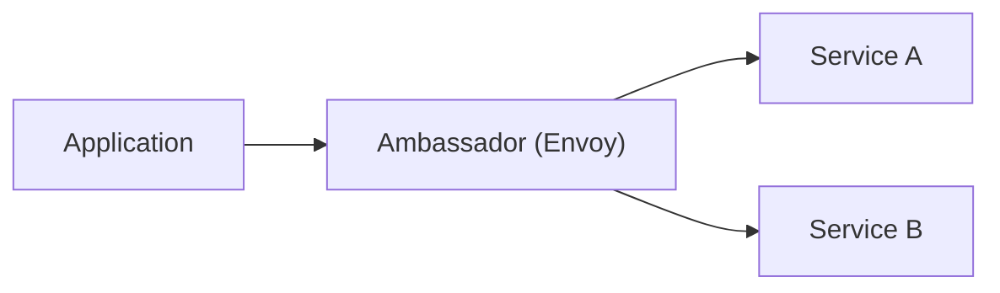
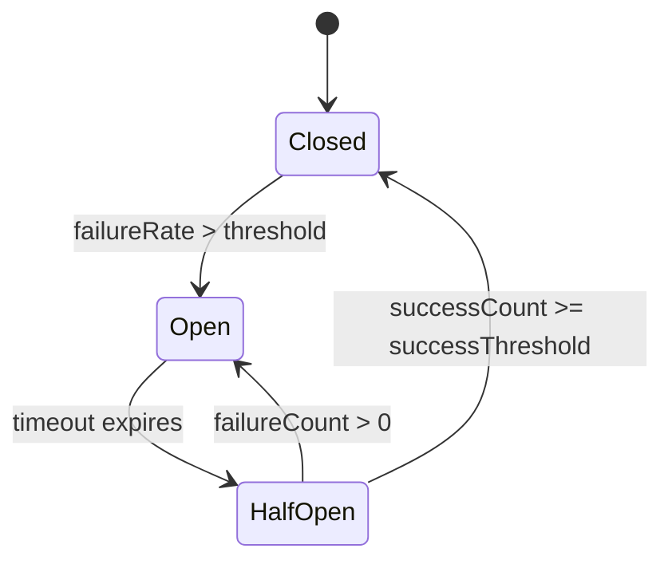
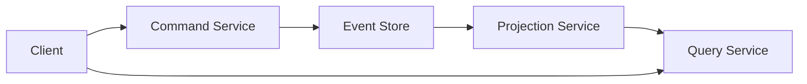
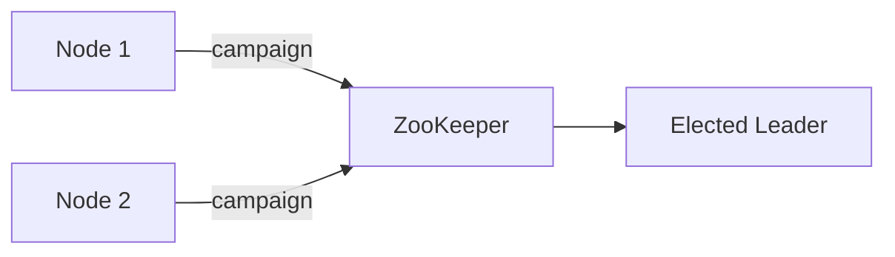
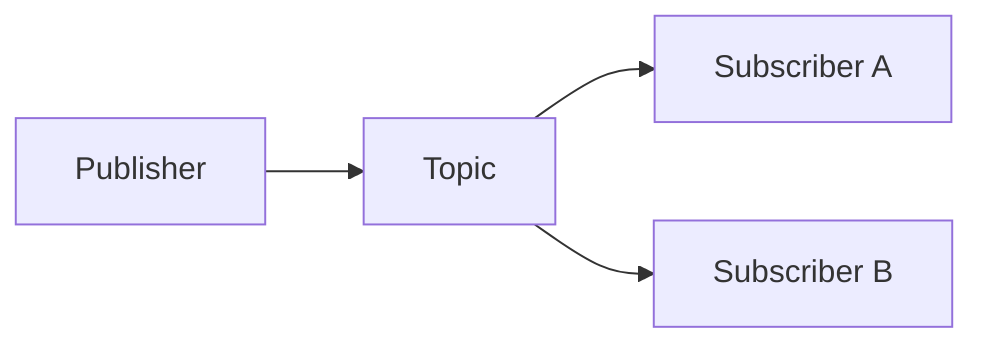
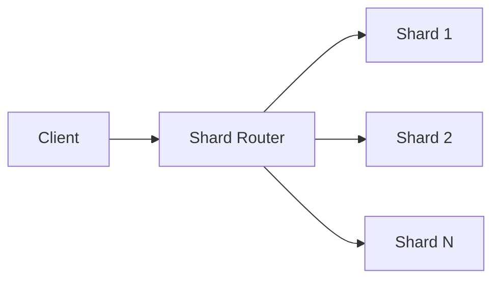

> Summary of [Top 7 Most-Used Distributed System Patterns](https://www.youtube.com/watch?v=nH4qjmP2KEE)
> from **ByteByteGo** · Published 2023-05-09 · Views: 368,251

*This note was generated automatically from the video transcript.*

## TL;DR
Distributed system patterns such as Ambassador, Circuit Breaker, CQRS, Event Sourcing, Leader Election, Pub/Sub, and Sharding provide reusable solutions for latency, resilience, scalability, and maintainability. Understanding their trade‑offs and real‑world implementations (Envoy, Hystrix, ZooKeeper, etc.) lets you choose the right pattern for a given workload.

## Key Insights
- **Ambassador** isolates cross‑cutting concerns (logging, retries, security) by deploying a sidecar proxy (e.g., Envoy) next to each service.  
- **Circuit Breaker** prevents cascading failures by short‑circuiting calls to an unhealthy service and optionally providing fallback responses (Netflix Hystrix).  
- **CQRS** splits write‑side and read‑side workloads, allowing independent scaling and optimization for each (e.g., high‑read e‑commerce catalog).  
- **Event Sourcing** stores immutable events instead of current state, enabling full audit trails, replay, and time‑travel debugging (Git commits as a canonical example).  
- **Leader Election** guarantees a single node performs exclusive tasks, with failover handled by coordination services like ZooKeeper or etcd.  
- **Pub/Sub** decouples producers and consumers through an asynchronous event bus (Google Cloud Pub/Sub), improving modularity and horizontal scalability.  
- **Sharding** partitions data across many nodes to keep per‑node load low and improve locality (MongoDB, Cassandra).  
- **Strangler Fig** offers a gradual migration path from legacy monoliths to modern services, reducing risk compared to a “big‑bang” cut‑over.

## Detailed Breakdown

### 1. Ambassador Pattern
- **Purpose:** Acts as a *go‑between* for an application and the services it calls, handling concerns that are orthogonal to business logic.
- **Typical implementation:** A sidecar proxy (Envoy, Istio’s Envoy) deployed alongside each microservice container.
- **Benefits:**  
  - Centralizes logging, metrics, retries, TLS termination.  
  - Reduces latency overhead compared to remote libraries because the proxy runs in the same pod/network namespace.  
  - Improves security by enforcing policies at the proxy layer.
- **Example flow:**  

### 2. Circuit Breaker
- **Purpose:** Detects when a downstream service is unhealthy and stops sending requests until it recovers, avoiding cascading failures.
- **State machine:** *Closed* → *Open* after a failure threshold, then *Half‑Open* after a cooldown to test the service.
- **Real‑world library:** Netflix Hystrix (now superseded by resilience4j, but the concept remains).
- **Diagram:**  

### 3. CQRS (Command Query Responsibility Segregation)
- **Purpose:** Separate command (write) paths from query (read) paths so each can be tuned independently.
- **Typical layout:**  
  - **Write side:** receives commands, validates, persists events or state.  
  - **Read side:** builds denormalized view models (often via event handlers) optimized for fast queries.
- **Typical use case:** An e‑commerce catalog where product listings are read millions of times per second, but order placement (writes) occurs far less frequently.
- **Flow example:**  

### 4. Event Sourcing
- **Purpose:** Persist every state‑changing event rather than the current snapshot.
- **Advantages:**  
  - Complete audit trail (replayability).  
  - Enables time‑travel debugging and rebuilding state for new read models.  
- **Analogy:** Git commits—each commit is an immutable event that can be replayed to reconstruct any repository state.
- **Typical components:**  
  - **Event Store** (append‑only log).  
  - **Command Handler** (validates and writes events).  
  - **Read Model Builder** (projects events into query‑optimized tables).

### 5. Leader Election
- **Purpose:** Ensure exactly one node performs a critical exclusive task (e.g., distributed lock holder, master scheduler).
- **Mechanisms:**  
  - **ZooKeeper:** creates an EPHEMERAL sequential ZNode; the smallest sequence becomes leader.  
  - **etcd:** uses lease‑based lock with `campaign` RPC.
- **Failover:** When the leader crashes, its session expires, causing remaining nodes to run a new election automatically.
- **Flow diagram:**  

### 6. Pub/Sub (Publisher/Subscriber)
- **Purpose:** Decouple producers from consumers; producers publish messages to a topic, and any number of subscribers receive them asynchronously.
- **Key properties:** At‑least‑once delivery, horizontal scaling of both publishers and subscribers, and optional message filtering.
- **Real‑world service:** Google Cloud Pub/Sub, Apache Kafka (though Kafka is technically a log‑based system, it’s often used as Pub/Sub).
- **Diagram:**  

### 7. Sharding
- **Purpose:** Partition a dataset across many physical nodes (shards) to keep per‑node workload manageable and improve locality.
- **Shard key:** Determines which shard a record belongs to (e.g., user ID hash).
- **Examples:**  
  - **MongoDB:** range‑based or hashed sharding via a config server.  
  - **Cassandra:** token‑ring partitioner distributes rows across nodes.
- **Benefits:** Linear scalability, reduced network hops for locality‑aware queries.
- **Simple illustration:**  

### Bonus: Strangler Fig Pattern
- **Purpose:** Incrementally replace a legacy monolith by routing new functionality to a fresh service while the old system continues to run.
- **Process:**  
  1. Identify a bounded context (e.g., user‑profile).  
  2. Build a new microservice for that context.  
  3. Add a router (API gateway or proxy) that forwards relevant requests to the new service, leaving the rest to the legacy code.  
  4. Gradually migrate more contexts until the monolith can be decommissioned.
- **Risk reduction:** Avoids the “big‑bang” cut‑over that often leads to outages.

## Trade-offs and Gotchas
- **Ambassador:** Adds an extra hop; misconfiguration can become a single point of failure if the sidecar crashes.  
- **Circuit Breaker:** Incorrect thresholds can either mask real failures (too permissive) or cause premature cut‑offs (too aggressive).  
- **CQRS:** Introduces data consistency complexity; eventual consistency between write and read models must be handled.  
- **Event Sourcing:** Event store can grow without bound—needs compaction or snapshotting; debugging requires replaying events.  
- **Leader Election:** Leader becomes a hotspot; if the leader performs heavy work, it may need to be sharded or delegated.  
- **Pub/Sub:** At‑least‑once delivery can cause duplicate processing; subscribers must be idempotent.  
- **Sharding:** Choosing a bad shard key leads to hot spots; rebalancing shards is non‑trivial and may require downtime or complex migration scripts.  
- **Strangler Fig:** Requires a robust routing layer; latency can increase when traffic is split across old and new systems.

## Takeaways
- Deploy sidecar proxies (Ambassador) to offload cross‑cutting concerns without touching application code.  
- Protect against downstream failures with a properly tuned Circuit Breaker and implement sensible fallback logic.  
- Use CQRS when read and write workloads have divergent performance or scaling needs, but plan for eventual consistency.  
- Store immutable events if auditability, replay, or time‑travel debugging are critical; manage event store size with snapshots.  
- Choose a coordination service (ZooKeeper, etcd) for reliable Leader Election when exclusive access is required.  
- Leverage Pub/Sub for asynchronous, many‑to‑many communication, ensuring subscribers are idempotent.  
- Partition data via sharding to achieve linear scalability, but invest time in selecting a balanced shard key.  
- Adopt the Strangler Fig pattern for low‑risk migration from legacy monoliths to a microservice architecture.

## Glossary
- **Ambassador:** A sidecar or proxy that mediates between a service and its downstream dependencies, handling concerns like retries, metrics, and security.  
- **Circuit Breaker:** A resilience pattern that stops calls to a failing service after a threshold, optionally allowing a test request after a cooldown.  
- **CQRS (Command Query Responsibility Segregation):** Architectural pattern separating write (command) and read (query) responsibilities into distinct models/services.  
- **Event Sourcing:** Persistence strategy where state changes are stored as a sequence of immutable events rather than overwriting the current state.  
- **Leader Election:** Algorithm that designates a single node as the coordinator/owner of a particular task, with automatic failover.  
- **Pub/Sub (Publisher/Subscriber):** Messaging paradigm where publishers emit messages to a topic without knowledge of subscribers; subscribers receive messages of interest asynchronously.  
- **Sharding:** Data partitioning technique that distributes rows/records across multiple physical nodes based on a shard key.  
- **Strangler Fig Pattern:** Incremental migration approach that gradually replaces parts of a legacy system with new services, analogous to a strangler fig tree enveloping its host.

## Full Transcript

Click to expand the raw transcript

In today's video, we'll explore the top 7 distributed system patterns with real-world examples.They can help us design more efficient and scalable systems.So, let's dive in!First is Ambassador.Picture yourself as a busy CEO with a personal assistant who handles all your appointments and communication.That's precisely what the Ambassador pattern does for your application.It acts as a "go-between" for your app and the services it communicates with, offloading tasks like logging, monitoring, or handling retries.For instance, Kubernetes uses Envoy as an Ambassador to simplify communication between services.The Ambassador pattern can help reduce latency, enhance security, and improve the overall architecture of your distributed systems.Next is Circuit BreakerImagine a water pipe bursting in your house.The first thing you'd do is shut off the main valve to prevent further damage.The Circuit Breaker pattern works similarly, preventing cascading failures in distributed systems.When a service becomes unavailable, the Circuit Breaker stops requests, allowing it to recover.Netflix's Hystrix library uses this pattern.It ensures a more resilient system.This pattern can be particularly useful when dealing with microservices or cloud-based applications, where failures are more likely to occur.The third pattern is CQRS, or Command Query Responsibility SegregationCQRS is like having a restaurant with separate lines for ordering food and picking up orders.By separating the write, or command, and read, or query, operations, we can scale and optimize each independently.An e-commerce platform might have high read requests for product listings but fewer write requests for placing orders.CQRS allows each operation to be handled efficiently.This pattern becomes especially valuable in systems where read and write operations have different performance characteristics, with different latency or resource requirements.Next is Event SourcingThink of Event Sourcing as keeping a journal of the life events. Instead of updating a record directly, we store events representing changes.This approach provides a complete history of the system and enables better auditing and debugging.Git version control is a great example of Event Sourcing, where each commit represents a change.With Event Sourcing, we can also implement advanced features like time-travel debugging or replaying events for analytics purposes.Number 5 is Leader Election.Imagine a classroom of students electing a class representative.In a distributed system, the Leader Election pattern ensures only one node is responsible for a specific task or resource.When a leader node fails, the remaining nodes elect a new leader.ZooKeeper and etcd use this pattern to manage distributed configurations.By having a designated leader, we can avoid conflicts and ensure consistent decision-making across the distributed system.Next is PubSub.The Publisher/Subscriber pattern is like a newspaper delivery service.Publishers emit events without knowing who'll receive them, and subscribers listen for events they're interested in.This pattern allows for better scalability and modularity.For example, Google Cloud Pub/Sub enables asynchronous messaging between services, making it easier to maintain and scale complex applications.Pub/Sub systems are well-suited for scenarios where we need to propagate changes or updates across multiple components, for example, updating a user's profile across various services.Number 7 is Sharding.Sharding is like dividing a large pizza into smaller slices, making it easier to handle.It's a technique for distributing data across multiple nodes in a system. It improves performance and scalability.Each shard contains a subset of the data, reducing the load on any single node.Databases like MongoDB and Cassandra use sharding to handle large amounts of data efficiently. Sharding can also help us achieve better data locality, reducing network latency and speeding up query execution.Here is a bonus pattern - the Strangler Fig pattern.This pattern is inspired by the strangler fig tree, which grows around other trees and eventually replaces them.In software, the Strangler Fig pattern is a method for gradually replacing legacy systems with new implementations.Instead of performing a risky "big bang" migration, we can incrementally replace parts of the old system with new components.This approach can help us manage the risks and complexities associated with system migrations.And that's it on this topic!These top 7 distributed system patterns, along with their real-world examples, can help us build more robust and scalable applications.Remember, understanding our specific system needs and applying suitable patterns is crucial.Let’s leverage these patterns in our designs to create better distributed systems.If you like our videos, you may like our system design newsletter as well.It covers topics and trends on large-scale system design, trusted by 300,000 readers.Subscribe at blog.bytebytego.com.

