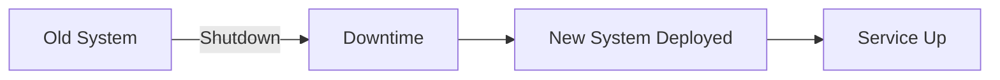
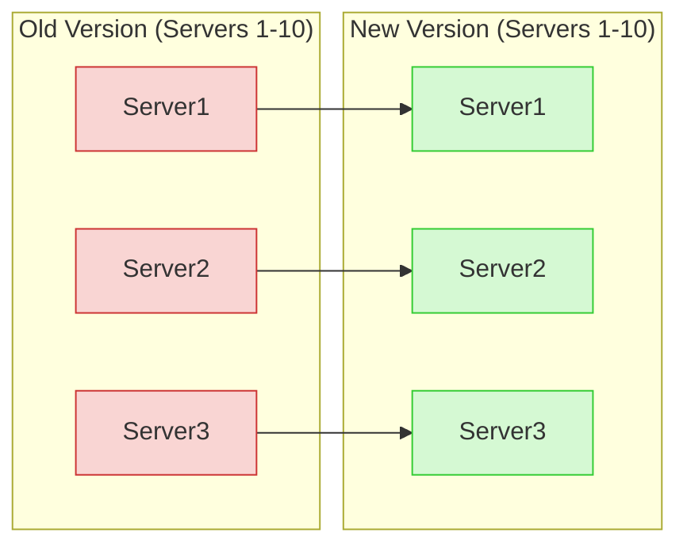
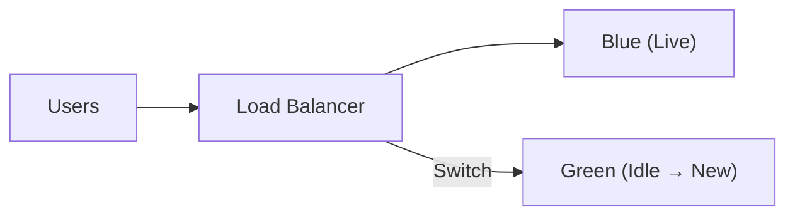
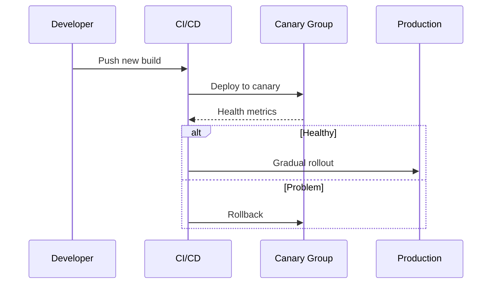

> Summary of [Top 5 Most-Used Deployment Strategies](https://www.youtube.com/watch?v=AWVTKBUnoIg)
> from **ByteByteGo** · Published 2023-06-06 · Views: 377,569

*This note was generated automatically from the video transcript.*

## TL;DR
Deployment strategies trade off risk, downtime, and resource cost. The five most‑used approaches—Big Bang, Rolling, Blue‑Green, Canary, and Feature Toggles—each fit different release constraints and operational maturity levels.

## Key Insights
- **Big Bang** pushes the entire change at once, causing a short outage but requiring a solid rollback plan.  
- **Rolling deployment** updates servers one‑by‑one, giving near‑zero downtime while exposing only a fraction of traffic to the new version.  
- **Blue‑Green** runs two parallel production environments and flips traffic via the load balancer, offering instant rollback at the cost of doubled infrastructure.  
- **Canary** releases to a small, targeted subset of servers or users first, enabling real‑world validation before a full rollout.  
- **Feature toggles** decouple code deployment from feature activation, allowing per‑user or per‑segment gating without redeploying.  
- All incremental strategies (Rolling, Blue‑Green, Canary) rely on robust monitoring and automated testing to detect failures early.  
- Resource overhead and operational complexity increase from Big Bang → Rolling → Canary → Blue‑Green, while risk decreases in the same direction.  

## Detailed Breakdown

### 1. Big Bang Deployment
- **What it is:** Deploy the entire new version in a single operation, akin to ripping off a Band‑Aid.  
- **Process:** Shut down the old system, push the new codebase, then bring the service back online.  
- **Example:** A monolithic app with a single database schema change that cannot be applied incrementally.  
- **Pros:** Simple to understand, no need for parallel environments.  
- **Cons:** Requires a brief outage; rollback can be costly and may still affect users.  

### 2. Rolling Deployment
- **What it is:** Incrementally replace instances of the service, updating a few servers at a time.  
- **Typical workflow (10‑server example):**  
  1. Take server 1 out of the pool.  
  2. Deploy the new version to server 1.  
  3. Bring server 1 back online after health checks.  
  4. Repeat for servers 2‑10.  
- **Result:** At any moment, most servers run the stable version, keeping user traffic flowing.  

- **Advantages:** Near‑zero downtime, early detection of regressions, no need for duplicate infrastructure.  
- **Drawbacks:** Slower overall rollout; a bug that slips past early checks can still affect later servers; cannot target specific user segments (all users see the new version as servers are upgraded).  

### 3. Blue‑Green Deployment
- **What it is:** Maintain two identical production environments (Blue & Green). One serves live traffic, the other is idle and used for the upcoming release.  
- **Workflow:**  
  1. Deploy new version to the idle *Green* environment while *Blue* continues serving users.  
  2. QA validates *Green*.  
  3. Switch the load balancer to point all traffic to *Green*.  
  4. *Blue* becomes the idle fallback for instant rollback.  

- **Pros:** Zero‑downtime cutover, instant rollback, clean separation of test and production.  
- **Cons:** Doubles infrastructure cost; requires rigorous data synchronization between environments; added operational complexity.  

### 4. Canary Deployment
- **What it is:** Release the new version to a small, controlled subset (the “canary”) before a full rollout.  
- **Typical canary criteria:**  
  - 1 % of servers, or  
  - Specific geographic region, or  
  - Particular device type.  
- **Process:**  
  1. Deploy to the canary group.  
  2. Monitor metrics (error rate, latency, business KPIs).  
  3. If healthy, expand the canary (e.g., 5 % → 20 % → 100 %).  
  4. If a problem appears, halt and rollback only the canary group.  

- **Advantages:** Real‑world validation with minimal user impact; supports targeted rollouts (geo, device).  
- **Challenges:** Requires sophisticated monitoring, automated canary analysis, and tooling to pause/continue the rollout; handling schema migrations can be tricky.  

### 5. Feature Toggles (Feature Flags)
- **What it is:** Embed conditional switches in the code that enable/disable a feature at runtime.  
- **Usage pattern:** Deploy the code containing the new feature behind a toggle; turn the toggle on for a subset of users (e.g., canary users) while the rest see the old behavior.  
- **Benefits:** Decouples code release from feature exposure, facilitates A/B testing, and provides an immediate “off‑switch” without redeploying.  
- **Risks:**  
  - Increases code complexity and testing surface.  
  - Accumulating stale toggles (“toggle debt”) can degrade maintainability if not cleaned up.  

## Trade-offs and Gotchas
- **Big Bang:** Simple but risky; any failure forces a full rollback that may still affect users.  
- **Rolling:** Low downtime but slower; a defect can propagate as more servers are updated.  
- **Blue‑Green:** Instant cutover & rollback, but doubles cost and adds data‑sync complexity.  
- **Canary:** Best for targeted, low‑risk exposure; requires robust observability and automation to avoid “stuck” canaries.  
- **Feature Toggles:** Powerful for gradual feature exposure, yet can lead to code bloat and “toggle debt” if not managed.  
- All incremental strategies depend on **health checks**, **metrics**, and **automated rollback** mechanisms; missing any of these can nullify their safety benefits.  

## Takeaways
- Choose a strategy that matches your **risk tolerance**, **infrastructure budget**, and **release frequency**.  
- For most modern microservice stacks, a **Rolling + Canary** combo offers a good balance of safety and speed.  
- Reserve **Blue‑Green** for high‑stakes releases where instant rollback is non‑negotiable and you can afford duplicate environments.  
- Use **feature toggles** to separate deployment from feature activation, but enforce a cleanup policy to avoid toggle debt.  
- Invest in **observability** (metrics, logs, alerts) and **automated health checks**—they are the linchpin of any safe deployment pipeline.  

## Glossary
- **Rollback:** Reverting a system to a previous stable version after a failed deployment.  
- **Load Balancer:** A network device that distributes incoming traffic across multiple servers or environments.  
- **Health Check:** Automated test that verifies a service instance is operating correctly before it receives traffic.  
- **Toggle Debt:** Accumulated, unused feature flags that clutter the codebase and increase maintenance burden.  
- **Observability:** The ability to infer the internal state of a system from its external outputs (metrics, logs, traces).

## Full Transcript

Click to expand the raw transcript

foreigninto the world of deploying code toproduction nothing beats thesatisfaction of seeing our code go liveto millions of users it is alwaysthrilling to see beginning there is notalways easy let's explore some of thecommon strategiesone of the earliest methods of deployingchanges to production is the Big Bangdeploymentpicture it as like ripping off aBand-Aid we push all our changes at oncethis causes a bit of down time as wehave to shut down the old system toswitch on a new onethe downtime is usually short but becareful you can Sting If things don't goas planned preparation and testing arekey if things goes wrong we roll back tothe previous versionrolling back is not always paying freethough we still might disrupt users andthat could still be data implication weneed to have a solid Roblox planBig Bang is sometimes the only choicefor example when an intricate databaseupgrade is involvedthen we have the rolling deploymentit is more like a marathon than a Sprintthis method let us incrementally updatedifferent parts of the system over timeit's a stage rollout where we graduallydeploy the new version of theapplication to the productionenvironmenthere's an example of how it might workimagine we have 10 servers running inour application in a rolling deploymentwe might take down the first serverdeploy the new version of ourapplication there and bring it backonline once we've confirmed everythingis working as expected we'll move on tothe second server and so on thisapproach allows a new version togradually replace the old one server byserver until the entire system isupdatedone big advantage of rolling deploymentis that it usually prevents down timewhile we are updating one server theothers are still up and running servingour usersanother Advantage is that we can spotand mitigate any issues early during therolloutthis reduces the risk of widespreadproblems we're only ever exposing asmall part of our system to the newversion at any one timehowever rolling deployment is typicallya slower process and while it reducesthe risk of system-wide issues itdoesn't entirely eliminate itif an issue slip past our initial checksit might still propagate as we updatemore serversthis strategy doesn't support targetedrollouts we can't control Rich users getthe new version during the rollout allusers will gradually see the new versionas we update the servers we can directthe new version to specific users basedon criteria like location device typeEtcrolling deployment is a popular choicefor many teams it balances risk and userimpact in a control methodical waynow let's take a look at blue greendeploymenthere we maintain two identicalproduction systemscleverly named blue and greenat any given time one site is active andvisible to users and the other side isIdle the active environment say blueserves the current live version of theapplication to the users the idle one isour playground where we can safelydeploy and test the new versionhere's how it might work when we have anew version ready to go we deploy it tothe green environment while this ishappening the blues system is still livein serving the current version of theapplication to usersour QA team then tests a new version inthe green environment this gives us thechance to catch and fix any bugs orissues before they reach our usersonce the new version in the greenenvironment is steam ready we simplyswitch the load balancer to redirecttraffic from the blue environment to thegreen one users are seamlesslytransitioned to the new version of theapplication with zero downtimenow the blue environment becomes idleand serves as a safety netit will encounter any issues with thenew version we can quickly switch backto the blue environment effectivelyrolling back the previous versionwhile blue green deployment allows forseamless transitions for an easyrollbacks there's a catchjust like the rolling deployment we candirect the new version to specific usersthe switch from blue to green happensfor all users at onceit is also resource intensivemaintaining two identical productionenvironments doubles the infrastructureand resource needswe could spin down the idle environmentbetween deployments but thisreintroduces complexitymanaging two parallel productionenvironments and ensuring seamless datasynchronization can add significantcomplexity to the deployment process itrequires sophisticated infrastructuremanagement and toolinghowever with its high level of controland minimized risk blue green deploymentremains a popular strategy for smoothuser experience and reliable rollbacksnext up is Canary deployment named afterthe HDO practice of using canaries inCoal Mines to detect dangerous gasesif the canary was in distress minersknew it was time to evacuatesimilarly in software deployment we usethis strategy to test our air before thefull-scale rollouthere's how it goes instead of deployingthe new version to all servers or userswe choose a small subset our canaries itcan be a percentage of servers or groupof usersoften selected based on certain criteriafor example we may start by deploying toa single server or a small cluster oreven a certain geographical locationthis allows us to monitor theperformance of the new version and thereal world conditions but on a muchsmaller scaleif everything goes well and our newversion performs as expected we cangradually roll it out to the rest of theservers or usersbut if something goes wrong we've got asafety net we can hold the deploymentfix the issues and try again all withoutimpacting the majority of our user basethis incremental approach give us bothsafety and controlCanary deployment also give us the powerof targeted rollouts unlike rolling orblue green deployments we can direct ourCanary based on user-specific criterialike geographical location or devicetypehowever Canary deployment does come withits own set of challenges it requirescareful monitoring and automated testingfor the canaries it requires somewhatcomplicated infrastructure tooling toramp up or hold the deployment as neededthe strategy can be complex to implementand manage especially when dealing withdatabase schema changes or APIcompatibility issuesCanary deployment is usually not astandalone strategy it's often combinedwith rolling deployment to create anapproach that brings together the bestof both worldsfinally as a bonus strategy we havefeature toggle it stands a bit apartfrom the other strategies we'vediscussed it's not about deploying a newversion of the entire application butrather about managing specific newfeatures within the applicationwith feature toggle we introduce atoggle or switch in the code for newfeatures this allows us to turn thefeature on or off for certain users orcircumstancesthink of it as a gate that we can openor close it controls who gets to see thenew featurefeature toggle can be used incombination with any of the deploymentstrategies we've discussed let's saywe're doing a canary deployment we canturn on the feature toggle for just thecanary users letting them test out thenew feature while the rest of the userbase carries on with the current versionfuture tacos offers excellent controlover new features and allow for targeteduser testing it's great for a b testingor gradually rolling out a feature tosee how it performshowever feature togglehas its down size if not managedproperly toggles can add complexity tothe code base and make testing moredifficulto or obsolete toggles need to be cleanedup to prevent toggle debt which can makethe system increasingly hard to maintainso there you have it five deploymentstrategies each with their strengthschallenges and use casesremember the best strategy depends onthe application's characteristics andthe user's expectationsnow it's over to you which deploymentstrategy have you used what works bestfor your team let's discuss in thecomments belowif you like our videos you may like oursystem design newsletter as well itcovers topics and Trends in large-scalesystem design trusted by 400 000 readerssubscribe that blog.bygo.com

