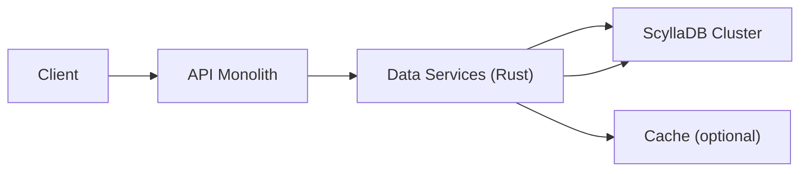
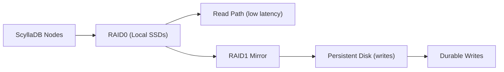

> Summary of [How Discord Stores TRILLIONS of Messages](https://www.youtube.com/watch?v=O3PwuzCvAjI)
> from **ByteByteGo** · Published 2023-06-15 · Views: 197,549

*This note was generated automatically from the video transcript.*

## TL;R
Discord migrated a trillion‑plus message store from Cassandra (177 nodes) to ScyllaDB (72 nodes) in nine days with zero downtime. The success hinged on a Rust‑based data‑service layer for request coalescing and a custom “super‑disk” that combined local SSDs (RAID‑0) for fast reads with Google Persistent Disks (RAID‑1) for durable writes.

## Key Insights
- **Incremental migrations** on smaller clusters let the team validate tooling and processes before tackling the massive “cassandra‑messages” cluster.  
- **ScyllaDB** provides Cassandra‑compatible semantics with a C++ engine that eliminates garbage‑collection pauses, dramatically improving latency and repair speed.  
- A **Rust data‑service layer** sits between the API monolith and the databases, performing request coalescing to avoid hot‑partition spikes.  
- The **“super‑disk”** is a two‑layer RAID: RAID‑0 across multiple local SSDs for low‑latency reads, mirrored (RAID‑1) to a Persistent Disk for durable writes.  
- **Linux kernel write‑path redirection** ensures every write lands on the Persistent Disk while reads are served from the SSD array, achieving both speed and reliability.  
- The entire migration was executed by a purpose‑built **Rust migrator**, completing the transfer of trillions of rows in nine days without service interruption.  
- Post‑migration, node count dropped from 177 to 72, cutting operational overhead and on‑call incidents while delivering consistently lower query latency.

## Detailed Breakdown

### 1. Problem Context & Motivation
Discord’s primary message store ran on Cassandra, a NoSQL database that, by 2022, spanned **177 nodes** and held **trillions of messages**. The cluster suffered:
- Unpredictable latency spikes.
- Frequent on‑call incidents due to repair and GC pauses.
- High operational toil maintaining the large node pool.

A more performant, low‑maintenance solution was required to keep Discord’s core chat experience responsive.

### 2. Choosing ScyllaDB
ScyllaDB is a **Cassandra‑compatible** database built in C++. Its advantages:
- **Garbage‑collection‑free** runtime, eliminating the GC‑induced latency seen in Cassandra.
- Faster repair mechanisms and higher throughput per node.
- Compatibility allowed a drop‑in migration path without rewriting query logic.

### 3. Incremental Migration Strategy
Rather than a “big bang” switch, Discord first migrated **smaller, non‑critical databases** to:
- Validate tooling (e.g., data migrator, monitoring).
- Surface hidden incompatibilities.
- Refine operational playbooks.

Only after confidence was built did they target the massive **cassandra‑messages** cluster.

### 4. Data Services Layer (Rust)
A new service, written in **Rust**, was introduced between the API monolith and the database clusters.

- **Request Coalescing**: When multiple clients request the same message or channel data, the service deduplicates the DB call, issuing a single query and broadcasting the result to all awaiting clients.
- This dramatically reduces the chance of **hot partitions**, especially in large servers with frequent `@everyone` pings.

### 5. The “Super‑Disk” Solution
Discord’s workload required **ultra‑low read latency** but also **strong durability** for writes. Neither local NVMe SSDs (fast but volatile) nor Google Persistent Disks (durable but higher latency) alone satisfied both constraints.

**Design**:
1. **RAID‑0** across several **Local SSDs** → creates a single high‑throughput, low‑latency virtual disk for reads.
2. **RAID‑1** mirrors the RAID‑0 array to a **Google Persistent Disk** → guarantees durability.
3. Kernel configuration directs **writes** to the Persistent Disk while **reads** are served from the SSD array.

Result: At peak load, disk queues vanished and query latency remained stable.

### 6. Migration Execution
- A **custom Rust migrator** streamed data from Cassandra to ScyllaDB.
- Migration window: **9 days** (≈216 hours) with **zero downtime**.
- Process involved:
  1. Snapshotting Cassandra tables.
  2. Streaming rows in parallel across multiple migrator instances.
  3. Verifying row counts and checksum integrity.
  4. Switchover of traffic to ScyllaDB once consistency thresholds were met.

### 7. Post‑Migration Outcomes
- Node count reduced from **177 Cassandra** to **72 ScyllaDB** nodes.
- Latency became more predictable; on‑call incidents dropped sharply.
- Operational cost and maintenance overhead decreased significantly.

## Trade‑offs and Gotchas
- **Compatibility vs. Performance**: ScyllaDB’s Cassandra‑compatible API eased migration but required careful tuning of compaction and memory settings to unlock its performance.
- **Super‑Disk Complexity**: Managing a custom RAID‑0+RAID‑1 stack adds operational complexity (monitoring RAID health, kernel tuning) and ties the solution to Google Cloud’s VM and disk offerings.
- **Write Path Bottleneck**: Directing all writes to Persistent Disk can become a bottleneck under extreme write spikes; capacity planning for the PD is essential.
- **Request Coalescing Limits**: Coalescing works best for hot, identical reads; divergent queries still hit the DB, so cache warm‑up strategies remain important.
- **Migration Validation**: Ensuring data fidelity at trillions‑scale required robust checksum and spot‑check mechanisms; any oversight could lead to silent data loss.

## Takeaways
- **Prototype on smaller workloads** before scaling a risky migration to production‑critical data.
- **Leverage compatible drop‑in replacements** (ScyllaDB for Cassandra) to minimize application changes while gaining performance.
- **Insert a thin, high‑performance service layer** (Rust data services) to implement request coalescing and protect the DB from hot‑spot storms.
- **Build storage solutions from first principles** when off‑the‑shelf options don’t meet latency‑durability trade‑offs.
- **Automate migration with purpose‑built tooling** and rigorous validation to achieve zero‑downtime moves at massive scale.

## Glossary
- **Cassandra**: A distributed NoSQL database optimized for high write throughput, using a Java runtime with garbage collection.
- **ScyllaDB**: A drop‑in replacement for Cassandra written in C++, offering higher performance and no GC pauses.
- **RAID0**: Striping across multiple disks to increase throughput and reduce latency, without redundancy.
- **RAID1**: Mirroring data across disks for redundancy and durability.
- **Persistent Disk**: Google Cloud’s network‑attached block storage offering durability guarantees.
- **Local SSD**: High‑performance, physically attached SSDs on a VM instance, offering low latency but limited durability.
- **Request Coalescing**: Merging multiple identical read requests into a single backend query and sharing the result.
- **Data Services (Rust)**: A micro‑service layer written in Rust that sits between the API and the database, handling request deduplication and other cross‑cutting concerns.

## Full Transcript

Click to expand the raw transcript

In this video, we’re going to discuss not just a database migration but a colossal task Discord engineers embarked on - moving trillions of messages from one database to another.If you’ve ever wondered what it takes to migrate data of such unimaginable scale, you’re gonna love this. Let’s dive right in.I’ve been eager to talk about this topic ever since I joined Discord.The engineering culture here is dynamic and innovative, and this story is a perfect illustration of that. Though this is all from public information, the insights and takeaways are my own.Discord recently peeled back the curtain on how they migrated trillions of messages from Cassandra - the database that houses your chats and conversations, to ScyllaDB - a faster and more reliable alternative.The process was first shared at ScyllaDB Summit 2023 by Bo Ingram, followed by a detailed blog post.A big shout-out to Bo for presenting this complex process so clearly.So, what did Bo share? I’ll summarize and share my own takeaways. You can watch his video and read his blog post if you want to learn more about it.Let’s rewind back a few years. Discord found themselves in a bit of a pickle with their database choice.They were using Cassandra, but as the platform continued to grow, they faced serious performance issues.It took a lot of effort to maintain the main Cassandra cluster that held messages. The latency was unpredictable, and the frequent on-call incidents put huge strain on the team.By 2022, the Cassandra cluster held trillions of messages across 177 nodes.They knew they needed something different, but this message cluster was critical to Discord. If the message cluster is slow, Discord is going to be slow. If the message cluster is down, Discord is going to be down.Their solution? ScyllaDB, a Cassandra-compatible database, but with a more powerful C++ based engine under the hood.Instead of jumping in headfirst to solve the riskiest and biggest problem, they started the migration with smaller databases.And this is my first takeaway. At Discord, the engineers move fast when mistakes are reversible, but if the solution is a one-way door, they spend a lot more time and care to get it right.They used these small migrations as an opportunity to test the waters and iron out as many issues as possible before tackling the big beast that held trillions of messages.Let’s talk a bit about ScyllaDB. It was written in C++ and promised better performance, faster repairs, and most importantly, it was garbage collection-free. For a team that had so many issues with Cassandra's garbage collector, this was a breath of fresh air.The next key step was to create an intermediate layer between the API monolith and the database clusters called data services. The layer was written in Rust, which is a safe and highly performant language. And it’s a joy to write in Rust.The really cool idea about this layer is something called request coalescing. If multiple users request the same data, the database only needs to be queried once. This drastically reduced the potential for hot partitions. Imagine all those unintended @everyone messages in hugely popular discord servers.With this layer in between, it is no problem for the database at all.Then, they came up with the concept of a Super-Disk. The database clusters run on Google Cloud.When faced with the challenges of disk latency, they couldn't rely on the local NVMe SSDs on the virtual machines for their critical data storage due to reliability and durability issues.The alternative was Google Cloud’s Persistent Disks. While it was reliable and flexible, it had the disadvantage of higher latency since they were network-attached rather than directly attached.So, what did Discord do? They went back to the drawing board and focused on creating a solution tailored to their specific needs. They chose to prioritize low-latency disk reads over all other disk metrics while maintaining the existing database uptime guarantee.What they came up with was a super-disk combining the best of local SSDs and Persistent Disks at the software level.Their super-disk was a two-layered RAID solution. They used RAID0 to combine multiple Local SSDs into one low-latency virtual disk, and then RAID1 to mirror this RAID0 array with a Persistent Disk. They then configured the linux kernel to direct the write to the persistent disk, which had strong durability guarantee, and the read to the local SSDs, which offered low latency. This setup ensured low-latency reads from the Local SSDs and write durability from the Persistent Disks.What's so great about this? It's an excellent example of problem-solving from first principles. Discord was dealing with a problem that had no ready-made solution. Instead of trying to make do with what was available, they redefined the problem based on their specific needs and then built a solution to match.The super-disk worked. At peak load, the databases no longer started queueing up disk operations, and they saw no change in query latency.Finally, with all this prep work done, it was time to migrate their largest database - the 'cassandra-messages' cluster. With trillions of messages and nearly 200 nodes, it was a daunting task.But with a newly written data migrator in Rust and some clever strategies, they managed to do it in just nine days! Yes, you heard that right - they migrated trillions of messages with NO downtime in less than two weeks!And the payoff? A significantly quieter, more efficient system. They went from running 177 Cassandra nodes to just 72 ScyllaDB nodes. It drastically improved latencies and the quality of life for the on-call staff.It was no ordinary task, but with clever risk mitigation and innovative solutions, they pulled it off.So there you have it. I’m incredibly proud of what the team was able to pull off. Migrating a production database is no joke, and doing it at this scale… well, it is hard.If you like our videos, you may like our system design newsletter as well. It covers topics and trends in large-scale system design, trusted by 400k readers.Subscribe at blog.bytebytego.com.

