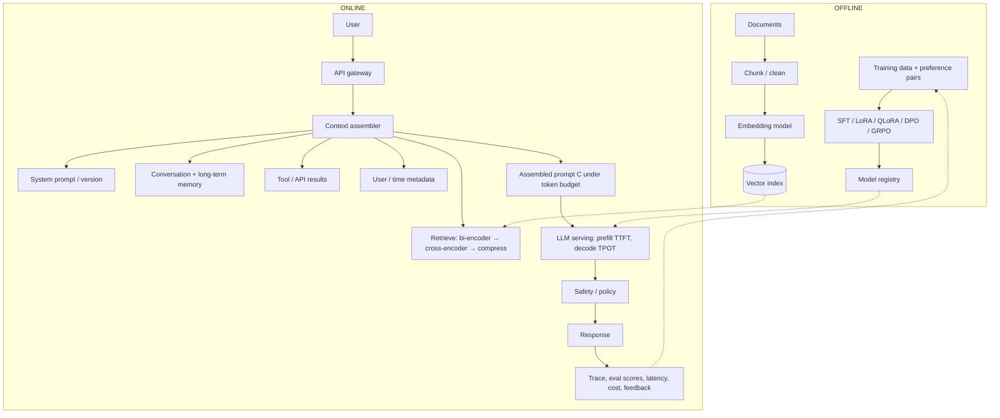
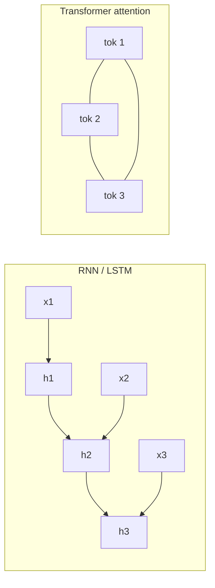
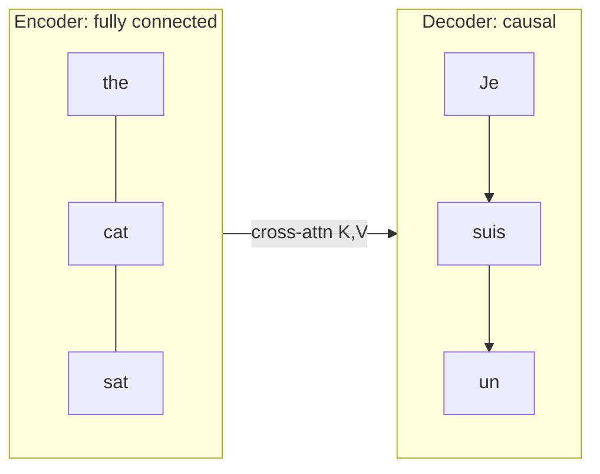
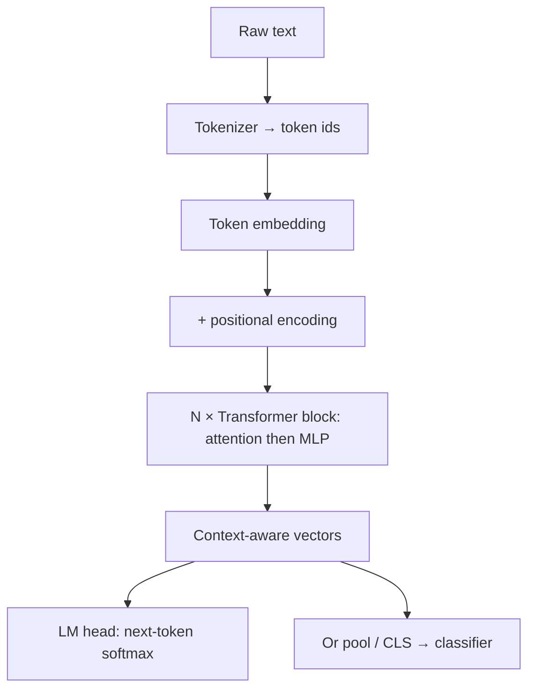
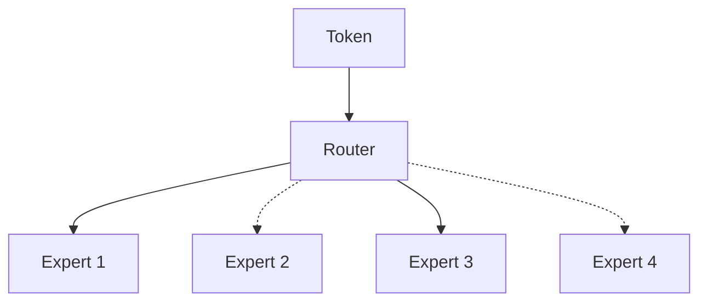
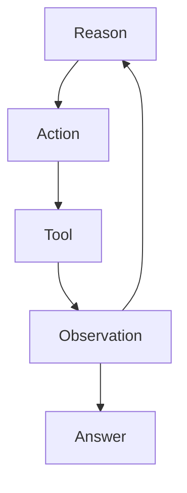
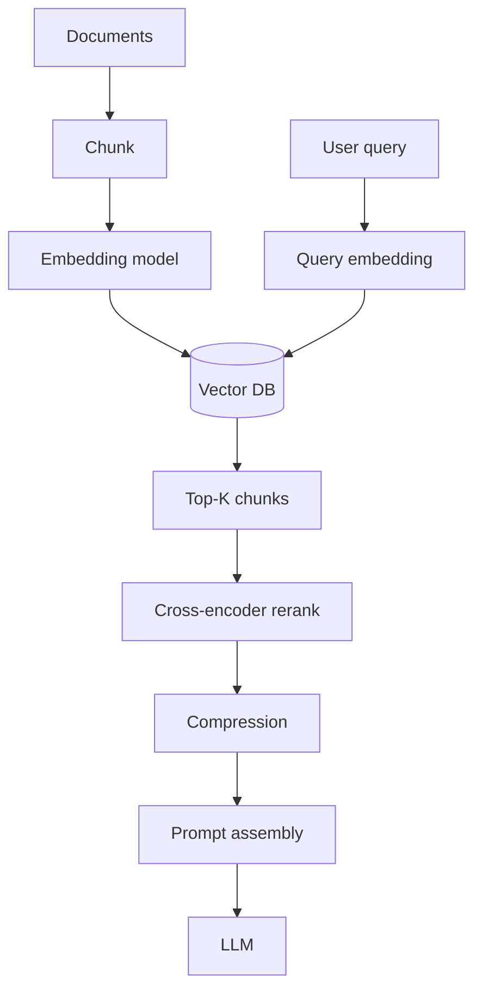

> Path: **text → tokens → Transformer → generation → context → evaluation → adaptation → inference / serving.**
>
> This note restores the full study guide (not the shortened draft). It weaves the LLMOps chapter sequence, [ByteByteGo — Transformers Step-by-Step](https://www.youtube.com/watch?v=avjX3QrYkls), [Stanford CS25 / Karpathy](https://www.youtube.com/watch?v=XfpMkf4rD6E) ([same lecture](https://www.youtube.com/watch?v=KizGcORD-KA)), and the papers those sources rest on.
>
> The Daily Dose of DS PDFs are copyrighted course notes; this is a complete *study reconstruction* of their topics and math, not a reprint of their prose. Dated 2026-09-05.

Three levers, cheapest first: **instructions → context → model weights**. Exhaust prompting and context before changing weights.

$$
\text{Data} \rightarrow \text{Context or training} \rightarrow \text{Model} \rightarrow \text{Inference} \rightarrow \text{Evaluation} \rightarrow \text{Iteration}
$$

## End-to-end LLMOps pipeline

Offline builds the index and the adapted model. Online assembles a finite context, runs prefill then decode, then records quality, safety, latency, and cost. Every later section is one box here.



| Pipeline box | Job | Later section |
|---|---|---|
| Application / model / infra layers | What AI engineering owns | Foundations |
| Chunk → embed → index | Documents become searchable vectors | Context and RAG |
| SFT / LoRA / DPO / GRPO → registry | Change behavior when prompts are not enough | Adaptation |
| Context assembler | Mix instructions, query, memory, retrieval, tools | Prompting, context, memory |
| Serving | Prefill then decode | Inference and serving |
| Trace / eval | Did the *system* succeed? | Evaluation |

A hosted API (OpenAI, Anthropic, …) only changes *who runs the serving box*. The rest of the pipeline stays yours.

## Map of the 14 chapters

| Parts | Theme | Core question |
|---|---|---|
| 1 | AI engineering / LLMOps | How do we build an LLM product? |
| 2 | Tokenization and embeddings | How does text become numbers? |
| 3 | Attention / Transformer / MoE | How do tokens exchange information? |
| 4 | Decoding | How does the model choose the next token? |
| 5–6 | Prompt engineering | How do we steer behavior without new weights? |
| 7–8 | Context engineering / memory | How do we give the model the right information? |
| 9–11 | Evaluation | How do we know the system is actually good? |
| 12 | Fine-tuning | How do we modify model behavior? |
| 13 | Inference optimization | How do we make generation fast and memory-efficient? |
| 14 | Serving | How do we expose the model at production scale? |

## Foundations (Part 1)

Traditional MLOps assumes you train a custom classifier on curated labels. LLMOps starts from a **foundation model** (Llama, GPT, Claude, …): a large pre-trained system you *adapt* rather than train from scratch. LLMs are the language-specialized slice of foundation models.

**AI engineering** is the broader job of shipping AI products. **LLMOps** is the operational subset: deploy, evaluate, secure, and cost-control LLM applications. The series uses the terms close together; the distinction still matters.

### Three-layer stack

1. **Application.** UI, product logic, prompting, extra context, how outputs are shown. Evaluation lives here because the model *is* the UX.
2. **Model development.** Choose / fine-tune / quantize a pre-trained model; prepare data. You rarely train a 100B model from scratch; you still need loss, optimization, and failure modes.
3. **Infrastructure.** Serving, GPUs, vector DBs, logs, quality monitors.

Ops fundamentals did not vanish: business problem, metrics, monitor, iterate, cost. What is new is working with a general pre-trained generator instead of a single-task classifier.

### What an LLM is

Given a prompt, the model predicts a continuation. Most production LLMs are **autoregressive Transformers** (Vaswani et al., 2017): they emit one token, then condition on everything so far.

- **Scale.** “Large” means billions of parameters (the bar moves every year).
- **Data.** Next-token prediction on huge corpora (books, web, Wikipedia, code, …) up to a cutoff. The model is a statistical model of that text, which happens to encode grammar, facts, and some reasoning patterns.
- **Generative.** Free-form text, or formats (JSON, code) if the prompt asks.
- **Masked LMs (BERT).** Predict a blank using *both* sides. Useful for classification and span tasks; this series means *autoregressive* unless it says otherwise.

**Emergent abilities** (Wei et al., 2022, and follow-ups): some skills (multi-step arithmetic, reliable CoT, complex instruction following) show up clearly only at larger scale. The model is still statistical; at enough scale it can look like it learned algorithms inside next-token prediction. Whether “emergent” is a true discontinuity or a smooth curve plus a bad metric is still debated (Schaeffer et al., 2023).

**Prompting already appears in Part 1:** zero-shot (instruction only) and few-shot (worked examples). Attention is flagged as the mechanism that lets tokens talk. Limitations flagged early: hallucination, cutoff knowledge, prompt sensitivity, cost, safety.

**Shift from classical ML:** adaptation (prompt / context / weights) instead of train-from-scratch; much more inference compute; evaluation that cannot be a single accuracy number.

**Levers:** optimize **instructions** first; if that fails, add **context** (RAG, tools, memory); only then **modify the model**.

**Open questions.** Where is the line between “product engineering on an API” and “you now own a model”? Which emergent-ability plots survive better metrics?

## Tokens, embeddings, positions (Part 2)

An LLM cannot consume raw characters.

$$
\text{text} \rightarrow \text{tokens} \rightarrow \text{token IDs} \rightarrow \text{vectors}
$$

Tokenization is stage one of a two-stage translation; embedding is stage two.

### Why subwords

Word-level splits explode the vocabulary and fail on unseen words (OOV). Character-level splits make sequences very long and weaken meaning. Subwords sit in the middle: frequent words stay whole; rare words break into reusable pieces.

**Example from the chapter.** `Transformers are amazing!` might become `["Transform", "ers", " are", " amazing", "!"]`. `cooking` → `cook` + `ing`. A character model would have to learn that relationship from scratch.

Reasons the material stresses:

- **Meaning.** Subwords carry morphology (`-ing`, `un-`).
- **Vocabulary size.** Fewer types than a word inventory; the softmax and embedding table stay tractable.
- **OOV.** New names can be composed from known pieces. Byte-level BPE almost never needs an `<unk>`.

| Method | Idea | Source |
|---|---|---|
| BPE | Repeatedly merge the most frequent adjacent pair | Sennrich et al., 2016 |
| WordPiece | Merge pairs that most improve corpus likelihood | Schuster & Nakajima; BERT |
| Unigram LM | Start from a large vocab, prune tokens that hurt likelihood least | Kudo, 2018; SentencePiece |
| Byte-level BPE | BPE over bytes | GPT-2, Radford et al., 2019 |

WordPiece *intuition* (the chapter is explicit: this ratio is pedagogical, not the exact training objective):

$$
\operatorname{score}(A,B) \propto \frac{P(AB)}{P(A)P(B)}
$$

A pair is interesting when it occurs together more than independence would predict. The real step is about corpus log-likelihood.

### Embeddings are a lookup

Vocabulary size $$V$$, width $$D$$:

$$
E \in \mathbb{R}^{V \times D},\qquad e_t = E[t]
$$

For $$x=[t_1,\ldots,t_L]$$:

$$
X=[E[t_1],\ldots,E[t_L]] \in \mathbb{R}^{L \times D}
$$

This is a gather, not a giant dense multiply at inference (training can still implement it as one-hot $$E$$). Bengio et al. (2003) already put words in a vector space; Transformers do it at subword scale.

The row for `"bank"` is the **same** in *river bank* and *bank loan*. Contextual meaning is computed later inside the stack. That is why static Word2Vec (Mikolov et al., 2013) could not disambiguate sense, while BERT/GPT can: every layer remixes $$X$$ using other positions.

### Position

Self-attention is permutation-equivariant. Absolute embeddings:

$$
Z_0 = X + P,\qquad P \in \mathbb{R}^{L_{\max} \times D}
$$

Without $$P$$, *dog bites man* and *man bites dog* are the same set. Vaswani et al. (2017) used fixed sinusoids. Many GPT-style models use **RoPE** (Su et al., 2021): rotate $$Q$$ and $$K$$ so the dot product depends on *relative* offset. **ALiBi** (Press et al., 2022) subtracts a distance bias from attention scores and helped some models run past the trained length.

ByteByteGo: the model has no order until you add position; otherwise “Jake learned AI” equals “AI learned Jake.”

**Open questions.** Why do many tokenizers fragment numbers so arithmetic fails? When is a larger vocabulary (fewer tokens per word, fatter softmax) worth embedding RAM? Does RoPE extrapolation *reason* over long range, or only keep local patterns alive (see Liu et al., 2023)?

## Attention and the Transformer (Part 3 + videos)

### From RNNs to attention (ByteByteGo + Karpathy)

ML learns a map $$x\mapsto y$$ (bedrooms → price; words → spam). A net is stacked layers; a linear layer is $$z=xW+b$$.

If each token is transformed **alone**, there is no context. RNNs / LSTMs update a hidden state left to right: $$h_t=f(h_{t-1},x_t)$$.

Two failures ByteByteGo and CS25 both stress:

1. **No parallelism.** Token $$t$$ waits on $$t-1$$. Training is a long thin graph — bad for GPUs.
2. **Long-range forgetfulness.** Early signal dies in $$h_t$$. Classic example: “I grew up in France … I speak fluent ___” needs *France* for *French*.



Seq2seq (Sutskever et al., 2014) used an encoder LSTM and a decoder LSTM. The whole source sentence was packed into **one vector** (the encoder bottleneck). Bahdanau et al. (2015) let the decoder **soft-search** source states. Karpathy’s history: Dmitry Bahdanau described the idea as a cursor that gazes back and forth, like a student translating; Yoshua Bengio suggested the name *attention*. Vaswani et al. (2017) kept attention and **deleted the RNN**.

Karpathy: attention is the **communication** phase; the MLP is **per-token compute**. The native object is a **directed graph** of token vectors. ByteByteGo: “a Transformer is a network that lets its inputs talk to each other.”

### The central equation

$$
Q=XW_Q,\quad K=XW_K,\quad V=XW_V
$$

$$
\operatorname{Attention}(Q,K,V)=\operatorname{softmax}\!\left(\frac{QK^\top}{\sqrt{d_k}}\right)V
$$

For token $$i$$:

- $$Q_i$$: what am I looking for?
- $$K_j$$: what do I advertise?
- $$V_j$$: what content do I contribute?

$$Q_i K_j^\top$$ is relevance. Divide by $$\sqrt{d_k}$$ because $$\mathrm{Var}(q^\top k)$$ grows with dimension; unscaled dots saturate softmax and kill gradients (Vaswani et al., §3.2.1).

At the start of training, $$W_Q,W_K,W_V$$ are random, so attention is noise. Gradient descent teaches verbs to query subjects and pronouns to query nouns (ByteByteGo).

**Numeric example (course + earlier note).** $$Q_1=[1,0]$$, $$K_1=[1,0]$$, $$K_2=[0,1]$$, $$d_k=2$$:

$$
Q_1K_1^\top=1,\qquad Q_1K_2^\top=0
$$

Scaled logits $$\approx[0.707,\,0]$$. Softmax $$\approx[0.67,\,0.33]$$: token 1 reads about twice as much from $$V_1$$ as from $$V_2$$.

**ByteByteGo sentence.** *Jake learned AI even though it was difficult.* Question: what does **it** refer to? A useful model puts most weight on **AI**, not **Jake**.

| Vector | Informal question | Role of `it` |
|---|---|---|
| Query $$q$$ | What am I looking for? | What noun am I a pronoun for? |
| Key $$k$$ | What do I advertise? | `AI` advertises “I am a subject / concept” |
| Value $$v$$ | What content do I share? | The meaning of `AI` |

Scores $$s_{ij}=q_i^\top k_j$$. Softmax:

$$
\alpha_{ij}=\frac{e^{s_{ij}}}{\sum_{j'}e^{s_{ij'}}}
$$

Then

$$
z_{\mathrm{it}}=\sum_j\alpha_{\mathrm{it},j}\,v_j
$$

If $$\alpha_{\mathrm{it},\mathrm{AI}}\approx 0.7$$ and $$\alpha_{\mathrm{it},\mathrm{Jake}}\approx 0.05$$, **it** borrows most of its new meaning from **AI**. That is pronoun resolution as linear algebra.

After attention, an **MLP** refines each token *alone*. Attention = communication. MLP = private compute. Residuals and LayerNorm keep training stable. Vaswani used post-norm; GPT-class models usually use **pre-norm**. The $$d\to 4d\to d$$ MLP width from 2017 mostly stuck. Cost of full attention is $$O(T^2 d)$$.

**Jake / AI numeric practice (from the first video note).** $$q_{\mathrm{it}}=[1,0]$$, $$k_{\mathrm{Jake}}=[0,1]$$, $$k_{\mathrm{AI}}=[1,0]$$. Unscaled scores: $$0$$ vs $$1$$. Scale by $$\sqrt{2}\approx 1.41$$ → $$s\approx[0,\,0.71]$$. Softmax $$\approx[0.33,\,0.67]$$. The update of **it** is mostly the subject.

One block:

$$
\begin{aligned}
X &\leftarrow X + \mathrm{MultiHead}(\mathrm{LN}(X)) \\
X &\leftarrow X + \mathrm{MLP}(\mathrm{LN}(X))
\end{aligned}
$$

### Causal mask, BERT, T5

$$
S=\frac{QK^\top}{\sqrt{d_k}}+M
$$

Future entries of $$M$$ are $$-\infty$$ so those softmax weights are $$0$$ (GPT; Radford et al.; Brown et al., 2020). Delete the mask → encoder (Devlin et al., 2019, BERT). Cross-attention: $$Q$$ from the decoder, $$K,V$$ from another sequence (Raffel et al., 2020, T5; Whisper). Self vs cross differs only in **where $$K,V$$ come from**; the math is the same (Karpathy).



Karpathy’s picture: attention is **message passing on a directed graph**. Nodes are token vectors. Edges say who may read whom.

| Flavor | Graph | Objective | Example |
|---|---|---|---|
| Encoder-only | Fully connected | Masked / denoising | BERT — sentiment, NER |
| Decoder-only | Lower-triangular (causal) | Next token | GPT — chat, code |
| Encoder–decoder | Encoder fully connected; decoder causal + **cross-attention** | Sequence-to-sequence | Original Transformer, T5, Whisper |



Karpathy / nanoGPT: flatten text to integer ids. Sample windows of length `block_size` $$T$$. A batch of shape $$B\times T$$ holds $$B\cdot T$$ next-token examples because every prefix predicts the next id. Loss is token-wise cross-entropy against the sequence shifted by one. At generation you sample, append, crop the left side when you exceed $$T$$ — naive Transformers have a **finite context**. That is why “refresh ChatGPT and get a different answer”: decoding is stochastic.

Clark et al. (2019) and “attention is not explanation” (Jain & Wallace, 2019; Wiegreffe & Pinter, 2019): a high weight is a **routing** signal, not a causal proof.

### Multi-head and MoE

$$
\mathrm{head}_h=\operatorname{Attention}(Q_h,K_h,V_h),\qquad
H=[\mathrm{head}_1;\ldots;\mathrm{head}_H]W_O
$$

Heads can specialize (syntax vs coreference vs neighbors). Interpretability finds some heads sharp and some nearly uniform.

**Dense FFN:** every token uses the same MLP. **MoE** (Shazeer et al., 2017; Switch Transformer, Fedus et al., 2022; Mixtral, Jiang et al., 2024): a router activates $$k$$ experts per token. Total parameter count can grow while FLOPs stay nearer a dense model of the *active* size. Cost moves to **HBM** (all experts live on the cluster) and **load balance** (some experts starve).



Karpathy on why this architecture won: (1) **expressive** forward pass, including in-context / inner-loop learning; (2) **optimizable** (short residual paths, LayerNorm); (3) **efficient on GPUs** (shallow-wide GEMMs). “Chop it up”: ViT patches, Whisper spectrogram slices, Decision Transformer $$(s,a,r)$$, AlphaFold residues — extra sensors are more tokens.

**Open questions.** Softmax vs linear / SSM alternatives (S4, Mamba)? When is a head an induction head (Olsson et al., 2022) vs positional copy? How much of MoE is “more parameters” vs “conditional compute”?

## Autoregressive generation and decoding (Part 4)

$$
P(w_1,\ldots,w_T)=\prod_{t=1}^{T}P(w_t\mid w_{<t})
$$

The model does not write a sentence. It emits logits, turns them into a distribution, picks one id, appends, repeats. There is no separate planner unless you add one (scratchpads, tools, draft-and-revise — Karpathy’s diffusion aside).

### Temperature

$$
P(i)=\frac{\exp(z_i/T)}{\sum_j\exp(z_j/T)}
$$

The chapter frames temperature as **rescaling logits before softmax**.

- $$T<1$$: sharper, more deterministic
- $$T=1$$: original
- $$T>1$$: flatter, more diverse

Refreshing a chat and getting a new answer is this distribution (plus top-$$p$$ / top-$$k$$), not a different model.

### Greedy

$$
w_t=\arg\max_i P(i\mid w_{<t})
$$

Fast and deterministic. Locally optimal steps can ruin the full sequence. Often fine for code or constrained answers.

### Beam search

Keep $$B$$ partial sequences. Useful when precision matters (translation, some summarization). Stahlberg & Byrne (2019) and others: length bias and generic dialogue — beams optimize **model likelihood**, not human interestingness.

### Top-$$K$$ vs Top-$$P$$

**Top-$$K$$** (Fan et al., 2018): keep the $$K$$ most likely tokens (e.g. $$K=50$$), drop the rest, sample.

**Nucleus / Top-$$P$$** (Holtzman et al., 2020): smallest set $$S$$ such that

$$
\sum_{i\in S}P(i)\ge p
$$

**Example from the material.** $$P(\mathrm{dog})=0.40$$, $$P(\mathrm{cat})=0.30$$, $$P(\mathrm{horse})=0.10$$ sum to $$0.80$$. If $$p=0.90$$, more tokens must enter $$S$$. Holtzman’s point: tail *shape* changes with context. A peaky distribution needs a small $$S$$; a flat one needs a large $$S$$. Fixed $$K$$ cannot track that.

$$
\text{Top-}K=\text{fixed count},\qquad \text{Top-}P=\text{variable count by probability mass}
$$

**Open questions.** Why does likelihood-optimal decoding so often sound worse than slightly noisier sampling (the “likelihood trap”)? When should we decode with a grammar / FSM instead of hoping the prompt is enough?

## Prompt engineering (Parts 5–6)

Prompts are a **probabilistic control surface**, not random strings. Version them like configuration: immutable, so old evals and incidents replay.

Brown et al. (2020): large LMs do **in-context learning** — extra $$(x,y)$$ pairs change behavior with no SGD. Karpathy / GPT-3: an **outer loop** (gradient descent on pretraining) and an **inner loop** (behavior change while reading the prompt). Some papers argue the residual stream can implement something like inner-loop regression. Min et al. (2022): even *wrong* labels in those pairs can still help — **format** can matter more than the gold mapping. Do not treat few-shot as a tiny labeled set.

| Technique | Mechanism | Cost | Paper |
|---|---|---|---|
| Zero-shot | Instruction only | Low | Brown et al., 2020 |
| Few-shot | Demonstrate examples | More context | Brown et al., 2020 |
| Chain-of-thought | Intermediate steps | More output tokens / latency | Wei et al., 2022 |
| Self-consistency | Several solutions + vote | Multiple full generations | Wang et al., 2023 |
| ReAct | Reason → Act → Observe → repeat | Tools + extra turns | Yao et al., 2023 |

**Self-consistency example from the chapter.** Five traces $$[42,42,42,42,41]$$; return $$\mathrm{mode}=42$$. That is an inference-time ensemble, not a proof of correctness.



Part 5 also lists prompt *types* used in products: system prompts, user prompts, few-shot examples, instruction-plus-context prompts, and formatting prompts. A useful production pattern: log the reasoning for audits, show only the clean final answer to the user.

### Prompt versioning (Part 6)

Prompts are as critical as code. Small wording changes can silently regress the product.

1. **Store prompts outside application logic** (files, DB, registry). A prompt edit should not require a code deploy.
2. **Immutable versions.** Never edit in place. Any id must always resolve to the same text.
3. **Semantic versions** (`major.minor.patch`): structural / breaking vs additive vs wording tweaks.
4. **Metadata:** author, time, target model and parameters, linked evals, env tags (`dev` / `staging` / `prod`).
5. **Eval as a promotion gate.**
6. **Rollback by alias.** The app fetches the *active* label (`prod`), not a hardcoded version. Rolling back is a pointer change, like a feature flag.

Hands-on pattern from the chapter (Langfuse-style): two immutable versions of `support_reply` — v1 labeled `prod` (concise professional), v2 labeled `dev` (friendly, max 5 sentences). Promote by moving the `prod` label; roll back by moving it back. The application never hard-codes `#2`.

**Templates.** A template is a string with placeholders (`{issue}`, `{itinerary_details}`). Keep separate templates for free-form vs JSON instead of one prompt that “does everything.” Treat production templates as read-only; changes go through versioning and tests.

### Defensive prompting (Part 6)

Assume adversarial input. One “safe prompt” does not solve this. Layer **model / prompt / system**.

Attack families (concepts, not recipes):

- **Prompt extraction** — try to leak system / developer text. Write the system prompt as if it could become public. Never put secrets in it.
- **Jailbreak / prompt injection** — override safety, or hide instructions inside user text or *retrieved* documents so the model treats them as authoritative. Tool-using agents are the high-stakes case (SQL, email, files).
- **Information extraction** — coax private context or memorized training snippets out of the model.

Defenses:

- **Model-level.** Prefer models trained with an instruction hierarchy (system > user > tool output).
- **Prompt-level.** Treat user text and retrieved docs as untrusted data, not instructions. Repeat a short constraint *after* user content (“prompt sandwiching”) if you must; it costs tokens and is not a guarantee.
- **System-level.** Human approval for irreversible actions; sandbox generated code; input/output guardrails; least-privilege tools; out-of-scope routing; abuse monitoring.

Red-team with two metrics: **violation rate** (attacks that succeed) vs **false refusal rate** (safe requests blocked). You want both low.

### Verbalized sampling and role prompting (Part 6)

**Verbalized sampling (VS).** After alignment, models often **mode-collapse** onto a few “safe” answers. VS asks the model, in one call, to list several candidates *with stated probabilities* (sometimes with a cap so it cannot dump all mass on one “best” answer). Useful for creative / divergent work. Wrong for a single correct fact or a safety-critical answer. The printed probabilities are not calibrated.

**Role prompting.** “You are a financial analyst…” or “as a kindergarten teacher…” narrows tone and domain. It works because training data contains persona-labeled text, and a role is contextual grounding. Caution: roles can pull **stereotypes**. Prefer roles that specify *task and constraints*, not caricatures.

**Open questions.** How much of CoT is multi-step computation vs fluent rationalization (Turpin et al., 2023)? When do extra demonstrations *hurt* because they crowd out the query?

## Context engineering (Part 7)

Prompting is a subset of context. One invocation is a mix under a **token budget** (the window is RAM, not disk):

$$
C=C_{\mathrm{instructions}}+C_{\mathrm{query}}+C_{\mathrm{history}}+C_{\mathrm{retrieved}}+C_{\mathrm{tools}}+C_{\mathrm{user}}+C_{\mathrm{time}}
$$

The engineering problem: **maximize useful signal under that budget**. Liu et al. (2023), *Lost in the Middle*: U-shaped use of long context — beginning and end are used more reliably than the middle. “Stuff more documents in” is not a strategy.

### Standard RAG pipeline

Lewis et al. (2020): parametric knowledge in the LM, non-parametric knowledge in an index. Typical production path (the chapter states this explicitly): **bi-encoder** (Karpukhin et al., 2020, DPR) retrieves a broad set cheaply; a **cross-encoder** jointly reads $$(q,d)$$ and reranks.



$$
\cos(q,d)=\frac{q^\top d}{\|q\|\,\|d\|}
$$

**Why rerank?** A vector that is semantically close is not always the span that *answers* the question. The chapter: chunks with high cosine often fall after cross-encoder reranking.

**Example.** Query: *What is the refund window for order 12345?* A chunk titled “Refunds at a glance” may sit close in embedding space but only list store credit. A chunk that names *30 days from delivery for order IDs* may rank lower on cosine and higher after a joint read.

Shi et al. (2023): irrelevant retrieved text can **lower** accuracy versus no retrieval. Filter and compress.

**Open questions.** Semantic sections vs sliding windows vs late-chunk embeddings? How do we audit an answer when the supporting span was compressed away?

## Memory (Part 8)

$$
\text{short-term memory}=\text{the active prompt},\qquad
\text{long-term memory}=\text{external persistent storage}
$$

Stored memory is **not** known to the LLM until:

$$
\mathrm{store}\rightarrow\mathrm{retrieve}\rightarrow\mathrm{filter}\rightarrow\mathrm{inject}
$$

A useful record often has: content, embedding, user/entity, timestamp, source, importance, metadata.

**Example from the material.** “I live in Seattle” (2024) and “I moved to San Francisco” (2026) can both match a housing query. Pure cosine retrieves both; **time** decides which state is current.

Part 8 warnings: more context is not always better. Failure modes include **context poisoning, distraction, clash, token wastage, and latency**.

**Open questions.** What eviction policy should a memory store use? How do we detect a poisoned memory row before injection?

## Evaluation mathematics (Part 9)

Part 9’s taxonomy (keep this split in mind for every later metric):

| Kind | What it measures | Examples |
|---|---|---|
| **Intrinsic** | How well $$Q$$ matches the language distribution | Entropy, CE, PPL |
| **Deterministic** | Ground truth or structure exists | Accuracy, EM, BLEU/ROUGE, BERTScore, JSON schema |
| **Subjective** | Open-ended, multi-dimensional quality | Human ratings / rankings; LLM-as-judge; pairwise + Elo |

### Entropy

True next-token law $$P$$:

$$
H(P)=-\sum_x P(x)\log_2 P(x)
$$

$$P=[0.5,0.5]$$ → $$H=1$$ bit. Four equally likely tokens → $$H=2$$ bits. That is the exact intuition Part 9 uses.

### Cross-entropy

Model $$Q$$ versus reality $$P$$:

$$
H(P,Q)=-\sum_x P(x)\log Q(x)=H(P)+D_{\mathrm{KL}}(P\|Q)
$$

So $$H(P,Q)\ge H(P)$$: the model cannot beat the data’s intrinsic uncertainty.

### Perplexity (base 2, as in the chapter)

$$
\mathrm{PPL}=2^{H(P,Q)}
$$

If $$H=3$$ then $$\mathrm{PPL}=8$$: as if choosing among eight equally plausible next tokens. **Lower is better.** Perplexity is a **language-modeling** number. It does not say the assistant is helpful, safe, or faithful (low PPL and still hallucinate).

### Application-level metrics

Closed answers: $$\mathrm{Accuracy}=\#\mathrm{correct}/N$$.

$$
\mathrm{Precision}=\frac{TP}{TP+FP},\quad
\mathrm{Recall}=\frac{TP}{TP+FN},\quad
F_1=\frac{2PR}{P+R}
$$

| Metric | Mostly measures | Reference |
|---|---|---|
| Exact match | Strict string correctness | QA sets |
| BLEU | *n*-gram precision | Papineni et al., 2002 |
| ROUGE | *n*-gram recall / coverage | Lin, 2004 |
| BERTScore | Contextual embedding overlap | Zhang et al., 2020 |
| LLM judge | Rubric / pairwise preference | Zheng et al., 2023 |

Part 9’s summarization experiment: a semantically faithful paraphrase can score **weak lexical overlap** and **strong BERTScore / judge**. Zhang et al. designed BERTScore for that gap. LLM judges have position bias and self-preference; pairwise comparisons plus Elo can be more stable than absolute scores. Use judges as one signal with gold spots.

### Model benchmarks vs *your* application (Part 10)

Leaderboard scores help **narrow candidates**. They do not certify *your* product. Many public scores are correlated (a general “ability” factor); a model that wins MMLU can still fail your domain.

| Benchmark | What it stresses | Notes |
|---|---|---|
| MMLU (Hendrycks et al., 2020) | Breadth: 57 subjects, multiple choice | Non-expert humans ~34%; frontier models can exceed 90%. Saturated → **MMLU-Pro** (10-way MC) |
| HellaSwag (Zellers et al., 2019) | Commonsense endings | Adversarial surface cues |
| TruthfulQA (Lin et al., 2022) | Truth vs popular myths | Free-form and MC |
| BIG-Bench / BBH / BBEH | Wide / hard / extra-hard suites | Used in emergent-ability plots |
| GLUE / SuperGLUE | Classic NLU | Largely solved at the high end |
| HumanEval (Chen et al., 2021) | Code functional correctness | 164 Python problems; **pass@$$k$$** = chance ≥1 of $$k$$ samples passes hidden tests |
| HELM (Liang et al., 2023) | Scorecard, not one number | Accuracy, calibration, robustness, fairness, toxicity, efficiency |
| XGLUE / XTREME | Cross-lingual | Use if you need non-English |
| TriviaQA, NQ, GSM8K, ARC | Facts / math CoT / science | Pick the one that matches the product |

**Application eval** needs its own test sets: **golden** (human-curated) plus **synthetic** (LLM-generated variations). Then measure the *pipeline*, not only the raw model.

**Open questions.** How do we report uncertainty on a 200-example eval? When is a judge cheaper than a human and still calibrated?

## RAG metrics (Part 10)

If $$R_K$$ is the top-$$K$$ retrieved set:

$$
\mathrm{Recall@}K=\frac{\#\text{relevant in top }K}{\#\text{all relevant}},\qquad
\mathrm{Precision@}K=\frac{\#\text{relevant in top }K}{K}
$$

**Example.** 3 relevant documents, 2 in the top 5: $$\mathrm{Recall@}5=2/3$$, $$\mathrm{Precision@}5=2/5$$.

$$
\mathrm{MRR}=\frac{1}{|Q|}\sum_{i=1}^{|Q|}\frac{1}{\mathrm{rank}_i}
$$

First relevant at rank 2 → $$RR=1/2$$.

Part 10: **evaluate retriever and generator independently**. Good retrieval + low faithfulness is usually a generator problem (the LM ignored or twisted good evidence). RAGAS-style faithfulness / answer relevance (Es et al., 2023) targets that split.

## Multi-turn, tools, tracing, red teaming (Part 11)

A chatbot cannot be judged one reply at a time.

$$
\text{turn-level quality}\neq\text{task-level success}
$$

**Example from the chapter.** User: *Return order #12345.*

Correct execution:

```
OrderLookup → PolicyRetriever → RefundProcessor → "Refund completed"
```

A model can say “Your refund has been processed” and **never call** `RefundProcessor`. Agent eval must check **tool selection + ordering + arguments + outcome**, not only the final string (ReAct, Yao et al., 2023; AgentBench, Liu et al., 2023).

Tracing (the chapter’s list):

```
Request
 ├── prompt / version
 ├── retrieved context
 ├── tool calls
 ├── model calls
 ├── token usage
 ├── latency
 ├── cost
 └── evaluation scores
```

Production evaluation = **quality + safety + latency + cost**. Red teaming (Perez et al., 2022, and later work) is part of eval, not a launch-week extra.

**Open questions.** What is the unit of success for a 20-turn support chat? How do we score partial tool success?

## Fine-tuning (Part 12)

### Decision framework (from the chapter)

```
Need external knowledge?
        │
        ├── Yes ──► RAG
        │
        └── No
             │
Need behavior / model adaptation?
             │
             ├── Low  ──► Prompting
             └── High ──► Fine-tuning
```

Need both (house style *and* a live catalog): **RAG + fine-tuning**. InstructGPT (Ouyang et al., 2022) is about following instructions, not stuffing an employee handbook into weights.

### LoRA

Full FT updates $$W$$. LoRA (Hu et al., 2022) freezes $$W$$ and learns $$\Delta W=AB$$:

$$
W'=W+\frac{\alpha}{r}AB,\qquad
A\in\mathbb{R}^{n\times r},\; B\in\mathbb{R}^{r\times m},\; r\ll n,m
$$

**Same $$4096\times4096$$ example as the chapter.** Full parameters: $$4096^2=16{,}777{,}216$$. Rank $$r=8$$: $$4096\cdot 8+8\cdot 4096=65{,}536$$ trainable — about **$$0.39\%$$**. That is the central PEFT appeal.

### QLoRA

Dettmers et al. (2023):

$$
\text{LoRA}+\text{quantized frozen base}
$$

Conceptually: base stored in **4-bit** → temporary dequantization → **16-bit compute** → frozen base, LoRA $$A,B$$ updated. QLoRA does **not** “train the model in 4-bit.” Storage is 4-bit; adapter SGD is higher precision. NF4’s 16 reconstruction levels are chosen to match roughly Gaussian weight histograms.

### RLHF vs DPO vs GRPO

| Method | Preference signal | Reward model? | Critic? | Paper |
|---|---|---|---|---|
| RLHF / PPO | Pairs → learned reward | Yes | Yes | Ouyang et al., 2022 |
| DPO | Preferred vs rejected pairs | No separate RM | No | Rafailov et al., 2023 |
| GRPO | Rewards on a *group* of answers | Reward signal yes | No | Shao et al., 2024 |

**RLHF / PPO** (sketch; chapter covers PPO, critic, advantage, KL):

$$
\max_\theta\mathbb{E}[R(y)]-\beta D_{\mathrm{KL}}(\pi_\theta\|\pi_{\mathrm{ref}})
$$

Reward pulls toward preferred behavior; KL stops the policy from leaving the reference (reward hacking: Gao et al., 2023).

**DPO.** Given $$(x,y_w,y_l)$$, train $$P_\theta(y_w\mid x)>P_\theta(y_l\mid x)$$ with no separate RM loop.

**GRPO.** Sample $$y_1,\ldots,y_G$$ with rewards $$r_1,\ldots,r_G$$. Group-normalized advantage:

$$
A_i=\frac{r_i-\bar r}{\sigma_r+\epsilon}
$$

A response only needs to beat the other attempts, not an absolute critic. **Example:** $$r=[1,1,0,0]$$, $$\bar r=0.5$$; correct completions get $$A>0$$. The chapter: GRPO eliminates the **critic**, not the **reward signal**.

**Open questions.** When does DPO collapse diversity? How much of GRPO is the group baseline vs the verifier? Should style live in a small adapter while facts stay in RAG?

## Inference: prefill vs decode (Part 13)

This is the main systems split.

| Phase | Work | Compute shape | Bound | User metric |
|---|---|---|---|---|
| **Prefill** | Entire prompt $$x_1,\ldots,x_L$$ | Matrix–matrix | Compute-bound | **TTFT** (time to first token) |
| **Decode** | $$y_1,y_2,\ldots$$ one at a time | Matrix–vector | Memory-bandwidth-bound | **TPOT** |

$$
\mathrm{TPOT}\approx\frac{T}{N-1}
$$

$$T$$ = time after the first token; $$N$$ = output length. Part 14 repeats this equation.

Also track E2E latency, $$\mathrm{RPS}$$, $$\mathrm{TPS}$$, $$p95$$ / $$p99$$, and

$$
\mathrm{Goodput}=\frac{\#\text{requests that meet all SLOs}}{\#\text{requests}}
$$

**Example.** Count a request only if $$\mathrm{TTFT}<500\,\mathrm{ms}$$ **and** $$\mathrm{TPOT}<50\,\mathrm{ms/token}$$. Raw RPS can look healthy while goodput is poor.

### KV cache

Without a cache, every decode step recomputes all past $$K,V$$. With a cache: store them; the new token only produces $$Q$$ and attends over cached $$K$$.

$$
\text{KV cache trades computation for memory}
$$

Long sequences × large batches fill VRAM. Part 13: FP16→FP8 $$\approx 2\times$$ compression; FP16→INT4 $$\approx 4\times$$.

### MHA → GQA → MQA

If there are $$H$$ query heads:

- **MHA:** each head has its own $$K,V$$.
- **GQA** (Ainslie et al., 2023): groups of query heads share $$K,V$$.
- **MQA** (Shazeer, 2019): all query heads share one $$K,V$$.

**Chapter example.** $$H=32$$, $$G=8$$ → $$32/8=4$$ query heads per KV head → about **$$4\times$$** less KV than 32-head MHA. Decode is often bandwidth-bound, so less KV traffic is faster, not just smaller.

### Optimizations tied to bottlenecks (Parts 13–14)

| Problem | Technique | Pointer |
|---|---|---|
| GPU underutilization | Continuous batching | Orca, Yu et al., 2022; vLLM |
| Repeated K/V compute | KV cache | Standard since 2017 |
| KV-memory fragmentation | PagedAttention | Kwon et al., 2023 |
| Repeated common prompt | Prefix caching | vLLM / TensorRT-LLM |
| Excessive KV memory | KV quant / GQA / MQA | Ainslie; Shazeer |
| Attention memory I/O | FlashAttention | Dao et al., 2022 |
| One-token-at-a-time decode | Speculative decoding | Leviathan et al., 2023 |
| Mixed compute/memory workloads | Prefill–decode disaggregation | DistServe / Splitwise-style |
| Model larger than one GPU | Tensor / pipeline / expert parallel | Megatron; GPipe; MoE papers |

Do not name an optimization without naming the bottleneck.

**Open questions.** When is a 20k-token prefix cache worth pinning? How should we colocate a 32k prefill with a 4-token decode? What SLO does a reasoning model advertise when “tokens” include hidden CoT?

## Serving (Part 14)

Two major choices.

**Provider API.** App → OpenAI / Anthropic / … → response. You own product logic; they own GPUs and kernels.

**Self-hosting.**

```
Client → API gateway → load balancer → inference server (vLLM or similar)
       → GPU workers → model weights + KV cache
```

More control (privacy, model pick, decode knobs, cost shape); you operate paging, batching, and on-call. vLLM is central because it combines continuous batching and PagedAttention.

## Practices from the videos

**Training**

- Scale compute and data moved more than most architecture tweaks.
- Use **pre-norm**, residual dropout, and $$1/\sqrt{d_k}$$ or softmax saturates.
- Encoder-only ≠ decoder-only: do not train BERT with a causal LM loss, and do not evaluate GPT as if it could see the future.
- Quadratic attention is the bottleneck. Long documents need sparse / sliding-window attention, a scratchpad, or retrieval — not a naive $$T=100\mathrm{k}$$ full mask.

**Prompting / products**

- A decoder-only model is a **next-token computer**. The prompt *is* the program.
- Few-shot examples are inner-loop learning; fine-tuning is the outer SGD loop.
- Finite context ⇒ the left side is dropped when you overflow. Put a hard constraint **near the end** if you must truncate.
- For facts: retrieve, then attend. The base model has no durable external memory unless you give it one.

**When a full Transformer is the wrong default**

- Tiny data + strong spatial structure: a conv net can still win.
- Hard real-time on-device with long audio: sparsify first.

## Glossary

- **Token.** Atomic unit after tokenization (subword, char, or patch).
- **Embedding.** Learned vector for a token id.
- **Attention weight** $$\alpha_{ij}$$. How much token $$i$$ reads from token $$j$$.
- **Causal / masked attention.** Ban looking at future tokens.
- **Cross-attention.** $$K,V$$ from another sequence.
- **Context length / block size.** Max $$T$$ the model was trained to attend over.
- **In-context learning.** Behavior change from examples in the prompt, no weight update.
- **Prefill / decode.** Whole-prompt GEMM vs one-token-at-a-time bandwidth-bound step.
- **Goodput.** Fraction of requests that meet *all* SLOs, not raw RPS.

## Ten equations that keep recurring

Not a memorization list — a checklist that each symbol and bottleneck is clear.

1. $$X=[E[t_1],\ldots,E[t_L]]$$
2. $$Q=XW_Q,\;K=XW_K,\;V=XW_V$$
3. $$\operatorname{Attention}(Q,K,V)=\operatorname{softmax}(QK^\top/\sqrt{d_k})\,V$$
4. $$P(w_{1:T})=\prod_t P(w_t\mid w_{<t})$$
5. $$p_i(T)=e^{z_i/T}/\sum_j e^{z_j/T}$$
6. $$H(P,Q)=-\sum_x P(x)\log Q(x)$$
7. $$\mathrm{PPL}=2^{H(P,Q)}$$
8. $$\mathrm{MRR}=\frac1{|Q|}\sum_i 1/\mathrm{rank}_i$$
9. $$W'=W+(\alpha/r)\,AB$$
10. $$\mathrm{TPOT}\approx T/(N-1)$$

## References

**Foundations and architecture**

- Bengio, Y., et al. (2003). A neural probabilistic language model. *JMLR*.
- Bahdanau, D., Cho, K., & Bengio, Y. (2015). [Neural machine translation by jointly learning to align and translate](https://arxiv.org/abs/1409.0473).
- Vaswani, A., et al. (2017). [Attention is all you need](https://arxiv.org/abs/1706.03762).
- Devlin, J., et al. (2019). [BERT](https://arxiv.org/abs/1810.04805).
- Radford, A., et al. (2019). Language models are unsupervised multitask learners (GPT-2).
- Brown, T., et al. (2020). [Language models are few-shot learners](https://arxiv.org/abs/2005.14165).
- Raffel, C., et al. (2020). [T5](https://arxiv.org/abs/1910.10683).
- Su, J., et al. (2021). [RoFormer / RoPE](https://arxiv.org/abs/2104.09864).
- Press, O., Smith, N., & Lewis, M. (2022). [ALiBi](https://arxiv.org/abs/2108.12409).
- Shazeer, N., et al. (2017). [Sparsely-gated MoE](https://arxiv.org/abs/1701.06538).
- Fedus, W., Zoph, B., & Shazeer, N. (2022). [Switch Transformers](https://arxiv.org/abs/2101.03961).
- Jiang, A. Q., et al. (2024). [Mixtral of Experts](https://arxiv.org/abs/2401.04088).
- Olsson, C., et al. (2022). [Induction heads](https://arxiv.org/abs/2209.11895).
- Wei, J., et al. (2022). Emergent abilities of large language models.
- Schaeffer, R., Miranda, B., & Koyejo, S. (2023). [Are emergent abilities a mirage?](https://arxiv.org/abs/2304.15004).

**Tokenization**

- Sennrich, R., Haddow, B., & Birch, A. (2016). [BPE](https://arxiv.org/abs/1508.07909).
- Kudo, T., & Richardson, J. (2018). [SentencePiece](https://arxiv.org/abs/1808.06226).

**Decoding and prompting**

- Holtzman, A., et al. (2020). [Neural text degeneration / nucleus](https://arxiv.org/abs/1904.09751).
- Wei, J., et al. (2022). [Chain-of-thought](https://arxiv.org/abs/2201.11903).
- Wang, X., et al. (2023). [Self-consistency](https://arxiv.org/abs/2203.11171).
- Yao, S., et al. (2023). [ReAct](https://arxiv.org/abs/2210.03629).
- Min, S., et al. (2022). [What makes in-context learning work?](https://arxiv.org/abs/2202.12837).
- Turpin, M., et al. (2023). [Language models don’t always say what they think](https://arxiv.org/abs/2305.04359).

**Context and RAG**

- Lewis, P., et al. (2020). [RAG](https://arxiv.org/abs/2005.11401).
- Karpukhin, V., et al. (2020). [DPR](https://arxiv.org/abs/2004.04906).
- Liu, N. F., et al. (2023). [Lost in the middle](https://arxiv.org/abs/2307.03172).
- Shi, F., et al. (2023). [Distracted by irrelevant context](https://arxiv.org/abs/2302.00093).

**Evaluation**

- Papineni, K., et al. (2002). BLEU.
- Lin, C.-Y. (2004). ROUGE.
- Zhang, T., et al. (2020). [BERTScore](https://arxiv.org/abs/1904.09675).
- Zheng, L., et al. (2023). [MT-Bench / LLM-as-judge](https://arxiv.org/abs/2306.05685).
- Es, S., et al. (2023). [RAGAS](https://arxiv.org/abs/2309.15217).
- Jain, S., & Wallace, B. (2019). [Attention is not explanation](https://arxiv.org/abs/1902.10186).
- Hendrycks, D., et al. (2020). [MMLU](https://arxiv.org/abs/2009.03300).
- Zellers, R., et al. (2019). [HellaSwag](https://arxiv.org/abs/1905.07830).
- Lin, S., Hilton, J., & Evans, O. (2022). [TruthfulQA](https://arxiv.org/abs/2109.07958).
- Chen, M., et al. (2021). [Evaluating large language models trained on code / HumanEval](https://arxiv.org/abs/2107.03374).
- Liang, P., et al. (2023). [HELM](https://arxiv.org/abs/2211.09110).

**Adaptation**

- Hu, E. J., et al. (2022). [LoRA](https://arxiv.org/abs/2106.09685).
- Dettmers, T., et al. (2023). [QLoRA](https://arxiv.org/abs/2305.14314).
- Ouyang, L., et al. (2022). [InstructGPT](https://arxiv.org/abs/2203.02155).
- Rafailov, R., et al. (2023). [DPO](https://arxiv.org/abs/2305.18290).
- Shao, Z., et al. (2024). [DeepSeekMath / GRPO](https://arxiv.org/abs/2402.03300).
- Gao, L., Schulman, J., & Hilton, J. (2023). [Reward model overoptimization](https://arxiv.org/abs/2210.10760).

**Systems**

- Dao, T., et al. (2022). [FlashAttention](https://arxiv.org/abs/2205.14135).
- Kwon, W., et al. (2023). [PagedAttention / vLLM](https://arxiv.org/abs/2309.06180).
- Ainslie, J., et al. (2023). [GQA](https://arxiv.org/abs/2305.13245).
- Shazeer, N. (2019). [MQA](https://arxiv.org/abs/1911.02150).
- Leviathan, Y., et al. (2023). [Speculative decoding](https://arxiv.org/abs/2211.17183).
- Yu, G.-I., et al. (2022). [Orca](https://www.usenix.org/conference/osdi22/presentation/yu).
- Pope, R., et al. (2022). [Efficiently scaling transformer inference](https://arxiv.org/abs/2211.05102).

**Talks, course, and study links**

- [ByteByteGo — Transformers Step-by-Step Explained (Attention Is All You Need)](https://www.youtube.com/watch?v=avjX3QrYkls) (2025-12-11, ~10 min).
- [Stanford CS25 V2 — Introduction to Transformers w/ Andrej Karpathy](https://www.youtube.com/watch?v=XfpMkf4rD6E) (official, 2023-05-19, ~72 min). [Same recording on GrokVerse](https://www.youtube.com/watch?v=KizGcORD-KA).
- Notion (login-walled; not fetched): [Gen-AI Concepts](https://app.notion.com/p/Gen-AI-Concepts-1366b7f954a280ddbc11c22340d7ecb2), [NLP Topics](https://app.notion.com/p/NLP-Topics-Main-Study-Group-fde9706b244f4d6e8d15204f41483ec3).
