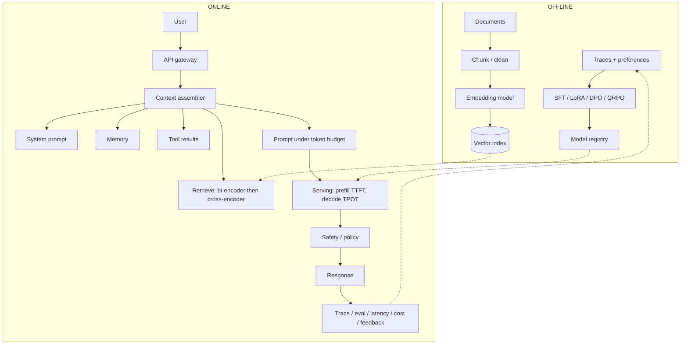

Three levers, cheapest first: **instructions → context → weights**.

$$
\text{Data} \rightarrow \text{Context or training} \rightarrow \text{Model} \rightarrow \text{Inference} \rightarrow \text{Eval} \rightarrow \text{Iterate}
$$

Notes from the LLMOps chapters plus [ByteByteGo](https://www.youtube.com/watch?v=avjX3QrYkls) and [CS25 / Karpathy](https://www.youtube.com/watch?v=XfpMkf4rD6E). 2026-09-05.

## End-to-end LLMOps pipeline

This is the architecture. Offline builds the index and the model. Online assembles a finite context, runs prefill/decode, then logs quality, latency, and cost. Every section below is one box on this diagram.

| Pipeline box | What it does | Section |
|---|---|---|
| Chunk → embed → index | Documents become searchable vectors | Context |
| SFT / LoRA / DPO / GRPO → registry | Change behavior when prompting is not enough | Adapt |
| Context assembler | Mix instructions, query, memory, retrieval, tools | Context, Prompting |
| Serving | Prefill then decode on GPUs | Inference |
| Trace / eval | Did the *system* work, not just the sentence? | Evaluation |

Hosted API vs self-host is only *who runs the serving box*. The rest of the pipeline stays the same.

## Tokens → vectors

$$
\text{text} \rightarrow \text{tokens} \rightarrow \text{IDs} \rightarrow X = [E[t_1],\ldots,E[t_L]]
$$

$$E \in \mathbb{R}^{V \times D}$$ is a lookup table. `bank` has one row for *river bank* and *bank loan*; context is added later.

| Method | Idea | Paper |
|---|---|---|
| BPE | Merge frequent pairs | Sennrich et al., 2016 |
| WordPiece | Merge to raise corpus likelihood | BERT |
| Unigram / SentencePiece | Start large, prune | Kudo, 2018 |
| Byte-level BPE | Almost no OOV | GPT-2 |

WordPiece intuition: $$\operatorname{score}(A,B) \propto P(AB)/(P(A)P(B))$$. **Example:** `unhappiness` → `un` + `happy` + `ness`.

Attention ignores order. $$Z_0 = X + P$$, or RoPE (Su et al., 2021) so scores depend on *relative* offset. Without position, *dog bites man* = *man bites dog*.

**Open.** Why do tokenizers smash numbers? Does long-context RoPE *reason*, or only keep local patterns (Liu et al., 2023, *Lost in the Middle*)?

## Attention

Bahdanau et al. (2015) let the decoder look back. Vaswani et al. (2017) dropped the RNN. Communication = attention; per-token compute = MLP (Karpathy). *Jake learned AI even though it was difficult*: `it` should mass on `AI`.

$$
Q=XW_Q,\; K=XW_K,\; V=XW_V,\qquad
\operatorname{Attention}(Q,K,V)=\operatorname{softmax}\!\left(\frac{QK^\top}{\sqrt{d_k}}\right)V
$$

Scale by $$\sqrt{d_k}$$ or dots saturate softmax. **Example:** $$Q_1=[1,0]$$, $$K_1=[1,0]$$, $$K_2=[0,1]$$ → softmax $$\approx[0.67,0.33]$$.

Causal mask $$M$$ ($$-\infty$$ on the future) → GPT. No mask → BERT. $$K,V$$ from another sequence → T5 / Whisper. Attention weight ≠ explanation (Jain & Wallace, 2019).

Heads: $$H=[\mathrm{head}_1;\ldots]W_O$$. MoE (Shazeer et al., 2017; Mixtral, 2024): a router runs a few experts. More *stored* parameters, not more FLOPs per token; memory and load-balance become the cost.

**Open.** Softmax vs SSMs (Mamba)? How much of MoE is “more weights” vs “conditional compute”?

## Decoding

$$
P(w_{1:T})=\prod_t P(w_t\mid w_{<t}),\qquad
P(i)=\frac{e^{z_i/T}}{\sum_j e^{z_j/T}}
$$

One token, then condition on it. $$T<1$$ sharpens; $$T>1$$ flattens. Greedy is local. Beams raise likelihood, often dull text.

Top-$$K$$: fixed width. Top-$$P$$ (Holtzman et al., 2020): smallest $$S$$ with $$\sum_{i\in S}P(i)\ge p$$. **Example:** masses $$0.40,0.30,0.10$$ sum to $$0.80$$; $$p=0.90$$ still grows $$S$$. A peaky tail needs a small $$S$$; a flat one needs a large $$S$$. Fixed $$K$$ cannot track that.

**Open.** Why does max-likelihood decoding sound worse than slightly noisier sampling?

## Prompting

Brown et al. (2020): extra examples in the prompt change behavior with no SGD. Min et al. (2022): even *wrong* labels can help — format can beat gold mappings.

| Pattern | Extra cost | Paper |
|---|---|---|
| Zero- / few-shot | Context tokens | Brown et al., 2020 |
| Chain-of-thought | Output tokens | Wei et al., 2022 |
| Self-consistency | $$N$$ generations; vote | Wang et al., 2023 |
| ReAct | Tools + turns | Yao et al., 2023 |

**Example:** five CoTs $$[42,42,42,42,41]$$ → mode $$42$$. Version prompts like config.

**Open.** Is CoT computation or fluent rationalization (Turpin et al., 2023)?

## Context

The window is RAM:

$$
C = C_{\mathrm{inst}}+C_{\mathrm{query}}+C_{\mathrm{hist}}+C_{\mathrm{retr}}+C_{\mathrm{tools}}+C_{\mathrm{user}}+C_{\mathrm{time}}
$$

Liu et al. (2023): models use the *ends* of a long prompt more than the middle. Shi et al. (2023): junk retrieval can beat *no* retrieval in the wrong direction.

RAG (Lewis et al., 2020): bi-encoder for cheap recall (DPR, Karpukhin et al., 2020), cross-encoder to rerank $$(q,d)$$. $$\cos(q,d)=q^\top d/(\|q\|\|d\|)$$. **Example:** “Refunds at a glance” may win cosine; “30 days from delivery for order IDs” may win the cross-encoder.

Memory: store → retrieve → filter → inject. 2024 “Seattle” and 2026 “San Francisco” are both close in embedding space; **time** picks the current fact.

**Open.** What is a principled chunk? How do we audit an answer after compression?

## Evaluation

$$
H(P,Q)=-\sum_x P(x)\log Q(x)=H(P)+D_{\mathrm{KL}}(P\|Q)\ge H(P),\qquad
\mathrm{PPL}=2^{H(P,Q)}
$$

$$H=3$$ → $$\mathrm{PPL}=8$$. Low PPL ≠ helpful or faithful.

$$F_1=2PR/(P+R)$$. BLEU (precision, Papineni et al., 2002) vs ROUGE (recall, Lin, 2004) vs BERTScore (Zhang et al., 2020). **Example:** a tight paraphrase loses BLEU to a copy-paste dump; BERTScore prefers the paraphrase.

Retrieval: 3 relevant, 2 in top-5 → $$\mathrm{Recall@}5=2/3$$, $$\mathrm{Precision@}5=2/5$$. $$\mathrm{MRR}=\frac1{|Q|}\sum 1/\mathrm{rank}$$. Score **retriever and generator separately** (RAGAS, Es et al., 2023).

Agents: “Refund processed” without `RefundProcessor` is a fail. Score tool **choice, order, args, outcome**. Trace prompt version, doc ids, tools, tokens, latency, cost.

**Open.** What is success on a 20-turn chat? When is an LLM judge calibrated?

## Adaptation

Need fresh/private facts → RAG. Need a stable behavior change → fine-tune. Need both → both. InstructGPT (Ouyang et al., 2022) is about *following instructions*, not stuffing a handbook into weights.

LoRA (Hu et al., 2022): $$W'=W+(\alpha/r)AB$$. **Example:** $$4096^2$$ weights; $$r=8$$ trains $$65{,}536$$ ≈ $$0.39\%$$. QLoRA (Dettmers et al., 2023): 4-bit *storage*, higher-precision adapter SGD — not “training in 4-bit.”

| Method | Extra machinery | Paper |
|---|---|---|
| RLHF / PPO | Reward (+ critic); KL to $$\pi_{\mathrm{ref}}$$ | Ouyang et al., 2022 |
| DPO | Preferred vs rejected pairs only | Rafailov et al., 2023 |
| GRPO | Group rewards, no critic | Shao et al., 2024 |

GRPO: $$A_i=(r_i-\bar r)/(\sigma_r+\epsilon)$$. Rewards $$[1,1,0,0]$$ → successes get $$A>0$$. Drops the **critic**, not the **reward**. Reward models can be hacked (Gao et al., 2023).

**Open.** When does DPO collapse diversity? Style in an adapter, facts in RAG?

## Inference and serving

| Phase | Bound | Metric |
|---|---|---|
| Prefill (whole prompt) | Compute | TTFT |
| Decode (one token) | Memory bandwidth | $$\mathrm{TPOT}\approx T/(N-1)$$ |

Goodput = fraction of requests that meet *all* SLOs. KV cache trades compute for HBM. GQA (Ainslie et al., 2023): $$H=32$$, $$G=8$$ → ~$$4\times$$ less KV than MHA.

| Bottleneck | Technique | Paper |
|---|---|---|
| Idle GPU | Continuous batching | Orca, Yu et al., 2022 |
| KV holes | PagedAttention | Kwon et al., 2023 |
| Attention I/O | FlashAttention | Dao et al., 2022 |
| Sequential decode | Speculative decoding | Leviathan et al., 2023 |

Name the bottleneck first. Hosted API: they own the serving box. Self-host: gateway → vLLM-class server → GPUs + weights + KV.

**Open.** When is a 20k-token prefix cache worth pinning? How do we colocate a 32k prefill with a 4-token decode?

## References

- Bahdanau et al. (2015). [Align and translate](https://arxiv.org/abs/1409.0473).
- Vaswani et al. (2017). [Attention is all you need](https://arxiv.org/abs/1706.03762).
- Sennrich et al. (2016). [BPE](https://arxiv.org/abs/1508.07909). Kudo & Richardson (2018). [SentencePiece](https://arxiv.org/abs/1808.06226).
- Devlin et al. (2019). [BERT](https://arxiv.org/abs/1810.04805). Brown et al. (2020). [GPT-3](https://arxiv.org/abs/2005.14165). Raffel et al. (2020). [T5](https://arxiv.org/abs/1910.10683). Su et al. (2021). [RoPE](https://arxiv.org/abs/2104.09864).
- Holtzman et al. (2020). [Nucleus sampling](https://arxiv.org/abs/1904.09751). Wei et al. (2022). [CoT](https://arxiv.org/abs/2201.11903). Wang et al. (2023). [Self-consistency](https://arxiv.org/abs/2203.11171). Yao et al. (2023). [ReAct](https://arxiv.org/abs/2210.03629). Min et al. (2022). [What makes ICL work](https://arxiv.org/abs/2202.12837). Turpin et al. (2023). [Unfaithful CoT](https://arxiv.org/abs/2305.04359).
- Lewis et al. (2020). [RAG](https://arxiv.org/abs/2005.11401). Karpukhin et al. (2020). [DPR](https://arxiv.org/abs/2004.04906). Liu et al. (2023). [Lost in the middle](https://arxiv.org/abs/2307.03172). Shi et al. (2023). [Distracting context](https://arxiv.org/abs/2302.00093).
- Zhang et al. (2020). [BERTScore](https://arxiv.org/abs/1904.09675). Zheng et al. (2023). [LLM-as-judge](https://arxiv.org/abs/2306.05685). Es et al. (2023). [RAGAS](https://arxiv.org/abs/2309.15217). Jain & Wallace (2019). [Attention is not explanation](https://arxiv.org/abs/1902.10186).
- Hu et al. (2022). [LoRA](https://arxiv.org/abs/2106.09685). Dettmers et al. (2023). [QLoRA](https://arxiv.org/abs/2305.14314). Ouyang et al. (2022). [InstructGPT](https://arxiv.org/abs/2203.02155). Rafailov et al. (2023). [DPO](https://arxiv.org/abs/2305.18290). Shao et al. (2024). [GRPO](https://arxiv.org/abs/2402.03300). Gao et al. (2023). [Reward overoptimization](https://arxiv.org/abs/2210.10760).
- Dao et al. (2022). [FlashAttention](https://arxiv.org/abs/2205.14135). Kwon et al. (2023). [PagedAttention / vLLM](https://arxiv.org/abs/2309.06180). Ainslie et al. (2023). [GQA](https://arxiv.org/abs/2305.13245). Leviathan et al. (2023). [Speculative decoding](https://arxiv.org/abs/2211.17183). Yu et al. (2022). [Orca](https://www.usenix.org/conference/osdi22/presentation/yu).
- [ByteByteGo](https://www.youtube.com/watch?v=avjX3QrYkls). [CS25 Karpathy](https://www.youtube.com/watch?v=XfpMkf4rD6E).
